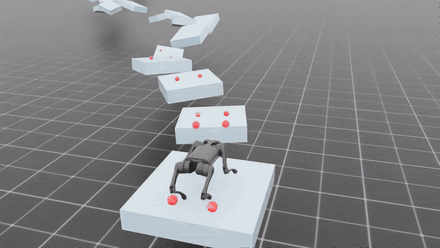
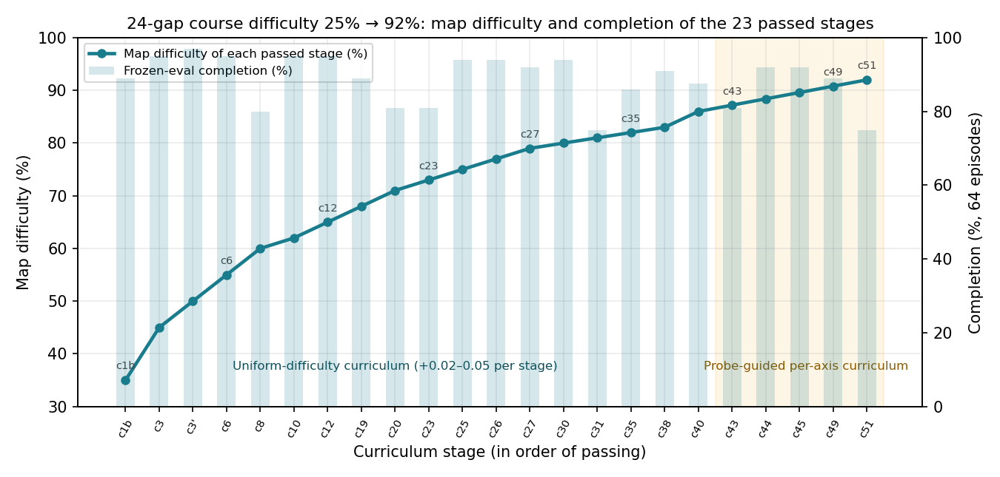
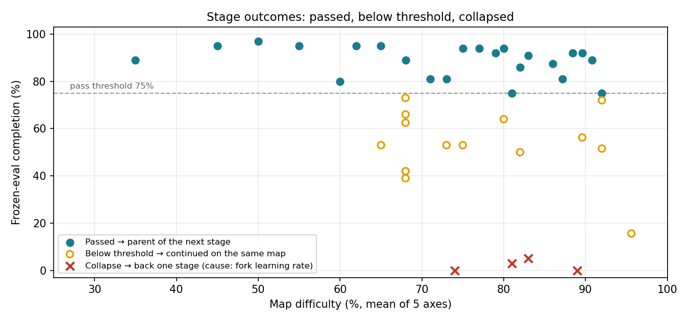
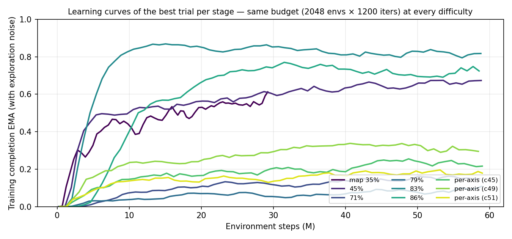
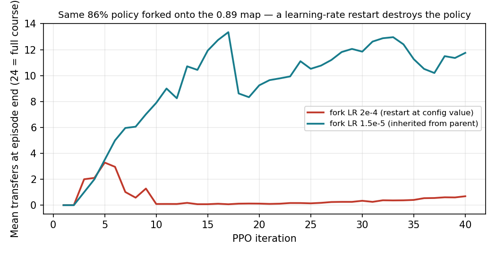
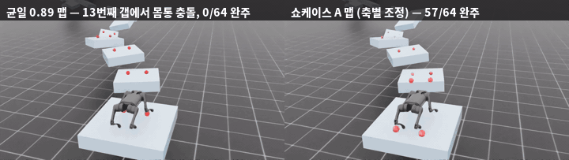
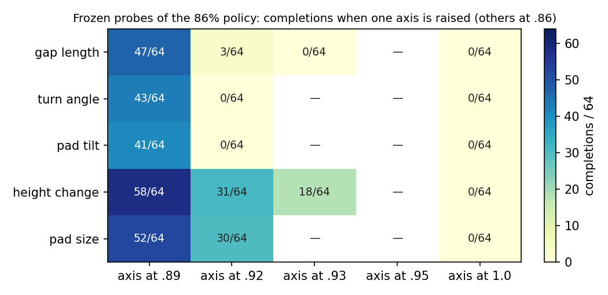
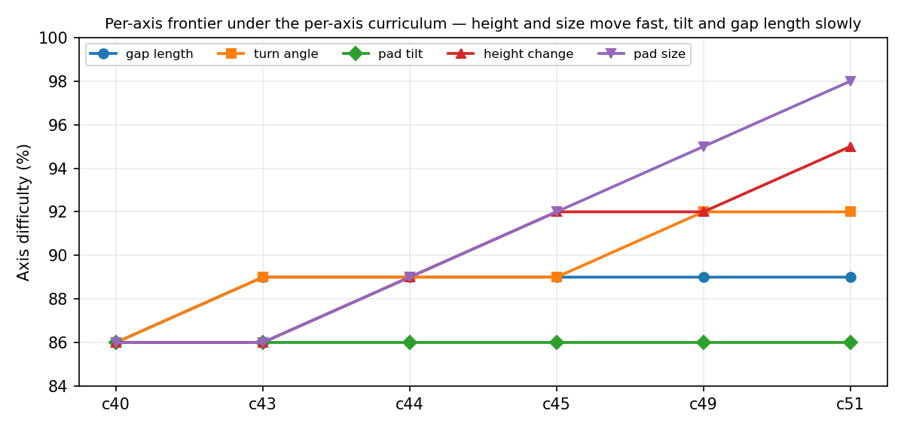
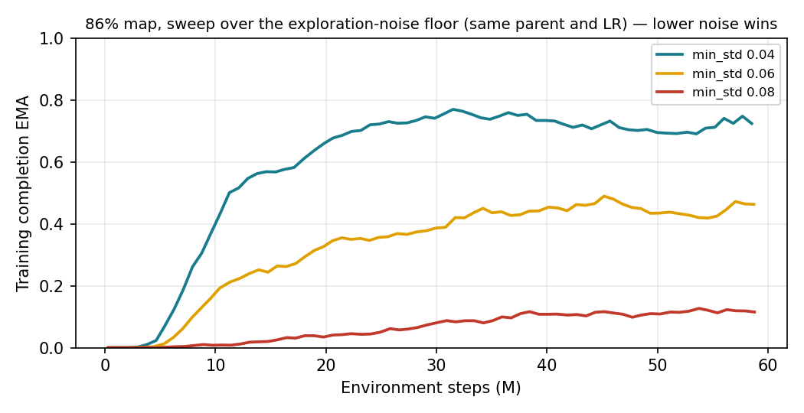
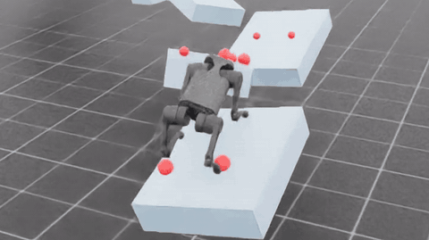

<h1 align="center">rlflow-parkour</h1>
<p align="center"><b>Unitree A1 사족보행 로봇이 떨어진 발판 24개를 연속 점프로 건너는 파쿠르 코스.<br>강화학습 커리큘럼으로 코스 난이도를 25%에서 92%까지 올렸다.</b><br>
Isaac Sim 4.5 · Isaac Lab 2.1.1 · PPO (rsl_rl) · Ray Tune · <a href="https://github.com/sxngt/rl-flow">RLflow</a></p>

<p align="center"></p>
<p align="center"><sub>쇼케이스 A. 갭 89% · 회전 92% · 경사 86% · 높이 92% · 크기 95% 난이도의 맵을 64회 중 57회 완주했다. 빨간 점은 표면 위에 그린 4단계 착지 계획이고, 큰 점이 다음 착지 예측이다.</sub></p>

**TL;DR (EN)** — A Unitree A1 quadruped learns to cross a 24-gap discontinuous parkour course in Isaac Sim (gaps up to 0.70 m, rises to ±0.27 m, turns to 50°, pads tilted to 22°). Fifty curriculum stages with Ray Tune sweeps raised course difficulty from 25% to 92% per axis; the final showcase policy completes its map 89% of the time. Two findings shaped the run: every training collapse traced back to a learning-rate restart at policy fork, and uniform difficulty steps had to give way to probe-guided per-axis steps.

---

## 결과

| | 맵 난이도 (gap / turn / tilt / height / size) | 완주 (64 ep) | 정책 |
|---|---|---|---|
| **쇼케이스 A** | .89 / .92 / .86 / .92 / .95 | **57 / 64 (89%)** | `parkour/v51` |
| 쇼케이스 B | .89 / .92 / .86 / .95 / .98 | 48 / 64 (75%) | trial `e3c085b6` |
| 쇼케이스 C | 균일 .86 | 56 / 64 (88%) | `parkour/v45` |
| 출발점 | 균일 .25 | 57 / 64 (89%) | `parkour/v5` |

코스는 `mixed_discrete` 24갭, geometry seed 1이다. 난이도는 갭 길이·회전각·발판 경사·높이차·발판 크기 다섯 축을 0~1 분율로 나눠 조절한다. 평가는 동결 정책, 결정론, 64 에피소드로 하고, 마지막 발판에 네 발이 올라가 0.2초 버티면 성공이다. 몸통이 발판에 닿으면 그 자리에서 실패.

100% 맵은 아직 못 건넌다. 지금 최고 정책도 네 번째 이동에서 떨어진다. 이 문서의 숫자는 거기까지다.

## 어떻게 올라왔나

<p align="center"></p>

한 단계의 흐름은 단순하다. 이전 단계에서 가장 잘한 체크포인트를 fork해 조금 더 어려운 맵에서 1200 iteration을 학습하고, 동결 평가로 75% 이상 완주하면 그 정책이 다음 단계의 부모가 된다. 미달이면 같은 맵에서 이어 학습하고, 성공률이 0에 가까우면 한 단계 전으로 돌아간다. 앞쪽 18단계는 다섯 축을 같은 비율로 올리는 균일 커리큘럼이었고, 86% 이후로는 축을 따로 올리는 방식으로 바꿨다. 그 이유는 아래에서 다룬다.

<p align="center"></p>

전체 단계를 난이도–완주율 평면에 놓으면 세 부류로 나뉜다. 통과, 미달 후 이어 학습, 그리고 붕괴. 붕괴 네 건은 0.74, 0.81, 0.83, 0.89에서 나왔고 당시에는 지형의 절벽으로 보였다.

<p align="center"></p>

단계별 학습 곡선이다. 난이도가 올라가도 같은 예산(2048 env × 1200 iteration, 약 5.9 × 10⁷ 스텝) 안에서 수렴한다. 학습 중 EMA는 탐색 노이즈를 섞은 rollout 기준이라 동결 평가보다 낮게 나오고, 노이즈 하한이 0.12였던 71~79% 단계가 특히 그렇다. 초반 몇 M 스텝 동안 EMA가 0에 머무는 구간이 모든 곡선에 있는데, 이 구간이 fork 문제의 흔적이다.

## 알아낸 것

### 붕괴의 원인은 지형이 아니라 fork 학습률이었다

<p align="center"></p>

부모 정책은 rsl_rl의 adaptive KL 스케줄을 거치며 학습률이 1e-5 근처까지 내려간 상태로 저장된다. 자식은 설정 파일의 2e-4로 새 Adam 옵티마이저를 시작했다. 첫 PPO 업데이트가 사실상 부호 하강이 되어 성숙한 정책을 흔들고, 첫 rollout에서는 멀쩡하던 로봇이 다섯 번째 iteration부터 매번 수백 대씩 넘어진다. 회복에 수 M 스텝이 들고, 네 번은 끝까지 회복하지 못했다.

같은 86% 정책을 0.89 맵으로 fork한 A/B(1024 env, 40 iteration)에서 LR 2e-4는 열두 iteration 만에 평균 이동 수가 3에서 0.1로 떨어졌고, 1.5e-5는 7에서 13까지 올라갔다. 이후 모든 fork는 `+fork_lr=inherit`로 부모의 마지막 학습률을 물려받는다.

### 다섯 축을 한꺼번에 올리면 절벽이 생긴다

<p align="center"></p>
<p align="center"></p>

86% 정책을 균일 0.89 맵에 올리면 64번 모두 13번째 갭(0.70 m 폭, 0.18 m 상승)에서 몸통이 착지면에 걸린다. 그런데 축을 하나만 0.89로 올리면 41~58번을 건넌다. 균일 스텝 하나가 다섯 개의 교란을 동시에 주고 있었던 셈이다.

여기서부터 단계 사이에 동결 프로브를 넣었다. 현재 정책을 축별로 +0.06, +0.03 올린 맵에서 30초짜리 결정론 평가를 돌리고, 견디는 축들의 조합을 다시 프로브한 뒤 그 조합을 다음 맵으로 삼는다. 위 행렬이 86% 정책의 프로브 결과다. 높이차와 발판 크기는 여유가 있고, 갭 길이는 0.89와 0.93 사이에 벽이 있으며, 경사는 0.89도 빠듯하다.

<p align="center"></p>

축별로 가니 최전선이 축마다 다른 속도로 움직인다. 높이차와 크기가 먼저 0.95, 0.98에 닿았고 회전이 뒤따랐다. 경사는 0.86에 머물렀고 갭 길이는 0.89에서 멈췄다. 남은 두 축이 이 연구의 다음 과제다.

### 탐색 노이즈는 낮을수록 좋았다

<p align="center"></p>

정책 출력에 더하는 가우시안 노이즈 하한을 0.04, 0.06, 0.08로 나눠 같은 부모에서 학습시켰다. 86% 맵에서 EMA는 각각 0.72, 0.46, 0.12. 이후 단계에서도 0.04가 매번 이겼다. 성숙한 정책을 다듬는 단계에서는 실수를 만들어내는 노이즈보다 정확한 rollout이 더 중요했다.

### 혼합 지형은 망각을 막지만 최전선을 밀지는 못했다

env마다 다른 난이도의 맵을 배정해 한 번에 학습하는 `terrain_mix`도 시도했다. 쉬운 맵의 성능은 유지되지만, 정책이 아직 못 하는 난이도에서는 성공 신호 자체가 생기지 않아 최전선은 그대로였다. 커리큘럼을 대체하지는 못했고, 보조 수단으로 남겨 두었다.

## 착지 계획 시각화

<p align="center"></p>

정책은 105차원 관측을 받아 관절 목표 12개를 내는 MLP라서 발걸음 계획을 따로 출력하지 않는다. 그래서 영상에는 추정치를 그린다. 큰 점은 몸통의 현재 속도로 다음 발판 도달 시간을 어림잡고 기본 보폭을 더해 표면 평면에 붙인 다음 착지 예측이고, 작은 점 세 단계는 계획기가 표면마다 정해 둔 페어 목표다. 발이 발판에 안착하면 계획이 한 칸 앞으로 밀린다. 표시용일 뿐 보상이나 판정에는 쓰지 않는다 (`src/parkour/predicted_footfall.py`).

## 방법 요약

```
[맵]    curriculum_maps.build_mixed_discrete_axes(seed, {gap, turn, tilt, height, size})
[학습]  PPO (rsl_rl), 105-dim obs → 12 joint targets, 2048 env × 1200 iter
        fork = 이전 단계 최고 체크포인트 + fork_lr=inherit + min_std 0.04
[스윕]  Ray Tune — 탐색 std, 학습률 배수, 후보 맵
[평가]  동결 정책 64 ep → 게이트 native ≥ 0.75 → MLflow 레지스트리 candidate → validated
[다음]  동결 프로브 (축별 +0.06 / +0.03, 조합) → 다음 맵 선택
```

- 정책·지형·평가·촬영: `src/parkour/` (`continuous_tracker_task.py`, `curriculum_maps.py`, `policy_fork.py`, `terrain_mix.py`, `predicted_footfall.py`, `media.py`)
- RLflow 진입점: `train.py`, `evaluate.py`, `export.py`. 설정은 `configs/*.yaml`, 스윕은 `configs/sweep/`, 평가 스위트는 `eval_suite/`
- 커리큘럼 드라이버: [`rl-flow/tools/parkour_campaign.py`](https://github.com/sxngt/rl-flow/blob/main/tools/parkour_campaign.py) — `stage` / `auto` / `auto-axes` / `auto-multi`
- 실행 방법은 [docs/rlflow-usage.md](docs/rlflow-usage.md), 연구 기록 490편은 [docs/](docs/) (인계 문서 [active-research.md](docs/active-research.md)), 이관 전 README는 [docs/legacy-readme.md](docs/legacy-readme.md)

## 규모

| 항목 | 값 |
|---|---|
| 커리큘럼 | 50 단계, 51 스윕, 약 150 trial |
| 학습량 | 단계당 약 5.9 × 10⁷ 환경 스텝, 누적 약 9 × 10⁹ |
| 평가 | 모든 단계 64 에피소드 동결 평가, 정책 55 버전 등록 |
| 실험 자산 | 런 1,456개 (이관 1,378 + 신규 78), 영상 900여 개 |

런·지표·영상·계보는 RLflow 콘솔 `/p/parkour`와 MLflow에 있다. 쇼케이스 세 런은 `purpose:showcase` 태그로 모아 볼 수 있다.

## 배경

원본 연구(`workspace/parkour`, 351 커밋)는 사전 지도 기반 Planner–RL Tracker 구조로 단일 도약, 연속 도약, 혼합 지형 순서로 진행됐다. 2026년 9월 RLflow 프로젝트로 옮기면서 실행 1,375개와 영상 900개를 원본 수정 없이 임포트했고, 그 뒤의 학습과 평가는 모두 RLflow를 거친다. 구현은 AI 코딩 에이전트(Claude Code)와 함께했다.
