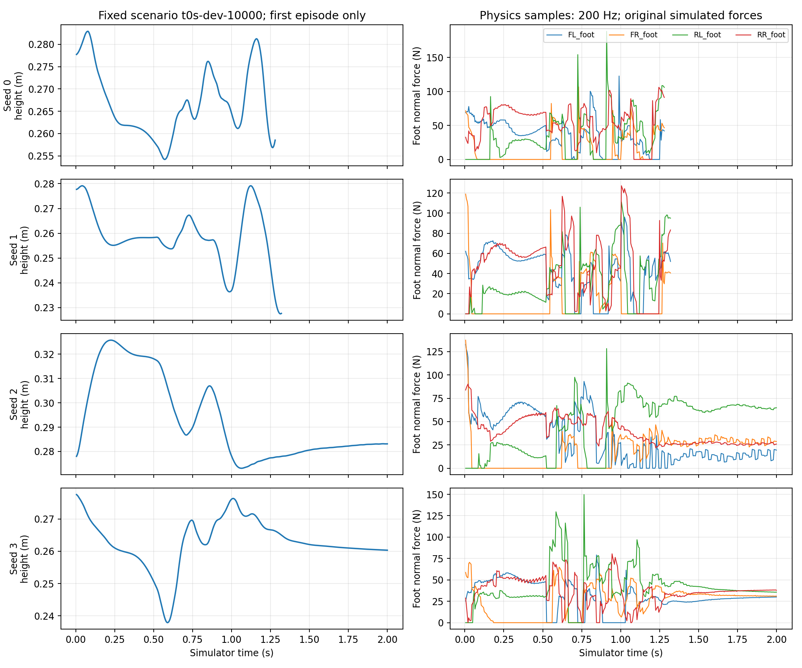

# P1 · Step 01 — Hopping 진단 (2026-09-10)

800-update checkpoint의 seed 0–3을 동일 개발군 64개에서 재평가했다. 정책·normalization·보상·종료 조건을 변경하거나 추가 학습하지 않았다. 네 seed 모두 기존 evaluation.json 전체 내용과 일치했다. 기본 자세 대조군도 같은 프로토콜로 계측했다.

| 정책 | 완주 | 20ms 이상 네 발 무접촉 episode | 몸체 높이 변동폭 평균 | episode 최대 수직 속도의 평균 | 지지 발 3개 미만 시간 비율 평균 | episode 최대 발 수직력의 평균 |
|---|---:|---:|---:|---:|---:|---:|
| 0 | 64/64 | 0/64 | 2.89 cm | 0.366 m/s | 29.62% | 187.8 N |
| 1 | 64/64 | 64/64 | 5.17 cm | 0.497 m/s | 29.42% | 129.1 N |
| 2 | 0/64 | 0/64 | 5.37 cm | 0.407 m/s | 4.23% | 137.8 N |
| 3 | 0/64 | 0/64 | 3.98 cm | 0.417 m/s | 1.31% | 149.2 N |
| Zero | 0/64 | 0/64 | 0.78 cm | 0.019 m/s | 0.00% | 40.9 N |

## 해석

- seed 0: 네 발이 동시에 뜨는 구간 없이도 몸체 높이가 평균 2.89cm 변한다. 따라서 통통 튀어 보인다는 관찰만으로 비행이라고 단정할 수 없다.
- seed 1: 64개 모두 연속 20ms 이상의 네 발 무접촉이 존재한다. 대표 시나리오에서는 약 1.105–1.120초, stage 3(마지막 발 목표)에서 관측된다. 이 구간을 포함해 발 외 부위의 5N 초과 접촉은 모든 평가에서 0이다. 짧은 공중 구간을 허용하면서 성공 판정을 통과하는 정책이다.
- seed 2: 58개는 한 번, 6개는 두 번의 발 이동만 완료한다. seed 3은 63개가 세 번, 1개가 한 번 완료한 뒤 시간초과다. 이 결과만으로 보상 가중치 중 무엇이 정체의 원인인지 확정할 수 없다.
- 성공한 seed 0/1은 지지 발 3개 미만인 시간이 평균 약 30%다. 현재 이벤트 판정은 다른 발 2개의 지지만 요구하므로 의도한 한 발씩의 안정적 이동보다 다양한 동작을 허용한다.
- 힘 peak는 기록된 시뮬레이터 값이다. 로봇의 허용 충격 기준이나 실제 센서 비교 없이 위험·안전 판정을 내리지 않는다.

## 계측과 한계

- scene.update 이후 매 physics step(5ms, 200Hz) 관측을 저장했다. 센서 history_length>0이면 매 update에 갱신되는 설치된 Isaac Lab 구현을 확인했다. 관측은 읽기 전용이다.
- done mask로 각 환경의 첫 episode만 포함했다. 마지막 physics sample은 종료 판정/자동 reset 이전이므로 reset으로 순간이동한 위치가 지표에 섞이지 않는다.
- 발 접촉은 별도의 5N onset / 2N release hysteresis로 계산했다. 연속 20ms를 진단상 flight 기준으로 미리 사용했으며 원래 학습 성공 기준은 유지했다. 이는 정상력 threshold 기준이다.
- 최대 힘은 200Hz에서 관측한 peak이며 더 짧은 물리 충격을 완벽히 복원하지 않는다. 접촉 시작 후 50ms의 정상력 적분에는 체중 지지가 포함된다. 종료 직전 시작한 창은 잘릴 수 있다.
- support_travel_total_m은 비활성 발의 인접한 두 지지 표본 사이 XY 경로를 합한 값이다. 발 중심의 굴림·접촉 geometry 변화도 포함하므로 진짜 미끄러짐 거리와 같다고 해석하지 않는다. 12초 timeout과 약 1.3초 성공의 누적 경로 길이를 단순 우열 비교하지 않는다.
- 진단은 초기 settling을 포함한다. 영상 trace는 25Hz라서 20ms 공중 구간을 놓칠 수 있다. 수치의 원본은 200Hz NPZ다.

## 원본·태그

실행 이름은 `p1-step01-hopping-diagnosis-v2-seed{0..3}` 및 `...-zero`다. 각 artifacts 실행 폴더에 diagnostics.json, motion-trace.npz, 평가 결과와 원본 MP4가 있다. 영상과 진단 JSON은 result에도 보관한다. 별도 초기 계측 파일럿 `p1-step01-hopping-diagnosis-seed0`은 본 비교에서 제외하고 purpose:instrumentation-pilot로 구분한다.

모니터링의 Phase=P1, 실험 단계=01·hopping 진단, 목적=동작 진단을 선택하면 본 비교 5개 실행을 볼 수 있다. Phase 태그는 연구 작업 분류이며 단계 완료를 뜻하지 않는다.

## 다음 비교 실험

기존 checkpoint와 성공 기준을 보존한 상태에서 순차 발 이동용 지지 조건·몸체 운동·착지 안정성 기준을 별도 버전으로 정의하고 동일 예산의 복수 seed 비교를 수행한다. 단일 도약에서는 비행을 의도적으로 허용해야 하므로 그 과제와 섞지 않는다. 이번 진단에서 보상을 수정하거나 새 정책을 승격하지 않았다.
