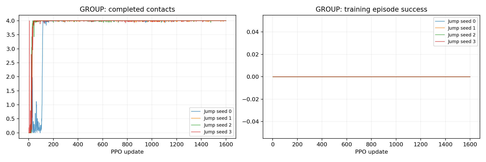
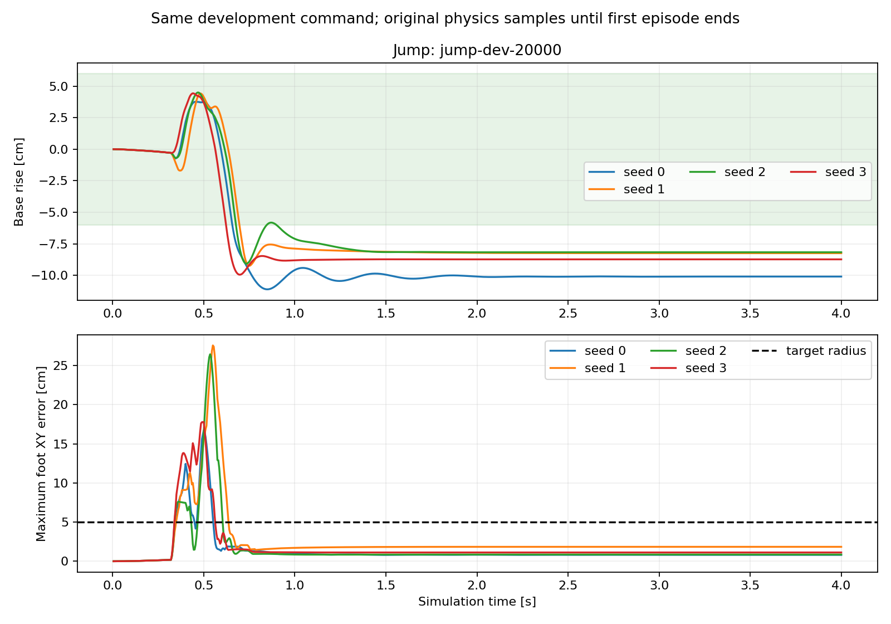

# P2-01 · 평지 단일 도약 기준선

self-collision과 비발 접촉 실패 조건을 적용한 A1의 평지 단일 도약. 요구 비행 중 몸체 상승4–6cm, 마지막64개 개발 명령을 평가한다. 갭 통과 결과가 아니다.

비교 전체 157,286,400 환경 step, 신규 157,286,400step. [사전 프로토콜](p2-01-protocol.md).

| 발 | 조건 | seed | 안정화 성공 | 필요 착지 완료 | 낙상 | 시간초과 | ≥20ms 전 발 무접촉 |
|---|---|---:|---:|---:|---:|---:|---:|---:|
| GROUP | Jump | 0 | 0/64 | 64/64 | 0/64 | 64/64 | 64/64 |
| GROUP | Jump | 1 | 0/64 | 64/64 | 0/64 | 64/64 | 64/64 |
| GROUP | Jump | 2 | 0/64 | 64/64 | 0/64 | 64/64 | 64/64 |
| GROUP | Jump | 3 | 0/64 | 64/64 | 0/64 | 64/64 | 64/64 |

## 도약 계약 지표

| 조건 | seed | 유효 비행 | 비행 후 재접촉 | 최종 안정화 | 비발 접촉 종료 | 평균 비행 apex 상승 | 높이 명령 충족 | 네 발 첫 접촉 반경 내 | 최종 높이 범위 밖 |
|---|---:|---:|---:|---:|---:|---:|---:|---:|---:|
| Jump | 0 | 64/64 | 64/64 | 0/64 | 0 | 3.75 cm | 0/64 | 0/64 | 64/64 |
| Jump | 1 | 64/64 | 64/64 | 0/64 | 0 | 4.41 cm | 11/64 | 0/64 | 64/64 |
| Jump | 2 | 64/64 | 64/64 | 0/64 | 0 | 4.43 cm | 11/64 | 0/64 | 64/64 |
| Jump | 3 | 64/64 | 64/64 | 0/64 | 0 | 4.43 cm | 12/64 | 0/64 | 64/64 |

학습 곡선은 각 update의 종료 episode 통계다. 고정 평가 결과와 구분한다. 종료 단계는 마지막 유효 200Hz 표본이며 실제 완료 여부는 terminal metrics를 우선한다.

## 종료 단계

- GROUP Jump seed 0: `{'2:2': 64}`
- GROUP Jump seed 1: `{'2:2': 64}`
- GROUP Jump seed 2: `{'2:2': 64}`
- GROUP Jump seed 3: `{'2:2': 64}`

## 해석 및 다음 판단

4개 seed 모두 유효 비행 및 네 발 재접촉64/64, 최종 안정화0/64였다. 비발 접촉 종료는 없고 모두4초 시간초과했다. 총157,286,400step의 기준선 실패를 보존하며 모델 승격은 하지 않는다.
평균 비행 상승량은 seed0~3 순서로3.75/4.41/4.43/4.43cm이고, 요구4–6cm 충족은0/11/11/12개였다. 유효 비행 감지 직후 상승 보상이 끝나는 구조와 관련될 가능성이 있지만 이 데이터만으로 인과를 확정하지 않는다.
최종 몸체 높이는 보정 자세보다 평균10.10/8.16/8.16/8.76cm 낮았다. 모든 episode가 마지막 표본에서±6cm 안정화 높이 조건을 벗어났다. 높이 명령을 충족한 사례도 웅크린 착지 상태로 남았다.
첫 접촉 시 네 발 모두 목표5cm 안에 들어온 사례는 모든 seed에서0/64였다. 최종 평균 발 오차가 작아진 결과를 정밀 첫 착지로 해석하면 안 된다. 이 수치는 학습 시작 후 추가한 보조 진단이며 본래 성공 기준이 아니다.

다음 P2-02는 같은 성공·센서·구동기 계약에서 요구 비행 높이의 진행 보상과 착지 후 몸체 높이 비용을 함께 추가하는 탐색적 보상 수정이다. 결합 변경의 효과만 비교하고 두 항의 개별 기여를 주장하지 않는다. 첫 착지 정밀성은 계속 별도 측정한다.

## 범위·재현

개발 조건의 탐색적 실험이다. 평가 episode 수와 독립 학습 seed 수를 구분하며 최종 시험 결과로 주장하지 않는다. 같은 발의 평가 시나리오가 동일함을 확인했다. 설정·checkpoint·원본200Hz NPZ는 artifacts, 최종16대병렬영상은 result에 보존한다. 재사용 대조군 원본은 변경하지 않는다.

실행 목록 및 보고서 명세: `configs/reports/p2-01.json`. 이 보고서는 `scripts/experiment_report.py`로 재생성한다.
