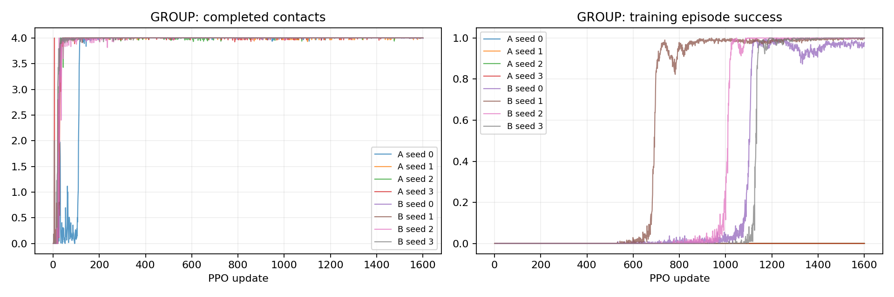
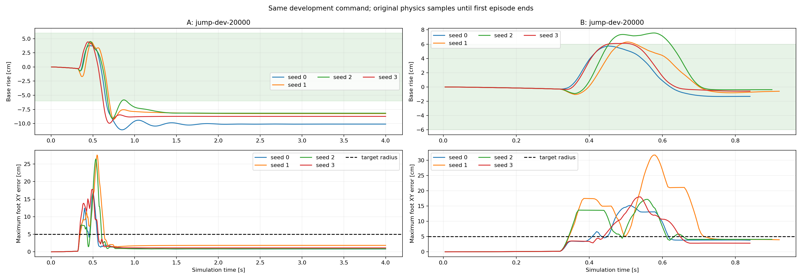

# P2-02 · 도약 높이·착지 자세 결합 보상 비교

같은 성공 계약에서 기존 보상 A와 높이 진행·착지 자세 비용을 결합한 B를 비교한다. 각 항의 개별 효과를 분리한 실험은 아니다.

비교 전체 314,572,800 환경 step, 신규 157,286,400step. [사전 프로토콜](p2-02-protocol.md).

| 발 | 조건 | seed | 안정화 성공 | 필요 착지 완료 | 낙상 | 시간초과 | ≥20ms 전 발 무접촉 |
|---|---|---:|---:|---:|---:|---:|---:|---:|
| GROUP | A | 0 | 0/64 | 64/64 | 0/64 | 64/64 | 64/64 |
| GROUP | A | 1 | 0/64 | 64/64 | 0/64 | 64/64 | 64/64 |
| GROUP | A | 2 | 0/64 | 64/64 | 0/64 | 64/64 | 64/64 |
| GROUP | A | 3 | 0/64 | 64/64 | 0/64 | 64/64 | 64/64 |
| GROUP | B | 0 | 64/64 | 64/64 | 0/64 | 0/64 | 64/64 |
| GROUP | B | 1 | 64/64 | 64/64 | 0/64 | 0/64 | 64/64 |
| GROUP | B | 2 | 64/64 | 64/64 | 0/64 | 0/64 | 64/64 |
| GROUP | B | 3 | 64/64 | 64/64 | 0/64 | 0/64 | 64/64 |

## 도약 계약 지표

| 조건 | seed | 유효 비행 | 비행 후 재접촉 | 최종 안정화 | 비발 접촉 종료 | 평균 비행 apex 상승 | 높이 명령 충족 | 네 발 첫 접촉 반경 내 | 최종 높이 범위 밖 |
|---|---:|---:|---:|---:|---:|---:|---:|---:|---:|
| A | 0 | 64/64 | 64/64 | 0/64 | 0 | 3.75 cm | 0/64 | 0/64 | 64/64 |
| A | 1 | 64/64 | 64/64 | 0/64 | 0 | 4.41 cm | 11/64 | 0/64 | 64/64 |
| A | 2 | 64/64 | 64/64 | 0/64 | 0 | 4.43 cm | 11/64 | 0/64 | 64/64 |
| A | 3 | 64/64 | 64/64 | 0/64 | 0 | 4.43 cm | 12/64 | 0/64 | 64/64 |
| B | 0 | 64/64 | 64/64 | 64/64 | 0 | 5.72 cm | 64/64 | 0/64 | 0/64 |
| B | 1 | 64/64 | 64/64 | 64/64 | 0 | 6.29 cm | 64/64 | 0/64 | 0/64 |
| B | 2 | 64/64 | 64/64 | 64/64 | 0 | 7.56 cm | 64/64 | 0/64 | 0/64 |
| B | 3 | 64/64 | 64/64 | 64/64 | 0 | 6.15 cm | 64/64 | 0/64 | 0/64 |

학습 곡선은 각 update의 종료 episode 통계다. 고정 평가 결과와 구분한다. 종료 단계는 마지막 유효 200Hz 표본이며 실제 완료 여부는 terminal metrics를 우선한다.

## 종료 단계

- GROUP A seed 0: `{'2:2': 64}`
- GROUP A seed 1: `{'2:2': 64}`
- GROUP A seed 2: `{'2:2': 64}`
- GROUP A seed 3: `{'2:2': 64}`
- GROUP B seed 0: `{'2:2': 64}`
- GROUP B seed 1: `{'2:2': 64}`
- GROUP B seed 2: `{'2:2': 64}`
- GROUP B seed 3: `{'2:2': 64}`

## 마지막 제어 표본의 안정화 조건 위반

복수 위반을 허용한다. 연속 hold 전체 구간의 실패 원인과 같지 않으며, 기록되지 않은 과거 실행은 표시하지 않는다.

- B seed 0: `{'height': 0, 'vertical_speed': 0, 'angular_speed': 0, 'foot_target': 0, 'contact_state': 0, 'support_history': 0}`
- B seed 1: `{'height': 0, 'vertical_speed': 0, 'angular_speed': 0, 'foot_target': 0, 'contact_state': 0, 'support_history': 0}`
- B seed 2: `{'height': 0, 'vertical_speed': 0, 'angular_speed': 0, 'foot_target': 0, 'contact_state': 0, 'support_history': 0}`
- B seed 3: `{'height': 0, 'vertical_speed': 0, 'angular_speed': 0, 'foot_target': 0, 'contact_state': 0, 'support_history': 0}`

## 해석 및 다음 판단

기존 A는4개 seed 모두0/64, 수정 B는4개 seed 모두64/64의 고정 개발평가 성공을 보였다. 동일한 물리·명령·성공 계약과1600updates 예산에서 평지 비행 후 안정화가 개선됐다. 신규4학습·4평가의 artifact hash, UUID 배치 및 자원회수 감사를 통과했다.
B의 요구 비행 높이 충족은 전seed64/64였다. 평균 비행 상승량은 seed0~3 순서로5.7/6.3/7.6/6.1cm였다. 현재 명령은 최소 요구량이며 정밀 apex 추종을 검증한 것은 아니다.
B의 최종 몸체 높이는 보정 자세보다 평균1.30/0.61/0.37/0.55cm 낮았으며, 높이·수직속도·각속도·발 목표·접촉 상태·접촉 history의 마지막 제어 표본 위반은 모두0이었다. 실제 성공은 원래 연속0.2초 hold 판정으로 확인했다.
그러나 네 발 첫 접촉이 모두5cm 반경 안인 episode는 A와B 모두 전seed0/64였다. B의 발별 첫 접촉 오차 중 최대값의 episode 평균은13.1/21.1/7.0/10.4cm였다. 이 모델을 정밀 착지 Tracker나 갭 통과 정책으로 제시할 수 없다.

높이 진행 보상과 착지 높이 비용을 결합했으므로 두 항의 개별 기여는 분리되지 않았다.64개 명령은 같은 초기 자세의 작은 높이 변화만 포함하는 개발집합이다. 다양한 초기 상태·센서오차·외란·불연속 지형이나 최종 시험 성능으로 일반화하지 않는다. 자동champion승격은 하지 않는다.
다음 P2-03에서는 첫 접촉 위치를200Hz에서 직접 고정해 기록하는 계약을 만들고, 목표 밖 첫 착지 후의 보정과 정밀 첫 착지를 분리한다. 새 성공 계약은 기존 성공률과 그대로 비교하지 않고, 공통 첫 착지 지표 및 비행/기존 안정화 지표를 함께 보고한다. 이후 수평 목표 이동과 제한 착지면으로 확장한다.

## 범위·재현

개발 조건의 탐색적 실험이다. 평가 episode 수와 독립 학습 seed 수를 구분하며 최종 시험 결과로 주장하지 않는다. 같은 발의 평가 시나리오가 동일함을 확인했다. 설정·checkpoint·원본200Hz NPZ는 artifacts, 최종16대병렬영상은 result에 보존한다. 재사용 대조군 원본은 변경하지 않는다.

실행 목록 및 보고서 명세: `configs/reports/p2-02.json`. 이 보고서는 `scripts/experiment_report.py`로 재생성한다.
