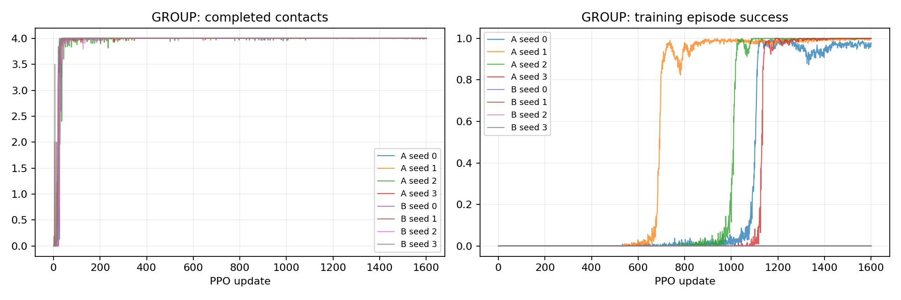
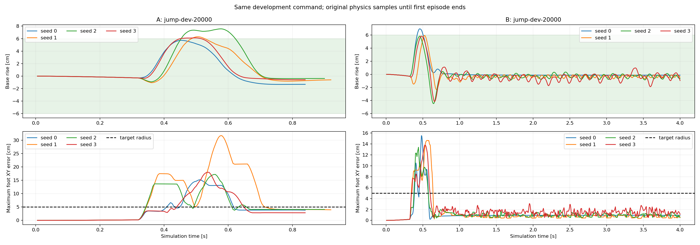

# P2-03 · 첫 착지 정밀화

A는기존안정화성공, B는첫착지반경까지요구하는새성공이므로성공률직접비교금지. 공통첫접촉지표를비교한다.

비교 전체 314,572,800 환경 step, 신규 157,286,400step. [사전 프로토콜](p2-03-protocol.md).

| 발 | 조건 | seed | 과제별 성공(계약 다름) | 필요 착지 완료 | 낙상 | 시간초과 | ≥20ms 전 발 무접촉 |
|---|---|---:|---:|---:|---:|---:|---:|---:|
| GROUP | A | 0 | 64/64 | 64/64 | 0/64 | 0/64 | 64/64 |
| GROUP | A | 1 | 64/64 | 64/64 | 0/64 | 0/64 | 64/64 |
| GROUP | A | 2 | 64/64 | 64/64 | 0/64 | 0/64 | 64/64 |
| GROUP | A | 3 | 64/64 | 64/64 | 0/64 | 0/64 | 64/64 |
| GROUP | B | 0 | 0/64 | 64/64 | 0/64 | 64/64 | 64/64 |
| GROUP | B | 1 | 8/64 | 64/64 | 0/64 | 56/64 | 64/64 |
| GROUP | B | 2 | 0/64 | 64/64 | 0/64 | 64/64 | 64/64 |
| GROUP | B | 3 | 0/64 | 64/64 | 0/64 | 64/64 | 64/64 |

## 도약 계약 지표

| 조건 | seed | 유효 비행 | 비행 후 재접촉 | 과제별 성공(계약 다름) | 비발 접촉 종료 | 평균 비행 apex 상승 | 높이 명령 충족 | 네 발 첫 접촉 반경 내 | 최종 높이 범위 밖 |
|---|---:|---:|---:|---:|---:|---:|---:|---:|---:|
| A | 0 | 64/64 | 64/64 | 64/64 | 0 | 5.72 cm | 64/64 | 0/64 | 0/64 |
| A | 1 | 64/64 | 64/64 | 64/64 | 0 | 6.29 cm | 64/64 | 0/64 | 0/64 |
| A | 2 | 64/64 | 64/64 | 64/64 | 0 | 7.56 cm | 64/64 | 0/64 | 0/64 |
| A | 3 | 64/64 | 64/64 | 64/64 | 0 | 6.15 cm | 64/64 | 0/64 | 0/64 |
| B | 0 | 64/64 | 64/64 | 0/64 | 0 | 6.94 cm | 64/64 | 64/64 | 0/64 |
| B | 1 | 64/64 | 64/64 | 8/64 | 0 | 5.94 cm | 64/64 | 64/64 | 0/64 |
| B | 2 | 64/64 | 64/64 | 0/64 | 0 | 5.84 cm | 63/64 | 64/64 | 0/64 |
| B | 3 | 64/64 | 64/64 | 0/64 | 0 | 5.82 cm | 63/64 | 64/64 | 0/64 |

## 발별 첫 접촉

오차 평균은 관측된 첫 접촉만 포함한다. 반경 내 수의 분모는 전체 episode이며 미접촉을 성공으로 세지 않는다.

| 조건 | seed | 발 | 관측 수 | 평균 오차 | 반경 내 |
|---|---:|---|---:|---:|---:|
| A | 0 | FL | 64/64 | 13.09 cm | 0/64 |
| A | 0 | FR | 64/64 | 5.14 cm | 39/64 |
| A | 0 | RL | 64/64 | 4.67 cm | 53/64 |
| A | 0 | RR | 64/64 | 3.61 cm | 64/64 |
| A | 1 | FL | 64/64 | 5.48 cm | 0/64 |
| A | 1 | FR | 64/64 | 8.23 cm | 0/64 |
| A | 1 | RL | 64/64 | 19.42 cm | 0/64 |
| A | 1 | RR | 64/64 | 21.07 cm | 0/64 |
| A | 2 | FL | 64/64 | 3.41 cm | 64/64 |
| A | 2 | FR | 64/64 | 3.04 cm | 64/64 |
| A | 2 | RL | 64/64 | 3.31 cm | 64/64 |
| A | 2 | RR | 64/64 | 7.04 cm | 0/64 |
| A | 3 | FL | 64/64 | 2.57 cm | 64/64 |
| A | 3 | FR | 64/64 | 10.40 cm | 0/64 |
| A | 3 | RL | 64/64 | 2.98 cm | 64/64 |
| A | 3 | RR | 64/64 | 9.58 cm | 0/64 |
| B | 0 | FL | 64/64 | 0.10 cm | 64/64 |
| B | 0 | FR | 64/64 | 0.08 cm | 64/64 |
| B | 0 | RL | 64/64 | 0.07 cm | 64/64 |
| B | 0 | RR | 64/64 | 0.03 cm | 64/64 |
| B | 1 | FL | 64/64 | 0.12 cm | 64/64 |
| B | 1 | FR | 64/64 | 0.19 cm | 64/64 |
| B | 1 | RL | 64/64 | 0.23 cm | 64/64 |
| B | 1 | RR | 64/64 | 0.19 cm | 64/64 |
| B | 2 | FL | 64/64 | 0.11 cm | 64/64 |
| B | 2 | FR | 64/64 | 0.11 cm | 64/64 |
| B | 2 | RL | 64/64 | 0.30 cm | 64/64 |
| B | 2 | RR | 64/64 | 0.17 cm | 64/64 |
| B | 3 | FL | 64/64 | 0.12 cm | 64/64 |
| B | 3 | FR | 64/64 | 0.19 cm | 64/64 |
| B | 3 | RL | 64/64 | 0.07 cm | 64/64 |
| B | 3 | RR | 64/64 | 0.49 cm | 64/64 |

## 공통 지표 분리

| 조건 | seed | 기존 안정화 달성 | 첫 접촉 네 발 반경 내 |
|---|---:|---:|---:|
| A | 0 | 64/64 | 0/64 |
| A | 1 | 64/64 | 0/64 |
| A | 2 | 64/64 | 0/64 |
| A | 3 | 64/64 | 0/64 |
| B | 0 | 0/64 | 64/64 |
| B | 1 | 8/64 | 64/64 |
| B | 2 | 0/64 | 64/64 |
| B | 3 | 0/64 | 64/64 |

학습 곡선은 각 update의 종료 episode 통계다. 고정 평가 결과와 구분한다. 종료 단계는 마지막 유효 200Hz 표본이며 실제 완료 여부는 terminal metrics를 우선한다.

## 종료 단계

- GROUP A seed 0: `{'2:2': 64}`
- GROUP A seed 1: `{'2:2': 64}`
- GROUP A seed 2: `{'2:2': 64}`
- GROUP A seed 3: `{'2:2': 64}`
- GROUP B seed 0: `{'2:2': 64}`
- GROUP B seed 1: `{'2:2': 64}`
- GROUP B seed 2: `{'2:2': 64}`
- GROUP B seed 3: `{'2:2': 64}`

## 마지막 제어 표본의 안정화 조건 위반

복수 위반을 허용한다. 연속 hold 전체 구간의 실패 원인과 같지 않으며, 기록되지 않은 과거 실행은 표시하지 않는다.

- A seed 0: `{'height': 0, 'vertical_speed': 0, 'angular_speed': 0, 'foot_target': 0, 'contact_state': 0, 'support_history': 0}`
- A seed 1: `{'height': 0, 'vertical_speed': 0, 'angular_speed': 0, 'foot_target': 0, 'contact_state': 0, 'support_history': 0}`
- A seed 2: `{'height': 0, 'vertical_speed': 0, 'angular_speed': 0, 'foot_target': 0, 'contact_state': 0, 'support_history': 0}`
- A seed 3: `{'height': 0, 'vertical_speed': 0, 'angular_speed': 0, 'foot_target': 0, 'contact_state': 0, 'support_history': 0}`
- B seed 0: `{'height': 0, 'vertical_speed': 0, 'angular_speed': 0, 'foot_target': 0, 'contact_state': 64, 'support_history': 64}`
- B seed 1: `{'height': 0, 'vertical_speed': 6, 'angular_speed': 0, 'foot_target': 0, 'contact_state': 35, 'support_history': 47}`
- B seed 2: `{'height': 0, 'vertical_speed': 24, 'angular_speed': 2, 'foot_target': 0, 'contact_state': 64, 'support_history': 64}`
- B seed 3: `{'height': 0, 'vertical_speed': 31, 'angular_speed': 22, 'foot_target': 0, 'contact_state': 58, 'support_history': 63}`

## 해석 및 다음 판단

새엄격성공은seed0~3 순서0/8/0/0(각64중)이다. 그러나 공통 첫 접촉 네 발5cm내는A의전seed0/64에서B의전seed64/64로개선됐다. 발별온라인기록과원본200Hz 사후계산이모두1e-5m이내일치했다.8run의hash/UUID/회수감사통과,최종영상4개보존.
B의발별최초접촉평균오차는약0.03–0.49cm 범위다. 목표는초기평지발위치이고새로운수평목표나갭일반화를검증한것은아니다. 첫착지정밀성성공과최종과제성공을구분한다.
기존안정화달성은B에서0/8/0/0이었다. 마지막제어표본의네발접촉상태위반은64/35/64/58,접촉history위반은64/47/64/63이었다. 높이및XY목표반경위반은전부0이어서위치만맞춘결과를안정된지지로해석하면안된다.
착지단계의200Hz 표본에서네발모두>5N인비율은seed0~3 약0.15/28.30/0.58/8.83%였다. 수직속도RMS는0.055/0.127/0.171/0.209m/s. 전발<2N 비율은0/12.09/1.64/32.72%였다. 이threshold통계는별도진단이며최종hysteresis/history조건과동일하지않다. seed0의실패를전발재비행으로설명할수없다.

다음P2-04는같은엄격성공계약을유지하고착지이후에만지지부족및수직속도비용을추가하는결합수정으로진행한다. 비행전/비행중도약을벌하지않고첫착지개선을유지하는지확인한다. 개별항기여는미분리이며사전고정예산으로비교한다. 목표반경/지지threshold를완화하지않는다.

## 범위·재현

개발 조건의 탐색적 실험이다. 평가 episode 수와 독립 학습 seed 수를 구분하며 최종 시험 결과로 주장하지 않는다. 같은 발의 평가 시나리오가 동일함을 확인했다. 설정·checkpoint·원본200Hz NPZ는 artifacts, 최종16대병렬영상은 result에 보존한다. 재사용 대조군 원본은 변경하지 않는다.

실행 목록 및 보고서 명세: `configs/reports/p2-03.json`. 이 보고서는 `scripts/experiment_report.py`로 재생성한다.
