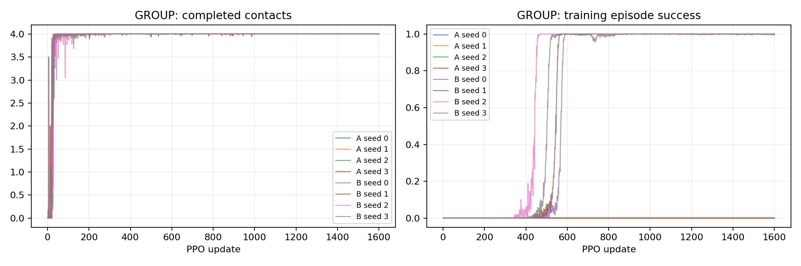
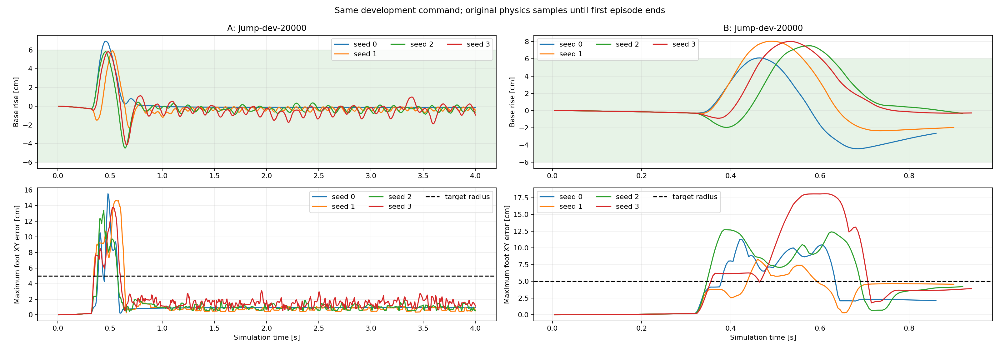

# P2-04 · 착지 후 지지와 수직속도 비용

동일한 정밀 착지 및 안정화 성공 계약에서 P2-03 A와 착지 후 비용을 추가한 B를 비교한다.

비교 전체 314,572,800 환경 step, 신규 157,286,400step. [사전 프로토콜](p2-04-protocol.md).

| 발 | 조건 | seed | 안정화 성공 | 필요 착지 완료 | 낙상 | 시간초과 | ≥20ms 전 발 무접촉 |
|---|---|---:|---:|---:|---:|---:|---:|---:|
| GROUP | A | 0 | 0/64 | 64/64 | 0/64 | 64/64 | 64/64 |
| GROUP | A | 1 | 8/64 | 64/64 | 0/64 | 56/64 | 64/64 |
| GROUP | A | 2 | 0/64 | 64/64 | 0/64 | 64/64 | 64/64 |
| GROUP | A | 3 | 0/64 | 64/64 | 0/64 | 64/64 | 64/64 |
| GROUP | B | 0 | 64/64 | 64/64 | 0/64 | 0/64 | 64/64 |
| GROUP | B | 1 | 64/64 | 64/64 | 0/64 | 0/64 | 64/64 |
| GROUP | B | 2 | 64/64 | 64/64 | 0/64 | 0/64 | 64/64 |
| GROUP | B | 3 | 64/64 | 64/64 | 0/64 | 0/64 | 64/64 |

## 도약 계약 지표

| 조건 | seed | 유효 비행 | 비행 후 재접촉 | 최종 안정화 | 비발 접촉 종료 | 평균 비행 apex 상승 | 높이 명령 충족 | 네 발 첫 접촉 반경 내 | 최종 높이 범위 밖 |
|---|---:|---:|---:|---:|---:|---:|---:|---:|---:|
| A | 0 | 64/64 | 64/64 | 0/64 | 0 | 6.94 cm | 64/64 | 64/64 | 0/64 |
| A | 1 | 64/64 | 64/64 | 8/64 | 0 | 5.94 cm | 64/64 | 64/64 | 0/64 |
| A | 2 | 64/64 | 64/64 | 0/64 | 0 | 5.84 cm | 63/64 | 64/64 | 0/64 |
| A | 3 | 64/64 | 64/64 | 0/64 | 0 | 5.82 cm | 63/64 | 64/64 | 0/64 |
| B | 0 | 64/64 | 64/64 | 64/64 | 0 | 6.10 cm | 64/64 | 64/64 | 0/64 |
| B | 1 | 64/64 | 64/64 | 64/64 | 0 | 8.03 cm | 64/64 | 64/64 | 0/64 |
| B | 2 | 64/64 | 64/64 | 64/64 | 0 | 7.52 cm | 64/64 | 64/64 | 0/64 |
| B | 3 | 64/64 | 64/64 | 64/64 | 0 | 8.00 cm | 64/64 | 64/64 | 0/64 |

## 발별 첫 접촉

오차 평균은 관측된 첫 접촉만 포함한다. 반경 내 수의 분모는 전체 episode이며 미접촉을 성공으로 세지 않는다.

| 조건 | seed | 발 | 관측 수 | 평균 오차 | 반경 내 |
|---|---:|---|---:|---:|---:|
| A | 0 | FL | 64/64 | 0.10 cm | 64/64 |
| A | 0 | FR | 64/64 | 0.08 cm | 64/64 |
| A | 0 | RL | 64/64 | 0.07 cm | 64/64 |
| A | 0 | RR | 64/64 | 0.03 cm | 64/64 |
| A | 1 | FL | 64/64 | 0.12 cm | 64/64 |
| A | 1 | FR | 64/64 | 0.19 cm | 64/64 |
| A | 1 | RL | 64/64 | 0.23 cm | 64/64 |
| A | 1 | RR | 64/64 | 0.19 cm | 64/64 |
| A | 2 | FL | 64/64 | 0.11 cm | 64/64 |
| A | 2 | FR | 64/64 | 0.11 cm | 64/64 |
| A | 2 | RL | 64/64 | 0.30 cm | 64/64 |
| A | 2 | RR | 64/64 | 0.17 cm | 64/64 |
| A | 3 | FL | 64/64 | 0.12 cm | 64/64 |
| A | 3 | FR | 64/64 | 0.19 cm | 64/64 |
| A | 3 | RL | 64/64 | 0.07 cm | 64/64 |
| A | 3 | RR | 64/64 | 0.49 cm | 64/64 |
| B | 0 | FL | 64/64 | 0.15 cm | 64/64 |
| B | 0 | FR | 64/64 | 0.22 cm | 64/64 |
| B | 0 | RL | 64/64 | 0.10 cm | 64/64 |
| B | 0 | RR | 64/64 | 0.12 cm | 64/64 |
| B | 1 | FL | 64/64 | 0.03 cm | 64/64 |
| B | 1 | FR | 64/64 | 0.03 cm | 64/64 |
| B | 1 | RL | 64/64 | 0.03 cm | 64/64 |
| B | 1 | RR | 64/64 | 0.02 cm | 64/64 |
| B | 2 | FL | 64/64 | 0.05 cm | 64/64 |
| B | 2 | FR | 64/64 | 0.02 cm | 64/64 |
| B | 2 | RL | 64/64 | 0.04 cm | 64/64 |
| B | 2 | RR | 64/64 | 0.02 cm | 64/64 |
| B | 3 | FL | 64/64 | 0.07 cm | 64/64 |
| B | 3 | FR | 64/64 | 0.12 cm | 64/64 |
| B | 3 | RL | 64/64 | 0.04 cm | 64/64 |
| B | 3 | RR | 64/64 | 0.06 cm | 64/64 |

## 공통 지표 분리

| 조건 | seed | 기존 안정화 달성 | 첫 접촉 네 발 반경 내 |
|---|---:|---:|---:|
| A | 0 | 0/64 | 64/64 |
| A | 1 | 8/64 | 64/64 |
| A | 2 | 0/64 | 64/64 |
| A | 3 | 0/64 | 64/64 |
| B | 0 | 64/64 | 64/64 |
| B | 1 | 64/64 | 64/64 |
| B | 2 | 64/64 | 64/64 |
| B | 3 | 64/64 | 64/64 |

학습 곡선은 각 update의 종료 episode 통계다. 고정 평가 결과와 구분한다. 종료 단계는 마지막 유효 200Hz 표본이며 실제 완료 여부는 terminal metrics를 우선한다.

## 종료 단계

- GROUP A seed 0: `{'2:2': 64}`
- GROUP A seed 1: `{'2:2': 64}`
- GROUP A seed 2: `{'2:2': 64}`
- GROUP A seed 3: `{'2:2': 64}`
- GROUP B seed 0: `{'2:2': 64}`
- GROUP B seed 1: `{'2:2': 64}`
- GROUP B seed 2: `{'2:2': 64}`
- GROUP B seed 3: `{'2:2': 64}`

## 마지막 제어 표본의 안정화 조건 위반

복수 위반을 허용한다. 연속 hold 전체 구간의 실패 원인과 같지 않으며, 기록되지 않은 과거 실행은 표시하지 않는다.

- A seed 0: `{'height': 0, 'vertical_speed': 0, 'angular_speed': 0, 'foot_target': 0, 'contact_state': 64, 'support_history': 64}`
- A seed 1: `{'height': 0, 'vertical_speed': 6, 'angular_speed': 0, 'foot_target': 0, 'contact_state': 35, 'support_history': 47}`
- A seed 2: `{'height': 0, 'vertical_speed': 24, 'angular_speed': 2, 'foot_target': 0, 'contact_state': 64, 'support_history': 64}`
- A seed 3: `{'height': 0, 'vertical_speed': 31, 'angular_speed': 22, 'foot_target': 0, 'contact_state': 58, 'support_history': 63}`
- B seed 0: `{'height': 0, 'vertical_speed': 0, 'angular_speed': 0, 'foot_target': 0, 'contact_state': 0, 'support_history': 0}`
- B seed 1: `{'height': 0, 'vertical_speed': 0, 'angular_speed': 0, 'foot_target': 0, 'contact_state': 0, 'support_history': 0}`
- B seed 2: `{'height': 0, 'vertical_speed': 0, 'angular_speed': 0, 'foot_target': 0, 'contact_state': 0, 'support_history': 0}`
- B seed 3: `{'height': 0, 'vertical_speed': 0, 'angular_speed': 0, 'foot_target': 0, 'contact_state': 0, 'support_history': 0}`

## 해석 및 다음 판단

동일한 엄격 성공 계약에서 A=P2-03은0/8/0/0, B=P2-04는전seed64/64 성공했다. 네 발 첫 접촉 반경 충족은양쪽전seed64/64로유지됐다. 온라인firsttouch와원본200Hz오차일치,8run의hash/UUID/회수검사를통과했다.
B의최종높이·수직속도·각속도·목표반경·접촉상태·history 위반은전부0이었다. 최초착지뒤연속0.2초안정화를실제종료조건으로확인했으며목표허용범위를완화하지않았다.
성공한B는일찍종료되므로전체착지단계RMS를4초시간초과A와그대로비교하면관측길이편향이있다. 사후보조분석으로최초발접촉부터동일40물리표본(0.2초)을비교했다. 모든조건64개episode에서완전한window가있어누락제외는없었다.
동일0.2초구간에서네발모두>5N인비율은A의2.5/36.9/9.8/10.0%에서B의57.4/77.5/62.5/55.0%로증가했다. 전발<2N 재비행표본은B의전seed0이었다. 이threshold지표는최종history/hysteresis와별도다.
동일window 수직속도RMS는A .281/.360/.552/.542m/s, B .439/.394/.343/.324m/s였다. seed0/1은오히려증가했으므로모든조건의수직충격·속도가감소했다고주장하지않는다. 초기충격과그이후의안정화를구분하며,이번결과는결합보상수정의과제성공개선이다.

범위는동일초기자세·평지·작은높이명령의개발평가다. 실기/갭/외란/연속코스나최종시험성능을증명하지않는다. 모델자동승격없음. 다음은수평목표도약이며출발영역과실제비행중이동량을함께검증해걸어간뒤제자리점프하는우회를구분한다.

## 범위·재현

개발 조건의 탐색적 실험이다. 평가 episode 수와 독립 학습 seed 수를 구분하며 최종 시험 결과로 주장하지 않는다. 같은 발의 평가 시나리오가 동일함을 확인했다. 설정·checkpoint·원본200Hz NPZ는 artifacts, 최종16대병렬영상은 result에 보존한다. 재사용 대조군 원본은 변경하지 않는다.

실행 목록 및 보고서 명세: `configs/reports/p2-04.json`. 이 보고서는 `scripts/experiment_report.py`로 재생성한다.
