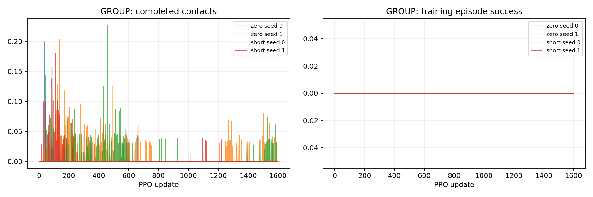

# P2-06 · 수평 도약 학습 거리 범위

제자리와0–5cm 학습을 동일 수평 도약 계약으로 비교한다. 각 조건의 학습 범위를 벗어난 거리 평가는 전이 진단이다.

비교 전체 157,286,400 환경 step, 신규 157,286,400step. [사전 프로토콜](p2-06-protocol.md).

| 발 | 조건 | seed | 수평 도약 성공 | 필요 착지 완료 | 낙상 | 시간초과 | ≥20ms 전 발 무접촉 |
|---|---|---:|---:|---:|---:|---:|---:|---:|
| GROUP | zero | 0 | 0/64 | 0/64 | 0/64 | 64/64 | 64/64 |
| GROUP | zero | 1 | 0/64 | 0/64 | 0/64 | 64/64 | 64/64 |
| GROUP | short | 0 | 0/64 | 0/64 | 0/64 | 64/64 | 64/64 |
| GROUP | short | 1 | 0/64 | 0/64 | 0/64 | 64/64 | 64/64 |

## 도약 계약 지표

| 조건 | seed | 유효 비행 | 비행 후 재접촉 | 수평 도약 성공 | 비발 접촉 종료 | 평균 비행 apex 상승 | 높이 명령 충족 | 네 발 첫 접촉 반경 내 | 최종 높이 범위 밖 |
|---|---:|---:|---:|---:|---:|---:|---:|---:|---:|
| zero | 0 | 0/64 | 0/64 | 0/64 | 0 | 0.00 cm | 0/64 | 0/64 | 0/64 |
| zero | 1 | 0/64 | 0/64 | 0/64 | 0 | 0.00 cm | 0/64 | 0/64 | 0/64 |
| short | 0 | 0/64 | 0/64 | 0/64 | 0 | 0.00 cm | 0/64 | 0/64 | 0/64 |
| short | 1 | 0/64 | 0/64 | 0/64 | 0 | 0.00 cm | 0/64 | 0/64 | 0/64 |

## 발별 첫 접촉

오차 평균은 관측된 첫 접촉만 포함한다. 반경 내 수의 분모는 전체 episode이며 미접촉을 성공으로 세지 않는다.

| 조건 | seed | 발 | 관측 수 | 평균 오차 | 반경 내 |
|---|---:|---|---:|---:|---:|
| zero | 0 | FL | 0/64 | N/A | 0/64 |
| zero | 0 | FR | 0/64 | N/A | 0/64 |
| zero | 0 | RL | 0/64 | N/A | 0/64 |
| zero | 0 | RR | 0/64 | N/A | 0/64 |
| zero | 1 | FL | 0/64 | N/A | 0/64 |
| zero | 1 | FR | 0/64 | N/A | 0/64 |
| zero | 1 | RL | 0/64 | N/A | 0/64 |
| zero | 1 | RR | 0/64 | N/A | 0/64 |
| short | 0 | FL | 0/64 | N/A | 0/64 |
| short | 0 | FR | 0/64 | N/A | 0/64 |
| short | 0 | RL | 0/64 | N/A | 0/64 |
| short | 0 | RR | 0/64 | N/A | 0/64 |
| short | 1 | FL | 0/64 | N/A | 0/64 |
| short | 1 | FR | 0/64 | N/A | 0/64 |
| short | 1 | RL | 0/64 | N/A | 0/64 |
| short | 1 | RR | 0/64 | N/A | 0/64 |

## 공통 지표 분리

| 조건 | seed | 기존 안정화 달성 | 첫 접촉 네 발 반경 내 |
|---|---:|---:|---:|
| zero | 0 | 0/64 | 0/64 |
| zero | 1 | 0/64 | 0/64 |
| short | 0 | 0/64 | 0/64 |
| short | 1 | 0/64 | 0/64 |

## 출발 계약과 궤적 부분집합

3cm 내 성공 궤적 수는 현재 실행에서의 부분집합이다. 다른 출발 반경으로 재실행한 평가를 대체하지 않는다.

| 조건 | seed | 실행 출발 반경 | 3cm 내 출발 / 전체 | 3cm 내 성공 / 전체 |
|---|---:|---:|---:|---:|
| zero | 0 | 3 cm | 0/64 | 0/64 |
| zero | 1 | 3 cm | 0/64 | 0/64 |
| short | 0 | 3 cm | 0/64 | 0/64 |
| short | 1 | 3 cm | 0/64 | 0/64 |

## 거리별 평가

| 조건 | seed | 전방 목표 | 성공 | 출발 영역 | 실비행 이동 충족 | 첫 접촉 반경 | 안정화 |
|---|---:|---:|---:|---:|---:|---:|---:|
| zero | 0 | 0 cm | 0/16 | 0/16 | 0/16 | 0/16 | 0/16 |
| zero | 0 | 5 cm | 0/16 | 0/16 | 0/16 | 0/16 | 0/16 |
| zero | 0 | 10 cm | 0/16 | 0/16 | 0/16 | 0/16 | 0/16 |
| zero | 0 | 15 cm | 0/16 | 0/16 | 0/16 | 0/16 | 0/16 |
| zero | 1 | 0 cm | 0/16 | 0/16 | 0/16 | 0/16 | 0/16 |
| zero | 1 | 5 cm | 0/16 | 0/16 | 0/16 | 0/16 | 0/16 |
| zero | 1 | 10 cm | 0/16 | 0/16 | 0/16 | 0/16 | 0/16 |
| zero | 1 | 15 cm | 0/16 | 0/16 | 0/16 | 0/16 | 0/16 |
| short | 0 | 0 cm | 0/16 | 0/16 | 0/16 | 0/16 | 0/16 |
| short | 0 | 5 cm | 0/16 | 0/16 | 0/16 | 0/16 | 0/16 |
| short | 0 | 10 cm | 0/16 | 0/16 | 0/16 | 0/16 | 0/16 |
| short | 0 | 15 cm | 0/16 | 0/16 | 0/16 | 0/16 | 0/16 |
| short | 1 | 0 cm | 0/16 | 0/16 | 0/16 | 0/16 | 0/16 |
| short | 1 | 5 cm | 0/16 | 0/16 | 0/16 | 0/16 | 0/16 |
| short | 1 | 10 cm | 0/16 | 0/16 | 0/16 | 0/16 | 0/16 |
| short | 1 | 15 cm | 0/16 | 0/16 | 0/16 | 0/16 | 0/16 |

학습 곡선은 각 update의 종료 episode 통계다. 고정 평가 결과와 구분한다. 종료 단계는 마지막 유효 200Hz 표본이며 실제 완료 여부는 terminal metrics를 우선한다.

## 종료 단계

- GROUP zero seed 0: `{'0:0': 64}`
- GROUP zero seed 1: `{'0:0': 64}`
- GROUP short seed 0: `{'0:0': 64}`
- GROUP short seed 1: `{'0:0': 64}`

## 마지막 제어 표본의 안정화 조건 위반

복수 위반을 허용한다. 연속 hold 전체 구간의 실패 원인과 같지 않으며, 기록되지 않은 과거 실행은 표시하지 않는다.

- zero seed 0: `{'height': 0, 'vertical_speed': 64, 'angular_speed': 0, 'foot_target': 64, 'contact_state': 64, 'support_history': 64}`
- zero seed 1: `{'height': 0, 'vertical_speed': 64, 'angular_speed': 0, 'foot_target': 64, 'contact_state': 64, 'support_history': 64}`
- short seed 0: `{'height': 0, 'vertical_speed': 64, 'angular_speed': 0, 'foot_target': 64, 'contact_state': 64, 'support_history': 64}`
- short seed 1: `{'height': 0, 'vertical_speed': 60, 'angular_speed': 12, 'foot_target': 64, 'contact_state': 64, 'support_history': 64}`

## 해석 및 다음 판단

제자리 및0–5cm 학습 모두 두 seed에서 유효 비행0/64, 과제 성공0/64였다. 학습 범위 안인0cm에서도 회복되지 않아 목표 거리 폭만으로 실패를 설명할 수 없다.
원본50Hz 제어 경계의 최대 상승은 전체1.26–2.46cm로3cm 비행 기준 미달이다. 20ms 무접촉 이력과 양의 상승속도는 모든 episode에서 관측됐다.
학습4개·평가4개 무결성 감사 및 원본 첫 접촉/몸체 좌표 대조 절차 통과. 이번 결과에는 유효 비행 양성 사례가 없으며 해당 대조는 음성 사례에 한정된다. 영상4개 result/보존, GPU 회수 확인.
기존 P2-04 성공 정책은 비행 확인 시 몸체가 출발점에서4.18–5.06cm 이동해 있었다. 다음 P2-07은 출발 반경6cm를 진단 비교하며,3cm 계약을 달성한 것으로 간주하지 않는다.

## 범위·재현

개발 조건의 탐색적 실험이다. 평가 episode 수와 독립 학습 seed 수를 구분하며 최종 시험 결과로 주장하지 않는다. 같은 발의 평가 시나리오가 동일함을 확인했다. 설정·checkpoint·원본200Hz NPZ는 artifacts, 최종16대병렬영상은 result에 보존한다. 재사용 대조군 원본은 변경하지 않는다.

실행 목록 및 보고서 명세: `configs/reports/p2-06.json`. 이 보고서는 `scripts/experiment_report.py`로 재생성한다.
