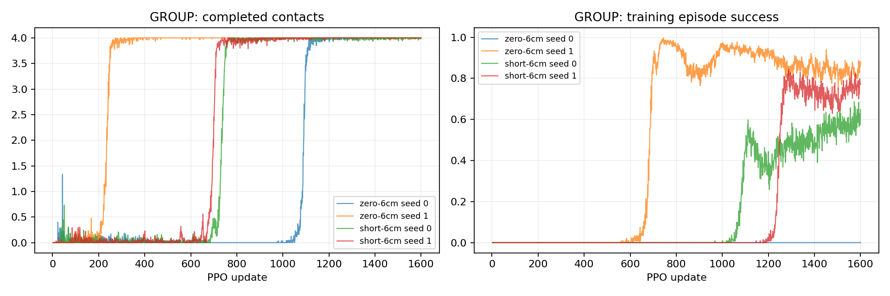

# P2-07 · 출발 영역 진단

출발 반경6cm에서 제자리/0–5cm 학습을 검사한다. P2-06의3cm 성공 기준과 다르므로 성공률을 동일 기준 개선으로 해석하지 않는다.

비교 전체 157,286,400 환경 step, 신규 157,286,400step. [사전 프로토콜](p2-07-protocol.md).

| 발 | 조건 | seed | 수평 도약 성공 | 필요 착지 완료 | 낙상 | 시간초과 | ≥20ms 전 발 무접촉 |
|---|---|---:|---:|---:|---:|---:|---:|---:|
| GROUP | zero-6cm | 0 | 0/64 | 64/64 | 3/64 | 61/64 | 64/64 |
| GROUP | zero-6cm | 1 | 31/64 | 64/64 | 0/64 | 33/64 | 64/64 |
| GROUP | short-6cm | 0 | 16/64 | 64/64 | 0/64 | 48/64 | 64/64 |
| GROUP | short-6cm | 1 | 16/64 | 64/64 | 0/64 | 48/64 | 64/64 |

## 도약 계약 지표

| 조건 | seed | 유효 비행 | 비행 후 재접촉 | 수평 도약 성공 | 비발 접촉 종료 | 평균 비행 apex 상승 | 높이 명령 충족 | 네 발 첫 접촉 반경 내 | 최종 높이 범위 밖 |
|---|---:|---:|---:|---:|---:|---:|---:|---:|---:|
| zero-6cm | 0 | 64/64 | 64/64 | 0/64 | 3 | 7.82 cm | 64/64 | 16/64 | 5/64 |
| zero-6cm | 1 | 64/64 | 64/64 | 31/64 | 0 | 5.86 cm | 57/64 | 32/64 | 0/64 |
| short-6cm | 0 | 64/64 | 64/64 | 16/64 | 0 | 8.09 cm | 64/64 | 48/64 | 0/64 |
| short-6cm | 1 | 64/64 | 64/64 | 16/64 | 0 | 6.56 cm | 62/64 | 62/64 | 0/64 |

## 발별 첫 접촉

오차 평균은 관측된 첫 접촉만 포함한다. 반경 내 수의 분모는 전체 episode이며 미접촉을 성공으로 세지 않는다.

| 조건 | seed | 발 | 관측 수 | 평균 오차 | 반경 내 |
|---|---:|---|---:|---:|---:|
| zero-6cm | 0 | FL | 64/64 | 5.96 cm | 32/64 |
| zero-6cm | 0 | FR | 64/64 | 9.60 cm | 16/64 |
| zero-6cm | 0 | RL | 64/64 | 5.85 cm | 32/64 |
| zero-6cm | 0 | RR | 64/64 | 5.58 cm | 32/64 |
| zero-6cm | 1 | FL | 64/64 | 2.29 cm | 57/64 |
| zero-6cm | 1 | FR | 64/64 | 4.46 cm | 48/64 |
| zero-6cm | 1 | RL | 64/64 | 3.92 cm | 47/64 |
| zero-6cm | 1 | RR | 64/64 | 4.27 cm | 32/64 |
| short-6cm | 0 | FL | 64/64 | 4.25 cm | 48/64 |
| short-6cm | 0 | FR | 64/64 | 2.94 cm | 64/64 |
| short-6cm | 0 | RL | 64/64 | 1.86 cm | 64/64 |
| short-6cm | 0 | RR | 64/64 | 3.20 cm | 64/64 |
| short-6cm | 1 | FL | 64/64 | 2.09 cm | 64/64 |
| short-6cm | 1 | FR | 64/64 | 2.38 cm | 62/64 |
| short-6cm | 1 | RL | 64/64 | 3.02 cm | 64/64 |
| short-6cm | 1 | RR | 64/64 | 2.02 cm | 64/64 |

## 공통 지표 분리

| 조건 | seed | 기존 안정화 달성 | 첫 접촉 네 발 반경 내 |
|---|---:|---:|---:|
| zero-6cm | 0 | 0/64 | 16/64 |
| zero-6cm | 1 | 31/64 | 32/64 |
| short-6cm | 0 | 63/64 | 48/64 |
| short-6cm | 1 | 33/64 | 62/64 |

## 출발 계약과 궤적 부분집합

3cm 내 성공 궤적 수는 현재 실행에서의 부분집합이다. 다른 출발 반경으로 재실행한 평가를 대체하지 않는다.

| 조건 | seed | 실행 출발 반경 | 3cm 내 출발 / 전체 | 3cm 내 성공 / 전체 |
|---|---:|---:|---:|---:|
| zero-6cm | 0 | 6 cm | 48/64 | 0/64 |
| zero-6cm | 1 | 6 cm | 64/64 | 31/64 |
| short-6cm | 0 | 6 cm | 32/64 | 0/64 |
| short-6cm | 1 | 6 cm | 48/64 | 0/64 |

## 거리별 평가

| 조건 | seed | 전방 목표 | 성공 | 출발 영역 | 실비행 이동 충족 | 첫 접촉 반경 | 안정화 |
|---|---:|---:|---:|---:|---:|---:|---:|
| zero-6cm | 0 | 0 cm | 0/16 | 16/16 | 16/16 | 16/16 | 0/16 |
| zero-6cm | 0 | 5 cm | 0/16 | 16/16 | 16/16 | 0/16 | 0/16 |
| zero-6cm | 0 | 10 cm | 0/16 | 16/16 | 0/16 | 0/16 | 0/16 |
| zero-6cm | 0 | 15 cm | 0/16 | 16/16 | 0/16 | 0/16 | 0/16 |
| zero-6cm | 1 | 0 cm | 15/16 | 16/16 | 16/16 | 16/16 | 15/16 |
| zero-6cm | 1 | 5 cm | 16/16 | 16/16 | 16/16 | 16/16 | 16/16 |
| zero-6cm | 1 | 10 cm | 0/16 | 16/16 | 0/16 | 0/16 | 0/16 |
| zero-6cm | 1 | 15 cm | 0/16 | 16/16 | 0/16 | 0/16 | 0/16 |
| short-6cm | 0 | 0 cm | 16/16 | 16/16 | 16/16 | 16/16 | 16/16 |
| short-6cm | 0 | 5 cm | 0/16 | 16/16 | 0/16 | 16/16 | 16/16 |
| short-6cm | 0 | 10 cm | 0/16 | 16/16 | 0/16 | 16/16 | 16/16 |
| short-6cm | 0 | 15 cm | 0/16 | 16/16 | 0/16 | 0/16 | 15/16 |
| short-6cm | 1 | 0 cm | 16/16 | 16/16 | 16/16 | 16/16 | 16/16 |
| short-6cm | 1 | 5 cm | 0/16 | 16/16 | 0/16 | 16/16 | 16/16 |
| short-6cm | 1 | 10 cm | 0/16 | 16/16 | 0/16 | 16/16 | 1/16 |
| short-6cm | 1 | 15 cm | 0/16 | 16/16 | 0/16 | 14/16 | 0/16 |

학습 곡선은 각 update의 종료 episode 통계다. 고정 평가 결과와 구분한다. 종료 단계는 마지막 유효 200Hz 표본이며 실제 완료 여부는 terminal metrics를 우선한다.

## 종료 단계

- GROUP zero-6cm seed 0: `{'2:2': 64}`
- GROUP zero-6cm seed 1: `{'2:2': 64}`
- GROUP short-6cm seed 0: `{'2:2': 64}`
- GROUP short-6cm seed 1: `{'2:2': 64}`

## 마지막 제어 표본의 안정화 조건 위반

복수 위반을 허용한다. 연속 hold 전체 구간의 실패 원인과 같지 않으며, 기록되지 않은 과거 실행은 표시하지 않는다.

- zero-6cm seed 0: `{'height': 5, 'vertical_speed': 11, 'angular_speed': 9, 'foot_target': 64, 'contact_state': 9, 'support_history': 10}`
- zero-6cm seed 1: `{'height': 0, 'vertical_speed': 0, 'angular_speed': 0, 'foot_target': 32, 'contact_state': 0, 'support_history': 0}`
- short-6cm seed 0: `{'height': 0, 'vertical_speed': 0, 'angular_speed': 0, 'foot_target': 25, 'contact_state': 0, 'support_history': 0}`
- short-6cm seed 1: `{'height': 0, 'vertical_speed': 0, 'angular_speed': 0, 'foot_target': 36, 'contact_state': 1, 'support_history': 1}`

## 해석 및 다음 판단

출발 반경6cm에서 네 실행 모두 유효 비행64/64로 회복됐다. P2-06은 모두0/64였다. 성공 계약이 달라 동일 기준의 성공률 개선으로 주장하지 않는다.
제자리 seed0/1 성공은0/31, 짧은 거리 seed0/1은16/16이다. 거리별로 짧은 거리 정책은0cm만16/16 성공했다.5cm에서는 첫 접촉 정밀·안정화는두 seed 모두16/16이지만 실비행 이동 조건은0/16이다.
5cm 명령의 실제 비행 전방 이동은 short seed0에서1.47–1.50cm, seed1에서1.59–1.82cm로 최소2cm에 미달했다. 목표 발 접촉만 맞추는 것과 몸체의 충분한 비행 이동은 다르다.
zero seed1은0cm15/16,5cm16/16 성공하며5cm에서비행 이동5.66–5.94cm였다. 학습 범위 밖5cm로의 전이이며 두 seed의 재현 가능한 일반 능력을 뜻하지 않는다.
6cm 실행 궤적 중3cm 내 성공은zero seed1의31개뿐이다. 이 부분집합을3cm 종료 조건 재실행의 대체로 간주하지 않는다. 다음으로 고정 모델의3cm 조건 재평가를 수행한다.
학습4개·평가4개 감사 및 원본 first-touch/launch/first-touch root XY 대조를 통과했다. 영상4개를 result/에 상세 제목으로 보존한다. 자동 모델 승격 없음.

## 범위·재현

개발 조건의 탐색적 실험이다. 평가 episode 수와 독립 학습 seed 수를 구분하며 최종 시험 결과로 주장하지 않는다. 같은 발의 평가 시나리오가 동일함을 확인했다. 설정·checkpoint·원본200Hz NPZ는 artifacts, 최종16대병렬영상은 result에 보존한다. 재사용 대조군 원본은 변경하지 않는다.

실행 목록 및 보고서 명세: `configs/reports/p2-07.json`. 이 보고서는 `scripts/experiment_report.py`로 재생성한다.
