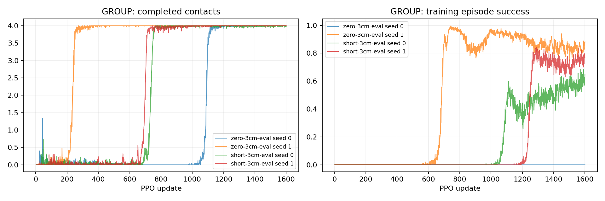

# P2-07 · 3cm 출발 조건 재평가

고정된6cm 학습 정책을3cm 출발 종료 조건에서 재평가한다. 추가 학습 없음.

비교 전체 157,286,400 환경 step, 신규 0step. [사전 프로토콜](p2-07-strict-evaluation-protocol.md).

| 발 | 조건 | seed | 수평 도약 성공 | 필요 착지 완료 | 낙상 | 시간초과 | ≥20ms 전 발 무접촉 |
|---|---|---:|---:|---:|---:|---:|---:|---:|
| GROUP | zero-3cm-eval | 0 | 0/64 | 48/64 | 16/64 | 48/64 | 64/64 |
| GROUP | zero-3cm-eval | 1 | 31/64 | 64/64 | 0/64 | 33/64 | 64/64 |
| GROUP | short-3cm-eval | 0 | 0/64 | 32/64 | 32/64 | 32/64 | 64/64 |
| GROUP | short-3cm-eval | 1 | 0/64 | 48/64 | 16/64 | 48/64 | 64/64 |

## 도약 계약 지표

| 조건 | seed | 유효 비행 | 비행 후 재접촉 | 수평 도약 성공 | 비발 접촉 종료 | 평균 비행 apex 상승 | 높이 명령 충족 | 네 발 첫 접촉 반경 내 | 최종 높이 범위 밖 |
|---|---:|---:|---:|---:|---:|---:|---:|---:|---:|
| zero-3cm-eval | 0 | 64/64 | 48/64 | 0/64 | 0 | 7.41 cm | 63/64 | 16/64 | 0/64 |
| zero-3cm-eval | 1 | 64/64 | 64/64 | 31/64 | 0 | 5.86 cm | 57/64 | 32/64 | 0/64 |
| short-3cm-eval | 0 | 64/64 | 32/64 | 0/64 | 0 | 7.16 cm | 57/64 | 16/64 | 5/64 |
| short-3cm-eval | 1 | 64/64 | 48/64 | 0/64 | 0 | 6.01 cm | 55/64 | 46/64 | 1/64 |

## 발별 첫 접촉

오차 평균은 관측된 첫 접촉만 포함한다. 반경 내 수의 분모는 전체 episode이며 미접촉을 성공으로 세지 않는다.

| 조건 | seed | 발 | 관측 수 | 평균 오차 | 반경 내 |
|---|---:|---|---:|---:|---:|
| zero-3cm-eval | 0 | FL | 48/64 | 3.65 cm | 32/64 |
| zero-3cm-eval | 0 | FR | 48/64 | 6.99 cm | 16/64 |
| zero-3cm-eval | 0 | RL | 48/64 | 3.73 cm | 32/64 |
| zero-3cm-eval | 0 | RR | 48/64 | 3.73 cm | 32/64 |
| zero-3cm-eval | 1 | FL | 64/64 | 2.29 cm | 57/64 |
| zero-3cm-eval | 1 | FR | 64/64 | 4.46 cm | 48/64 |
| zero-3cm-eval | 1 | RL | 64/64 | 3.92 cm | 47/64 |
| zero-3cm-eval | 1 | RR | 64/64 | 4.27 cm | 32/64 |
| short-3cm-eval | 0 | FL | 32/64 | 6.31 cm | 16/64 |
| short-3cm-eval | 0 | FR | 32/64 | 3.03 cm | 32/64 |
| short-3cm-eval | 0 | RL | 32/64 | 2.37 cm | 32/64 |
| short-3cm-eval | 0 | RR | 32/64 | 2.94 cm | 32/64 |
| short-3cm-eval | 1 | FL | 48/64 | 2.48 cm | 48/64 |
| short-3cm-eval | 1 | FR | 48/64 | 2.68 cm | 46/64 |
| short-3cm-eval | 1 | RL | 48/64 | 2.81 cm | 48/64 |
| short-3cm-eval | 1 | RR | 48/64 | 2.15 cm | 48/64 |

## 공통 지표 분리

| 조건 | seed | 기존 안정화 달성 | 첫 접촉 네 발 반경 내 |
|---|---:|---:|---:|
| zero-3cm-eval | 0 | 0/64 | 16/64 |
| zero-3cm-eval | 1 | 31/64 | 32/64 |
| short-3cm-eval | 0 | 31/64 | 16/64 |
| short-3cm-eval | 1 | 17/64 | 46/64 |

## 출발 계약과 궤적 부분집합

3cm 내 성공 궤적 수는 현재 실행에서의 부분집합이다. 다른 출발 반경으로 재실행한 평가를 대체하지 않는다.

| 조건 | seed | 실행 출발 반경 | 3cm 내 출발 / 전체 | 3cm 내 성공 / 전체 |
|---|---:|---:|---:|---:|
| zero-3cm-eval | 0 | 3 cm | 48/64 | 0/64 |
| zero-3cm-eval | 1 | 3 cm | 64/64 | 31/64 |
| short-3cm-eval | 0 | 3 cm | 32/64 | 0/64 |
| short-3cm-eval | 1 | 3 cm | 48/64 | 0/64 |

## 거리별 평가

| 조건 | seed | 전방 목표 | 성공 | 출발 영역 | 실비행 이동 충족 | 첫 접촉 반경 | 안정화 |
|---|---:|---:|---:|---:|---:|---:|---:|
| zero-3cm-eval | 0 | 0 cm | 0/16 | 16/16 | 16/16 | 16/16 | 0/16 |
| zero-3cm-eval | 0 | 5 cm | 0/16 | 16/16 | 16/16 | 0/16 | 0/16 |
| zero-3cm-eval | 0 | 10 cm | 0/16 | 16/16 | 0/16 | 0/16 | 0/16 |
| zero-3cm-eval | 0 | 15 cm | 0/16 | 0/16 | 0/16 | 0/16 | 0/16 |
| zero-3cm-eval | 1 | 0 cm | 15/16 | 16/16 | 16/16 | 16/16 | 15/16 |
| zero-3cm-eval | 1 | 5 cm | 16/16 | 16/16 | 16/16 | 16/16 | 16/16 |
| zero-3cm-eval | 1 | 10 cm | 0/16 | 16/16 | 0/16 | 0/16 | 0/16 |
| zero-3cm-eval | 1 | 15 cm | 0/16 | 16/16 | 0/16 | 0/16 | 0/16 |
| short-3cm-eval | 0 | 0 cm | 0/16 | 0/16 | 0/16 | 0/16 | 0/16 |
| short-3cm-eval | 0 | 5 cm | 0/16 | 0/16 | 0/16 | 0/16 | 0/16 |
| short-3cm-eval | 0 | 10 cm | 0/16 | 16/16 | 0/16 | 16/16 | 16/16 |
| short-3cm-eval | 0 | 15 cm | 0/16 | 16/16 | 0/16 | 0/16 | 15/16 |
| short-3cm-eval | 1 | 0 cm | 0/16 | 0/16 | 0/16 | 0/16 | 0/16 |
| short-3cm-eval | 1 | 5 cm | 0/16 | 16/16 | 0/16 | 16/16 | 16/16 |
| short-3cm-eval | 1 | 10 cm | 0/16 | 16/16 | 0/16 | 16/16 | 1/16 |
| short-3cm-eval | 1 | 15 cm | 0/16 | 16/16 | 0/16 | 14/16 | 0/16 |

학습 곡선은 각 update의 종료 episode 통계다. 고정 평가 결과와 구분한다. 종료 단계는 마지막 유효 200Hz 표본이며 실제 완료 여부는 terminal metrics를 우선한다.

## 종료 단계

- GROUP zero-3cm-eval seed 0: `{'0:0': 16, '2:2': 48}`
- GROUP zero-3cm-eval seed 1: `{'2:2': 64}`
- GROUP short-3cm-eval seed 0: `{'0:0': 32, '2:2': 32}`
- GROUP short-3cm-eval seed 1: `{'0:0': 16, '2:2': 48}`

## 마지막 제어 표본의 안정화 조건 위반

복수 위반을 허용한다. 연속 hold 전체 구간의 실패 원인과 같지 않으며, 기록되지 않은 과거 실행은 표시하지 않는다.

- zero-3cm-eval seed 0: `{'height': 0, 'vertical_speed': 16, 'angular_speed': 16, 'foot_target': 64, 'contact_state': 16, 'support_history': 16}`
- zero-3cm-eval seed 1: `{'height': 0, 'vertical_speed': 0, 'angular_speed': 0, 'foot_target': 32, 'contact_state': 0, 'support_history': 0}`
- short-3cm-eval seed 0: `{'height': 5, 'vertical_speed': 32, 'angular_speed': 32, 'foot_target': 57, 'contact_state': 32, 'support_history': 32}`
- short-3cm-eval seed 1: `{'height': 1, 'vertical_speed': 16, 'angular_speed': 15, 'foot_target': 52, 'contact_state': 17, 'support_history': 17}`

## 해석 및 다음 판단

추가 학습 없이 네 checkpoint를3cm 출발 종료 조건으로 재평가했다. 원래 checkpoint 계약 검사는 유지하고 평가 override를 명시적으로 기록했다.
zero seed1만31/64 성공:0cm15/16,5cm16/16. 다른 세 모델은0/64. 6cm 실행의3cm 내 성공 부분집합과 일치했지만 실제 재실행으로 확인한 별도 결과다.
출발 영역 위반 종료는 zero seed0에서16/64, short seed0에서32/64, short seed1에서16/64였다. zero seed1은0건.5cm 목표 short seed1은출발·첫접촉·안정화를충족하지만비행이동부족으로성공0/16이다.
한 seed의5cm 전이 성공은 여러 seed의 수평 명령 학습 재현성을 증명하지 않는다. 다음은 실비행 거리의 보상·학습 유인을 조사하며 성공 기준은 변경하지 않는다.
네 재평가 감사 및 원본좌표 대조 통과, 영상4개 보존, GPU회수 확인. 학습예산0step. 모델자동승격없음.

## 범위·재현

개발 조건의 탐색적 실험이다. 평가 episode 수와 독립 학습 seed 수를 구분하며 최종 시험 결과로 주장하지 않는다. 같은 발의 평가 시나리오가 동일함을 확인했다. 설정·checkpoint·원본200Hz NPZ는 artifacts, 최종16대병렬영상은 result에 보존한다. 재사용 대조군 원본은 변경하지 않는다.

실행 목록 및 보고서 명세: `configs/reports/p2-07-strict.json`. 이 보고서는 `scripts/experiment_report.py`로 재생성한다.
