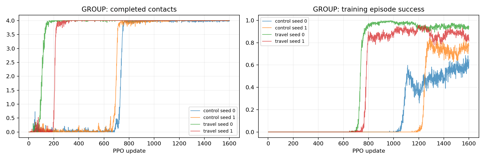

# P2-08 · 최초 착지 비행거리 보상

동일6cm 출발 계약·0–5cm 학습에서 비행거리 첫 착지 보상0/4를 비교한다.

비교 전체 157,286,400 환경 step, 신규 157,286,400step. [사전 프로토콜](p2-08-protocol.md).

| 발 | 조건 | seed | 수평 도약 성공 | 필요 착지 완료 | 낙상 | 시간초과 | ≥20ms 전 발 무접촉 |
|---|---|---:|---:|---:|---:|---:|---:|---:|
| GROUP | control | 0 | 16/64 | 64/64 | 0/64 | 48/64 | 64/64 |
| GROUP | control | 1 | 16/64 | 64/64 | 0/64 | 48/64 | 64/64 |
| GROUP | travel | 0 | 32/64 | 32/64 | 32/64 | 0/64 | 64/64 |
| GROUP | travel | 1 | 24/64 | 32/64 | 32/64 | 8/64 | 40/64 |

## 도약 계약 지표

| 조건 | seed | 유효 비행 | 비행 후 재접촉 | 수평 도약 성공 | 비발 접촉 종료 | 평균 비행 apex 상승 | 높이 명령 충족 | 네 발 첫 접촉 반경 내 | 최종 높이 범위 밖 |
|---|---:|---:|---:|---:|---:|---:|---:|---:|---:|
| control | 0 | 64/64 | 64/64 | 16/64 | 0 | 8.09 cm | 64/64 | 48/64 | 0/64 |
| control | 1 | 64/64 | 64/64 | 16/64 | 0 | 6.56 cm | 62/64 | 62/64 | 0/64 |
| travel | 0 | 32/64 | 32/64 | 32/64 | 32 | 3.13 cm | 32/64 | 32/64 | 16/64 |
| travel | 1 | 39/64 | 32/64 | 24/64 | 25 | 3.19 cm | 25/64 | 32/64 | 0/64 |

## 발별 첫 접촉

오차 평균은 관측된 첫 접촉만 포함한다. 반경 내 수의 분모는 전체 episode이며 미접촉을 성공으로 세지 않는다.

| 조건 | seed | 발 | 관측 수 | 평균 오차 | 반경 내 |
|---|---:|---|---:|---:|---:|
| control | 0 | FL | 64/64 | 4.25 cm | 48/64 |
| control | 0 | FR | 64/64 | 2.94 cm | 64/64 |
| control | 0 | RL | 64/64 | 1.86 cm | 64/64 |
| control | 0 | RR | 64/64 | 3.20 cm | 64/64 |
| control | 1 | FL | 64/64 | 2.09 cm | 64/64 |
| control | 1 | FR | 64/64 | 2.38 cm | 62/64 |
| control | 1 | RL | 64/64 | 3.02 cm | 64/64 |
| control | 1 | RR | 64/64 | 2.02 cm | 64/64 |
| travel | 0 | FL | 32/64 | 0.30 cm | 32/64 |
| travel | 0 | FR | 32/64 | 0.68 cm | 32/64 |
| travel | 0 | RL | 32/64 | 0.59 cm | 32/64 |
| travel | 0 | RR | 32/64 | 0.57 cm | 32/64 |
| travel | 1 | FL | 32/64 | 3.12 cm | 32/64 |
| travel | 1 | FR | 32/64 | 1.31 cm | 32/64 |
| travel | 1 | RL | 32/64 | 0.73 cm | 32/64 |
| travel | 1 | RR | 32/64 | 1.05 cm | 32/64 |

## 공통 지표 분리

| 조건 | seed | 기존 안정화 달성 | 첫 접촉 네 발 반경 내 |
|---|---:|---:|---:|
| control | 0 | 63/64 | 48/64 |
| control | 1 | 33/64 | 62/64 |
| travel | 0 | 32/64 | 32/64 |
| travel | 1 | 24/64 | 32/64 |

## 출발 계약과 궤적 부분집합

3cm 내 성공 궤적 수는 현재 실행에서의 부분집합이다. 다른 출발 반경으로 재실행한 평가를 대체하지 않는다.

| 조건 | seed | 실행 출발 반경 | 3cm 내 출발 / 전체 | 3cm 내 성공 / 전체 |
|---|---:|---:|---:|---:|
| control | 0 | 6 cm | 32/64 | 0/64 |
| control | 1 | 6 cm | 48/64 | 0/64 |
| travel | 0 | 6 cm | 32/64 | 32/64 |
| travel | 1 | 6 cm | 32/64 | 24/64 |

## 거리별 평가

| 조건 | seed | 전방 목표 | 성공 | 출발 영역 | 실비행 이동 충족 | 첫 접촉 반경 | 안정화 |
|---|---:|---:|---:|---:|---:|---:|---:|
| control | 0 | 0 cm | 16/16 | 16/16 | 16/16 | 16/16 | 16/16 |
| control | 0 | 5 cm | 0/16 | 16/16 | 0/16 | 16/16 | 16/16 |
| control | 0 | 10 cm | 0/16 | 16/16 | 0/16 | 16/16 | 16/16 |
| control | 0 | 15 cm | 0/16 | 16/16 | 0/16 | 0/16 | 15/16 |
| control | 1 | 0 cm | 16/16 | 16/16 | 16/16 | 16/16 | 16/16 |
| control | 1 | 5 cm | 0/16 | 16/16 | 0/16 | 16/16 | 16/16 |
| control | 1 | 10 cm | 0/16 | 16/16 | 0/16 | 16/16 | 1/16 |
| control | 1 | 15 cm | 0/16 | 16/16 | 0/16 | 14/16 | 0/16 |
| travel | 0 | 0 cm | 16/16 | 16/16 | 16/16 | 16/16 | 16/16 |
| travel | 0 | 5 cm | 16/16 | 16/16 | 16/16 | 16/16 | 16/16 |
| travel | 0 | 10 cm | 0/16 | 0/16 | 0/16 | 0/16 | 0/16 |
| travel | 0 | 15 cm | 0/16 | 0/16 | 0/16 | 0/16 | 0/16 |
| travel | 1 | 0 cm | 10/16 | 16/16 | 16/16 | 16/16 | 10/16 |
| travel | 1 | 5 cm | 14/16 | 16/16 | 16/16 | 16/16 | 14/16 |
| travel | 1 | 10 cm | 0/16 | 0/16 | 0/16 | 0/16 | 0/16 |
| travel | 1 | 15 cm | 0/16 | 0/16 | 0/16 | 0/16 | 0/16 |

학습 곡선은 각 update의 종료 episode 통계다. 고정 평가 결과와 구분한다. 종료 단계는 마지막 유효 200Hz 표본이며 실제 완료 여부는 terminal metrics를 우선한다.

## 종료 단계

- GROUP control seed 0: `{'2:2': 64}`
- GROUP control seed 1: `{'2:2': 64}`
- GROUP travel seed 0: `{'0:0': 32, '2:2': 32}`
- GROUP travel seed 1: `{'0:0': 32, '2:2': 32}`

## 마지막 제어 표본의 안정화 조건 위반

복수 위반을 허용한다. 연속 hold 전체 구간의 실패 원인과 같지 않으며, 기록되지 않은 과거 실행은 표시하지 않는다.

- control seed 0: `{'height': 0, 'vertical_speed': 0, 'angular_speed': 0, 'foot_target': 25, 'contact_state': 0, 'support_history': 0}`
- control seed 1: `{'height': 0, 'vertical_speed': 0, 'angular_speed': 0, 'foot_target': 36, 'contact_state': 1, 'support_history': 1}`
- travel seed 0: `{'height': 16, 'vertical_speed': 21, 'angular_speed': 24, 'foot_target': 32, 'contact_state': 32, 'support_history': 32}`
- travel seed 1: `{'height': 0, 'vertical_speed': 12, 'angular_speed': 31, 'foot_target': 32, 'contact_state': 31, 'support_history': 31}`

## 해석 및 다음 판단

동일6cm출발·0–5cm학습에서5cm성공은대조군두seed0/16,보상군16/16과14/16이었다. 실제비행이동·첫접촉반경을보상군두seed모두충족했다.
제자리성공은대조군16/16씩,보상군16/16과10/16으로seed1에안정화회귀가있다. 보상추가가모든능력을향상했다고주장하지않는다.
학습범위밖10/15cm는보상군모두실패했다. 출발영역조건을넘거나비행을충족하지못하는조건이있다. 해당범위까지학습했다고간주하지않는다.
학습4개·평가4개감사와원본launch/첫접촉좌표대조통과. 영상4개보존.3cm내성공부분집합은대조0/0,보상32/24이며실제3cm재평가로확인한다. 모델승격없음.

## 범위·재현

개발 조건의 탐색적 실험이다. 평가 episode 수와 독립 학습 seed 수를 구분하며 최종 시험 결과로 주장하지 않는다. 같은 발의 평가 시나리오가 동일함을 확인했다. 설정·checkpoint·원본200Hz NPZ는 artifacts, 최종16대병렬영상은 result에 보존한다. 재사용 대조군 원본은 변경하지 않는다.

실행 목록 및 보고서 명세: `configs/reports/p2-08.json`. 이 보고서는 `scripts/experiment_report.py`로 재생성한다.
