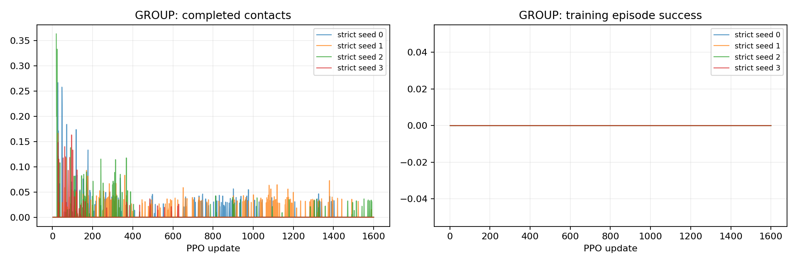

# P2-10 · 3cm 출발 조건 직접 학습

P2-09와 같은 비행거리 보상과0–15cm 명령에서 출발 범위만3cm로 줄여 새 정책을 학습한다.

비교 전체 157,286,400 환경 step, 신규 157,286,400step. [사전 프로토콜](p2-10-protocol.md).

| 발 | 조건 | seed | 수평 도약 성공 | 필요 착지 완료 | 낙상 | 시간초과 | ≥20ms 전 발 무접촉 |
|---|---|---:|---:|---:|---:|---:|---:|---:|
| GROUP | strict | 0 | 0/64 | 0/64 | 0/64 | 64/64 | 64/64 |
| GROUP | strict | 1 | 0/64 | 0/64 | 0/64 | 64/64 | 64/64 |
| GROUP | strict | 2 | 0/64 | 0/64 | 0/64 | 64/64 | 64/64 |
| GROUP | strict | 3 | 0/64 | 0/64 | 0/64 | 64/64 | 64/64 |

## 도약 계약 지표

| 조건 | seed | 유효 비행 | 비행 후 재접촉 | 수평 도약 성공 | 비발 접촉 종료 | 평균 비행 apex 상승 | 높이 명령 충족 | 네 발 첫 접촉 반경 내 | 최종 높이 범위 밖 |
|---|---:|---:|---:|---:|---:|---:|---:|---:|---:|
| strict | 0 | 0/64 | 0/64 | 0/64 | 0 | 0.00 cm | 0/64 | 0/64 | 0/64 |
| strict | 1 | 0/64 | 0/64 | 0/64 | 0 | 0.00 cm | 0/64 | 0/64 | 0/64 |
| strict | 2 | 0/64 | 0/64 | 0/64 | 0 | 0.00 cm | 0/64 | 0/64 | 48/64 |
| strict | 3 | 0/64 | 0/64 | 0/64 | 0 | 0.00 cm | 0/64 | 0/64 | 0/64 |

## 발별 첫 접촉

오차 평균은 관측된 첫 접촉만 포함한다. 반경 내 수의 분모는 전체 episode이며 미접촉을 성공으로 세지 않는다.

| 조건 | seed | 발 | 관측 수 | 평균 오차 | 반경 내 |
|---|---:|---|---:|---:|---:|
| strict | 0 | FL | 0/64 | N/A | 0/64 |
| strict | 0 | FR | 0/64 | N/A | 0/64 |
| strict | 0 | RL | 0/64 | N/A | 0/64 |
| strict | 0 | RR | 0/64 | N/A | 0/64 |
| strict | 1 | FL | 0/64 | N/A | 0/64 |
| strict | 1 | FR | 0/64 | N/A | 0/64 |
| strict | 1 | RL | 0/64 | N/A | 0/64 |
| strict | 1 | RR | 0/64 | N/A | 0/64 |
| strict | 2 | FL | 0/64 | N/A | 0/64 |
| strict | 2 | FR | 0/64 | N/A | 0/64 |
| strict | 2 | RL | 0/64 | N/A | 0/64 |
| strict | 2 | RR | 0/64 | N/A | 0/64 |
| strict | 3 | FL | 0/64 | N/A | 0/64 |
| strict | 3 | FR | 0/64 | N/A | 0/64 |
| strict | 3 | RL | 0/64 | N/A | 0/64 |
| strict | 3 | RR | 0/64 | N/A | 0/64 |

## 공통 지표 분리

| 조건 | seed | 기존 안정화 달성 | 첫 접촉 네 발 반경 내 |
|---|---:|---:|---:|
| strict | 0 | 0/64 | 0/64 |
| strict | 1 | 0/64 | 0/64 |
| strict | 2 | 0/64 | 0/64 |
| strict | 3 | 0/64 | 0/64 |

## 출발 계약과 궤적 부분집합

3cm 내 성공 궤적 수는 현재 실행에서의 부분집합이다. 다른 출발 반경으로 재실행한 평가를 대체하지 않는다.

| 조건 | seed | 실행 출발 반경 | 3cm 내 출발 / 전체 | 3cm 내 성공 / 전체 |
|---|---:|---:|---:|---:|
| strict | 0 | 3 cm | 0/64 | 0/64 |
| strict | 1 | 3 cm | 0/64 | 0/64 |
| strict | 2 | 3 cm | 0/64 | 0/64 |
| strict | 3 | 3 cm | 0/64 | 0/64 |

## 거리별 평가

| 조건 | seed | 전방 목표 | 성공 | 출발 영역 | 실비행 이동 충족 | 첫 접촉 반경 | 안정화 |
|---|---:|---:|---:|---:|---:|---:|---:|
| strict | 0 | 0 cm | 0/16 | 0/16 | 0/16 | 0/16 | 0/16 |
| strict | 0 | 5 cm | 0/16 | 0/16 | 0/16 | 0/16 | 0/16 |
| strict | 0 | 10 cm | 0/16 | 0/16 | 0/16 | 0/16 | 0/16 |
| strict | 0 | 15 cm | 0/16 | 0/16 | 0/16 | 0/16 | 0/16 |
| strict | 1 | 0 cm | 0/16 | 0/16 | 0/16 | 0/16 | 0/16 |
| strict | 1 | 5 cm | 0/16 | 0/16 | 0/16 | 0/16 | 0/16 |
| strict | 1 | 10 cm | 0/16 | 0/16 | 0/16 | 0/16 | 0/16 |
| strict | 1 | 15 cm | 0/16 | 0/16 | 0/16 | 0/16 | 0/16 |
| strict | 2 | 0 cm | 0/16 | 0/16 | 0/16 | 0/16 | 0/16 |
| strict | 2 | 5 cm | 0/16 | 0/16 | 0/16 | 0/16 | 0/16 |
| strict | 2 | 10 cm | 0/16 | 0/16 | 0/16 | 0/16 | 0/16 |
| strict | 2 | 15 cm | 0/16 | 0/16 | 0/16 | 0/16 | 0/16 |
| strict | 3 | 0 cm | 0/16 | 0/16 | 0/16 | 0/16 | 0/16 |
| strict | 3 | 5 cm | 0/16 | 0/16 | 0/16 | 0/16 | 0/16 |
| strict | 3 | 10 cm | 0/16 | 0/16 | 0/16 | 0/16 | 0/16 |
| strict | 3 | 15 cm | 0/16 | 0/16 | 0/16 | 0/16 | 0/16 |

학습 곡선은 각 update의 종료 episode 통계다. 고정 평가 결과와 구분한다. 종료 단계는 마지막 유효 200Hz 표본이며 실제 완료 여부는 terminal metrics를 우선한다.

## 종료 단계

- GROUP strict seed 0: `{'0:0': 64}`
- GROUP strict seed 1: `{'0:0': 64}`
- GROUP strict seed 2: `{'0:0': 64}`
- GROUP strict seed 3: `{'0:0': 64}`

## 마지막 제어 표본의 안정화 조건 위반

복수 위반을 허용한다. 연속 hold 전체 구간의 실패 원인과 같지 않으며, 기록되지 않은 과거 실행은 표시하지 않는다.

- strict seed 0: `{'height': 0, 'vertical_speed': 56, 'angular_speed': 0, 'foot_target': 64, 'contact_state': 64, 'support_history': 64}`
- strict seed 1: `{'height': 0, 'vertical_speed': 64, 'angular_speed': 0, 'foot_target': 64, 'contact_state': 64, 'support_history': 64}`
- strict seed 2: `{'height': 48, 'vertical_speed': 64, 'angular_speed': 26, 'foot_target': 64, 'contact_state': 52, 'support_history': 55}`
- strict seed 3: `{'height': 0, 'vertical_speed': 51, 'angular_speed': 0, 'foot_target': 64, 'contact_state': 64, 'support_history': 64}`

## 해석 및 다음 판단

네 seed 모두 성공0/64, 유효 비행0/64, timeout64/64이다. 3cm 조건을 처음부터 적용하는 것만으로 비행거리 보상의 효과를 얻지 못했다.
원본200Hz 기록의 제어 경계 분석에서 네 seed 모두 비접촉 window와 상승속도 조건을 각각 만족했으나 몸체 상승3cm 조건은 모든 episode에서 미달했다. 따라서 출발 범위 위반으로 끝난 P2-09-strict의15cm 실패와 다르다.
같은3cm 평가의 P2-09 고정 모델은 seed별32/64·18/64·33/64·32/64였다. 성공한 비행 행동을 먼저 학습한 뒤 조건을 좁히는 접근을 후속 가설로 검토한다.
학습4+평가4 artifact 감사 통과. 원본 진단과 평가 기록을 대조했고 영상4개를 result에 보존했다. 같은 예산을 단순 연장하지 않는다.

## 범위·재현

개발 조건의 탐색적 실험이다. 평가 episode 수와 독립 학습 seed 수를 구분하며 최종 시험 결과로 주장하지 않는다. 같은 발의 평가 시나리오가 동일함을 확인했다. 설정·checkpoint·원본200Hz NPZ는 artifacts, 최종16대병렬영상은 result에 보존한다. 재사용 대조군 원본은 변경하지 않는다.

실행 목록 및 보고서 명세: `configs/reports/p2-10.json`. 이 보고서는 `scripts/experiment_report.py`로 재생성한다.
