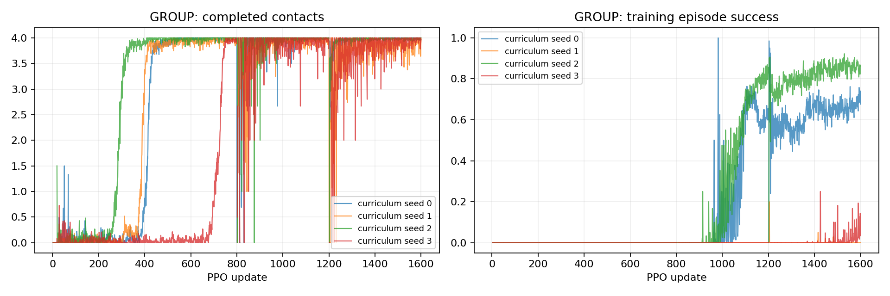

# P2-11 · 출발 범위 커리큘럼

6→4.5→3cm 출발 범위를 고정 업데이트에서 적용하는 새 정책 네 seed 비교.

비교 전체 157,286,400 환경 step, 신규 157,286,400step. [사전 프로토콜](p2-11-protocol.md).

| 발 | 조건 | seed | 수평 도약 성공 | 필요 착지 완료 | 낙상 | 시간초과 | ≥20ms 전 발 무접촉 |
|---|---|---:|---:|---:|---:|---:|---:|---:|
| GROUP | curriculum | 0 | 48/64 | 64/64 | 0/64 | 16/64 | 64/64 |
| GROUP | curriculum | 1 | 17/64 | 61/64 | 3/64 | 44/64 | 64/64 |
| GROUP | curriculum | 2 | 51/64 | 64/64 | 0/64 | 13/64 | 64/64 |
| GROUP | curriculum | 3 | 51/64 | 64/64 | 0/64 | 13/64 | 64/64 |

## 도약 계약 지표

| 조건 | seed | 유효 비행 | 비행 후 재접촉 | 수평 도약 성공 | 비발 접촉 종료 | 평균 비행 apex 상승 | 높이 명령 충족 | 네 발 첫 접촉 반경 내 | 최종 높이 범위 밖 |
|---|---:|---:|---:|---:|---:|---:|---:|---:|---:|
| curriculum | 0 | 64/64 | 64/64 | 48/64 | 0 | 9.49 cm | 64/64 | 64/64 | 0/64 |
| curriculum | 1 | 64/64 | 61/64 | 17/64 | 0 | 8.08 cm | 62/64 | 46/64 | 0/64 |
| curriculum | 2 | 64/64 | 64/64 | 51/64 | 0 | 7.79 cm | 56/64 | 64/64 | 0/64 |
| curriculum | 3 | 64/64 | 64/64 | 51/64 | 0 | 11.68 cm | 64/64 | 51/64 | 0/64 |

## 발별 첫 접촉

오차 평균은 관측된 첫 접촉만 포함한다. 반경 내 수의 분모는 전체 episode이며 미접촉을 성공으로 세지 않는다.

| 조건 | seed | 발 | 관측 수 | 평균 오차 | 반경 내 |
|---|---:|---|---:|---:|---:|
| curriculum | 0 | FL | 64/64 | 1.54 cm | 64/64 |
| curriculum | 0 | FR | 64/64 | 2.77 cm | 64/64 |
| curriculum | 0 | RL | 64/64 | 2.46 cm | 64/64 |
| curriculum | 0 | RR | 64/64 | 2.18 cm | 64/64 |
| curriculum | 1 | FL | 61/64 | 2.71 cm | 61/64 |
| curriculum | 1 | FR | 61/64 | 2.63 cm | 60/64 |
| curriculum | 1 | RL | 61/64 | 2.20 cm | 61/64 |
| curriculum | 1 | RR | 61/64 | 3.91 cm | 47/64 |
| curriculum | 2 | FL | 64/64 | 0.99 cm | 64/64 |
| curriculum | 2 | FR | 64/64 | 0.85 cm | 64/64 |
| curriculum | 2 | RL | 64/64 | 1.19 cm | 64/64 |
| curriculum | 2 | RR | 64/64 | 1.54 cm | 64/64 |
| curriculum | 3 | FL | 64/64 | 1.71 cm | 64/64 |
| curriculum | 3 | FR | 64/64 | 2.33 cm | 64/64 |
| curriculum | 3 | RL | 64/64 | 2.13 cm | 64/64 |
| curriculum | 3 | RR | 64/64 | 3.28 cm | 51/64 |

## 공통 지표 분리

| 조건 | seed | 기존 안정화 달성 | 첫 접촉 네 발 반경 내 |
|---|---:|---:|---:|
| curriculum | 0 | 64/64 | 64/64 |
| curriculum | 1 | 29/64 | 46/64 |
| curriculum | 2 | 51/64 | 64/64 |
| curriculum | 3 | 64/64 | 51/64 |

## 출발 계약과 궤적 부분집합

3cm 내 성공 궤적 수는 현재 실행에서의 부분집합이다. 다른 출발 반경으로 재실행한 평가를 대체하지 않는다.

| 조건 | seed | 실행 출발 반경 | 3cm 내 출발 / 전체 | 3cm 내 성공 / 전체 |
|---|---:|---:|---:|---:|
| curriculum | 0 | 3 cm | 64/64 | 48/64 |
| curriculum | 1 | 3 cm | 61/64 | 17/64 |
| curriculum | 2 | 3 cm | 64/64 | 51/64 |
| curriculum | 3 | 3 cm | 64/64 | 51/64 |

## 거리별 평가

| 조건 | seed | 전방 목표 | 성공 | 출발 영역 | 실비행 이동 충족 | 첫 접촉 반경 | 안정화 |
|---|---:|---:|---:|---:|---:|---:|---:|
| curriculum | 0 | 0 cm | 16/16 | 16/16 | 16/16 | 16/16 | 16/16 |
| curriculum | 0 | 5 cm | 16/16 | 16/16 | 16/16 | 16/16 | 16/16 |
| curriculum | 0 | 10 cm | 16/16 | 16/16 | 16/16 | 16/16 | 16/16 |
| curriculum | 0 | 15 cm | 0/16 | 16/16 | 0/16 | 16/16 | 16/16 |
| curriculum | 1 | 0 cm | 13/16 | 16/16 | 16/16 | 15/16 | 14/16 |
| curriculum | 1 | 5 cm | 0/16 | 16/16 | 16/16 | 16/16 | 0/16 |
| curriculum | 1 | 10 cm | 1/16 | 16/16 | 16/16 | 2/16 | 12/16 |
| curriculum | 1 | 15 cm | 3/16 | 13/16 | 13/16 | 13/16 | 3/16 |
| curriculum | 2 | 0 cm | 8/16 | 16/16 | 16/16 | 16/16 | 8/16 |
| curriculum | 2 | 5 cm | 16/16 | 16/16 | 16/16 | 16/16 | 16/16 |
| curriculum | 2 | 10 cm | 15/16 | 16/16 | 16/16 | 16/16 | 15/16 |
| curriculum | 2 | 15 cm | 12/16 | 16/16 | 16/16 | 16/16 | 12/16 |
| curriculum | 3 | 0 cm | 16/16 | 16/16 | 16/16 | 16/16 | 16/16 |
| curriculum | 3 | 5 cm | 3/16 | 16/16 | 16/16 | 3/16 | 16/16 |
| curriculum | 3 | 10 cm | 16/16 | 16/16 | 16/16 | 16/16 | 16/16 |
| curriculum | 3 | 15 cm | 16/16 | 16/16 | 16/16 | 16/16 | 16/16 |

학습 곡선은 각 update의 종료 episode 통계다. 고정 평가 결과와 구분한다. 종료 단계는 마지막 유효 200Hz 표본이며 실제 완료 여부는 terminal metrics를 우선한다.

## 종료 단계

- GROUP curriculum seed 0: `{'2:2': 64}`
- GROUP curriculum seed 1: `{'0:0': 3, '2:2': 61}`
- GROUP curriculum seed 2: `{'2:2': 64}`
- GROUP curriculum seed 3: `{'2:2': 64}`

## 마지막 제어 표본의 안정화 조건 위반

복수 위반을 허용한다. 연속 hold 전체 구간의 실패 원인과 같지 않으며, 기록되지 않은 과거 실행은 표시하지 않는다.

- curriculum seed 0: `{'height': 0, 'vertical_speed': 0, 'angular_speed': 0, 'foot_target': 0, 'contact_state': 0, 'support_history': 0}`
- curriculum seed 1: `{'height': 0, 'vertical_speed': 3, 'angular_speed': 3, 'foot_target': 34, 'contact_state': 4, 'support_history': 6}`
- curriculum seed 2: `{'height': 0, 'vertical_speed': 0, 'angular_speed': 0, 'foot_target': 5, 'contact_state': 0, 'support_history': 0}`
- curriculum seed 3: `{'height': 0, 'vertical_speed': 0, 'angular_speed': 0, 'foot_target': 0, 'contact_state': 0, 'support_history': 0}`

## 해석 및 다음 판단

3cm 최종 평가 성공은 seed0/1/2/3 각각48/64·17/64·51/64·51/64이다. P2-10 직접3cm 학습의 모든 seed0/64에 비해 비행과 일부 성공을 획득했다.
15cm 성공은0/16·3/16·12/16·16/16으로 seed 의존성이 남았다. seed0은 첫 접촉/안정화를 모두 통과했지만 실제 비행거리 조건이0/16이었다.
5cm는16/16·0/16·16/16·3/16이다. seed1은 안정화, seed3은 첫 접촉 정밀도에서 실패했다. 제자리도16/16·13/16·8/16·16/16이므로 전체 능력이 해결됐다고 볼 수 없다.
P2-09-strict(32/18/33/32 성공)와 비교하면 seed1은 전체 성공이 감소했다. 커리큘럼이 모든 seed에서 우월하다고 주장하지 않는다.
네 학습의801·1201update에 반경4.5·3cm와 reset 기록을 확인했다. 학습4+기본평가4+64개근접구도평가1 감사 통과. 원본200Hz launch/first-touch 좌표를 대조했다.
64개 추가영상은 먼저 종료된 seed3으로 제작했다. 평가 성공 조건으로 모델을 선정한 영상이 아니다. 반경3cm 고정 평가 결과는 원래16개 영상 평가와 거리별 동일했다. 렌더링 활성64개이며 일부는 화면 밖에 있다.

## 범위·재현

개발 조건의 탐색적 실험이다. 평가 episode 수와 독립 학습 seed 수를 구분하며 최종 시험 결과로 주장하지 않는다. 같은 발의 평가 시나리오가 동일함을 확인했다. 설정·checkpoint·원본200Hz NPZ는 artifacts, 최종16대병렬영상은 result에 보존한다. 재사용 대조군 원본은 변경하지 않는다.

실행 목록 및 보고서 명세: `configs/reports/p2-11.json`. 이 보고서는 `scripts/experiment_report.py`로 재생성한다.
