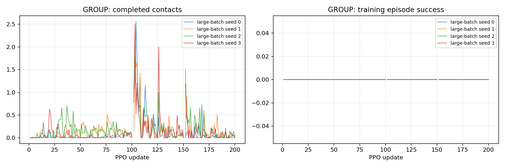

# P2-12 · 동일 step 예산의 대규모 병렬 학습

8192환경200update와 P2-11의1024환경1600update를 같은39321600step으로 비교한다. 학습 batch와 갱신 횟수는 다르다.

비교 전체 157,286,400 환경 step, 신규 157,286,400step. [사전 프로토콜](p2-12-protocol.md).

| 발 | 조건 | seed | 수평 도약 성공 | 필요 착지 완료 | 낙상 | 시간초과 | ≥20ms 전 발 무접촉 |
|---|---|---:|---:|---:|---:|---:|---:|---:|
| GROUP | large-batch | 0 | 0/64 | 0/64 | 0/64 | 64/64 | 64/64 |
| GROUP | large-batch | 1 | 0/64 | 0/64 | 0/64 | 64/64 | 64/64 |
| GROUP | large-batch | 2 | 0/64 | 0/64 | 0/64 | 64/64 | 64/64 |
| GROUP | large-batch | 3 | 0/64 | 0/64 | 0/64 | 64/64 | 64/64 |

## 도약 계약 지표

| 조건 | seed | 유효 비행 | 비행 후 재접촉 | 수평 도약 성공 | 비발 접촉 종료 | 평균 비행 apex 상승 | 높이 명령 충족 | 네 발 첫 접촉 반경 내 | 최종 높이 범위 밖 |
|---|---:|---:|---:|---:|---:|---:|---:|---:|---:|
| large-batch | 0 | 0/64 | 0/64 | 0/64 | 0 | 0.00 cm | 0/64 | 0/64 | 0/64 |
| large-batch | 1 | 0/64 | 0/64 | 0/64 | 0 | 0.00 cm | 0/64 | 0/64 | 0/64 |
| large-batch | 2 | 0/64 | 0/64 | 0/64 | 0 | 0.00 cm | 0/64 | 0/64 | 0/64 |
| large-batch | 3 | 0/64 | 0/64 | 0/64 | 0 | 0.00 cm | 0/64 | 0/64 | 5/64 |

## 발별 첫 접촉

오차 평균은 관측된 첫 접촉만 포함한다. 반경 내 수의 분모는 전체 episode이며 미접촉을 성공으로 세지 않는다.

| 조건 | seed | 발 | 관측 수 | 평균 오차 | 반경 내 |
|---|---:|---|---:|---:|---:|
| large-batch | 0 | FL | 0/64 | N/A | 0/64 |
| large-batch | 0 | FR | 0/64 | N/A | 0/64 |
| large-batch | 0 | RL | 0/64 | N/A | 0/64 |
| large-batch | 0 | RR | 0/64 | N/A | 0/64 |
| large-batch | 1 | FL | 0/64 | N/A | 0/64 |
| large-batch | 1 | FR | 0/64 | N/A | 0/64 |
| large-batch | 1 | RL | 0/64 | N/A | 0/64 |
| large-batch | 1 | RR | 0/64 | N/A | 0/64 |
| large-batch | 2 | FL | 0/64 | N/A | 0/64 |
| large-batch | 2 | FR | 0/64 | N/A | 0/64 |
| large-batch | 2 | RL | 0/64 | N/A | 0/64 |
| large-batch | 2 | RR | 0/64 | N/A | 0/64 |
| large-batch | 3 | FL | 0/64 | N/A | 0/64 |
| large-batch | 3 | FR | 0/64 | N/A | 0/64 |
| large-batch | 3 | RL | 0/64 | N/A | 0/64 |
| large-batch | 3 | RR | 0/64 | N/A | 0/64 |

## 공통 지표 분리

| 조건 | seed | 기존 안정화 달성 | 첫 접촉 네 발 반경 내 |
|---|---:|---:|---:|
| large-batch | 0 | 0/64 | 0/64 |
| large-batch | 1 | 0/64 | 0/64 |
| large-batch | 2 | 0/64 | 0/64 |
| large-batch | 3 | 0/64 | 0/64 |

## 출발 계약과 궤적 부분집합

3cm 내 성공 궤적 수는 현재 실행에서의 부분집합이다. 다른 출발 반경으로 재실행한 평가를 대체하지 않는다.

| 조건 | seed | 실행 출발 반경 | 3cm 내 출발 / 전체 | 3cm 내 성공 / 전체 |
|---|---:|---:|---:|---:|
| large-batch | 0 | 3 cm | 0/64 | 0/64 |
| large-batch | 1 | 3 cm | 0/64 | 0/64 |
| large-batch | 2 | 3 cm | 0/64 | 0/64 |
| large-batch | 3 | 3 cm | 0/64 | 0/64 |

## 거리별 평가

| 조건 | seed | 전방 목표 | 성공 | 출발 영역 | 실비행 이동 충족 | 첫 접촉 반경 | 안정화 |
|---|---:|---:|---:|---:|---:|---:|---:|
| large-batch | 0 | 0 cm | 0/16 | 0/16 | 0/16 | 0/16 | 0/16 |
| large-batch | 0 | 5 cm | 0/16 | 0/16 | 0/16 | 0/16 | 0/16 |
| large-batch | 0 | 10 cm | 0/16 | 0/16 | 0/16 | 0/16 | 0/16 |
| large-batch | 0 | 15 cm | 0/16 | 0/16 | 0/16 | 0/16 | 0/16 |
| large-batch | 1 | 0 cm | 0/16 | 0/16 | 0/16 | 0/16 | 0/16 |
| large-batch | 1 | 5 cm | 0/16 | 0/16 | 0/16 | 0/16 | 0/16 |
| large-batch | 1 | 10 cm | 0/16 | 0/16 | 0/16 | 0/16 | 0/16 |
| large-batch | 1 | 15 cm | 0/16 | 0/16 | 0/16 | 0/16 | 0/16 |
| large-batch | 2 | 0 cm | 0/16 | 0/16 | 0/16 | 0/16 | 0/16 |
| large-batch | 2 | 5 cm | 0/16 | 0/16 | 0/16 | 0/16 | 0/16 |
| large-batch | 2 | 10 cm | 0/16 | 0/16 | 0/16 | 0/16 | 0/16 |
| large-batch | 2 | 15 cm | 0/16 | 0/16 | 0/16 | 0/16 | 0/16 |
| large-batch | 3 | 0 cm | 0/16 | 0/16 | 0/16 | 0/16 | 0/16 |
| large-batch | 3 | 5 cm | 0/16 | 0/16 | 0/16 | 0/16 | 0/16 |
| large-batch | 3 | 10 cm | 0/16 | 0/16 | 0/16 | 0/16 | 0/16 |
| large-batch | 3 | 15 cm | 0/16 | 0/16 | 0/16 | 0/16 | 0/16 |

학습 곡선은 각 update의 종료 episode 통계다. 고정 평가 결과와 구분한다. 종료 단계는 마지막 유효 200Hz 표본이며 실제 완료 여부는 terminal metrics를 우선한다.

## 종료 단계

- GROUP large-batch seed 0: `{'0:0': 64}`
- GROUP large-batch seed 1: `{'0:0': 64}`
- GROUP large-batch seed 2: `{'0:0': 64}`
- GROUP large-batch seed 3: `{'0:0': 64}`

## 마지막 제어 표본의 안정화 조건 위반

복수 위반을 허용한다. 연속 hold 전체 구간의 실패 원인과 같지 않으며, 기록되지 않은 과거 실행은 표시하지 않는다.

- large-batch seed 0: `{'height': 0, 'vertical_speed': 22, 'angular_speed': 0, 'foot_target': 64, 'contact_state': 64, 'support_history': 64}`
- large-batch seed 1: `{'height': 0, 'vertical_speed': 64, 'angular_speed': 46, 'foot_target': 64, 'contact_state': 64, 'support_history': 64}`
- large-batch seed 2: `{'height': 0, 'vertical_speed': 24, 'angular_speed': 48, 'foot_target': 64, 'contact_state': 64, 'support_history': 64}`
- large-batch seed 3: `{'height': 5, 'vertical_speed': 64, 'angular_speed': 5, 'foot_target': 64, 'contact_state': 39, 'support_history': 59}`

## 해석 및 다음 판단

네 seed 모두 성공0/64·유효비행0/64·timeout64/64이다. 총환경step을맞췄지만 P2-11의48/17/51/51성공을유지하지못했다.
학습run wall-clock은약366–376초로 P2-11의1167–1212초보다짧았다. 성공모델을얻지못했으므로목표성능도달시간이개선됐다고주장하지않는다.
batch8배·update수1/8의종합변경이다. 실패원인을update수하나로확정하지않는다. 다음비교는minibatch수를4→32로바꿔기존minibatch표본수6144와총gradient갱신횟수를맞추되on-policy수집빈도차이는유지한다.
학습4+평가4감사와원본진단대조통과.101/151update조건전환을확인했고영상4개를result에보존했다.

## 범위·재현

개발 조건의 탐색적 실험이다. 평가 episode 수와 독립 학습 seed 수를 구분하며 최종 시험 결과로 주장하지 않는다. 같은 발의 평가 시나리오가 동일함을 확인했다. 설정·checkpoint·원본200Hz NPZ는 artifacts, 최종16대병렬영상은 result에 보존한다. 재사용 대조군 원본은 변경하지 않는다.

실행 목록 및 보고서 명세: `configs/reports/p2-12.json`. 이 보고서는 `scripts/experiment_report.py`로 재생성한다.
