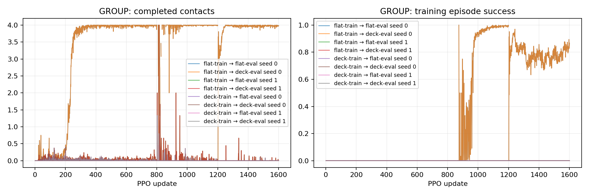

# P2-15 · seed0/1 부분 결과 (seed2/3 학습 중)

평지/넓은 발판에서 각각 fresh PPO 4seed를 같은 예산으로 학습하고 양쪽 지형에서 평가한다. 각 모델은 두 번 평가하지만 학습 예산은 한 번만 계산한다.

고유 학습 run 기준 157,286,400 환경 step, 신규 157,286,400step. [사전 프로토콜](p2-15-protocol.md).

| 발 | 조건 | seed | 목표 도약 성공 | 필요 착지 완료 | 낙상 | 시간초과 | ≥20ms 전 발 무접촉 |
|---|---|---:|---:|---:|---:|---:|---:|---:|
| GROUP | flat-train → flat-eval | 0 | 0/64 | 64/64 | 0/64 | 64/64 | 64/64 |
| GROUP | flat-train → deck-eval | 0 | 0/64 | 48/64 | 16/64 | 48/64 | 64/64 |
| GROUP | flat-train → flat-eval | 1 | 0/64 | 0/64 | 0/64 | 64/64 | 64/64 |
| GROUP | flat-train → deck-eval | 1 | 0/64 | 0/64 | 0/64 | 64/64 | 64/64 |
| GROUP | deck-train → flat-eval | 0 | 0/64 | 0/64 | 0/64 | 64/64 | 64/64 |
| GROUP | deck-train → deck-eval | 0 | 0/64 | 0/64 | 0/64 | 64/64 | 64/64 |
| GROUP | deck-train → flat-eval | 1 | 0/64 | 0/64 | 0/64 | 64/64 | 64/64 |
| GROUP | deck-train → deck-eval | 1 | 0/64 | 0/64 | 0/64 | 64/64 | 64/64 |

## 도약 계약 지표

| 조건 | seed | 유효 비행 | 비행 후 재접촉 | 목표 도약 성공 | 비발 접촉 종료 | 평균 비행 apex 상승 | 높이 명령 충족 | 네 발 첫 접촉 반경 내 | 최종 높이 범위 밖 |
|---|---:|---:|---:|---:|---:|---:|---:|---:|---:|
| flat-train → flat-eval | 0 | 64/64 | 64/64 | 0/64 | 0 | 14.68 cm | 64/64 | 64/64 | 0/64 |
| flat-train → deck-eval | 0 | 48/64 | 48/64 | 0/64 | 16 | 11.83 cm | 48/64 | 48/64 | 16/64 |
| flat-train → flat-eval | 1 | 0/64 | 0/64 | 0/64 | 0 | 0.00 cm | 0/64 | 0/64 | 63/64 |
| flat-train → deck-eval | 1 | 0/64 | 0/64 | 0/64 | 0 | 0.00 cm | 0/64 | 0/64 | 64/64 |
| deck-train → flat-eval | 0 | 0/64 | 0/64 | 0/64 | 0 | 0.00 cm | 0/64 | 0/64 | 36/64 |
| deck-train → deck-eval | 0 | 0/64 | 0/64 | 0/64 | 0 | 0.00 cm | 0/64 | 0/64 | 18/64 |
| deck-train → flat-eval | 1 | 0/64 | 0/64 | 0/64 | 0 | 0.00 cm | 0/64 | 0/64 | 62/64 |
| deck-train → deck-eval | 1 | 0/64 | 0/64 | 0/64 | 0 | 0.00 cm | 0/64 | 0/64 | 64/64 |

## 발별 첫 접촉

오차 평균은 관측된 첫 접촉만 포함한다. 반경 내 수의 분모는 전체 episode이며 미접촉을 성공으로 세지 않는다.

| 조건 | seed | 발 | 관측 수 | 평균 오차 | 반경 내 |
|---|---:|---|---:|---:|---:|
| flat-train → flat-eval | 0 | FL | 64/64 | 1.34 cm | 64/64 |
| flat-train → flat-eval | 0 | FR | 64/64 | 2.77 cm | 64/64 |
| flat-train → flat-eval | 0 | RL | 64/64 | 0.88 cm | 64/64 |
| flat-train → flat-eval | 0 | RR | 64/64 | 1.54 cm | 64/64 |
| flat-train → deck-eval | 0 | FL | 48/64 | 1.42 cm | 48/64 |
| flat-train → deck-eval | 0 | FR | 48/64 | 2.93 cm | 48/64 |
| flat-train → deck-eval | 0 | RL | 48/64 | 0.72 cm | 48/64 |
| flat-train → deck-eval | 0 | RR | 48/64 | 1.45 cm | 48/64 |
| flat-train → flat-eval | 1 | FL | 0/64 | N/A | 0/64 |
| flat-train → flat-eval | 1 | FR | 0/64 | N/A | 0/64 |
| flat-train → flat-eval | 1 | RL | 0/64 | N/A | 0/64 |
| flat-train → flat-eval | 1 | RR | 0/64 | N/A | 0/64 |
| flat-train → deck-eval | 1 | FL | 0/64 | N/A | 0/64 |
| flat-train → deck-eval | 1 | FR | 0/64 | N/A | 0/64 |
| flat-train → deck-eval | 1 | RL | 0/64 | N/A | 0/64 |
| flat-train → deck-eval | 1 | RR | 0/64 | N/A | 0/64 |
| deck-train → flat-eval | 0 | FL | 0/64 | N/A | 0/64 |
| deck-train → flat-eval | 0 | FR | 0/64 | N/A | 0/64 |
| deck-train → flat-eval | 0 | RL | 0/64 | N/A | 0/64 |
| deck-train → flat-eval | 0 | RR | 0/64 | N/A | 0/64 |
| deck-train → deck-eval | 0 | FL | 0/64 | N/A | 0/64 |
| deck-train → deck-eval | 0 | FR | 0/64 | N/A | 0/64 |
| deck-train → deck-eval | 0 | RL | 0/64 | N/A | 0/64 |
| deck-train → deck-eval | 0 | RR | 0/64 | N/A | 0/64 |
| deck-train → flat-eval | 1 | FL | 0/64 | N/A | 0/64 |
| deck-train → flat-eval | 1 | FR | 0/64 | N/A | 0/64 |
| deck-train → flat-eval | 1 | RL | 0/64 | N/A | 0/64 |
| deck-train → flat-eval | 1 | RR | 0/64 | N/A | 0/64 |
| deck-train → deck-eval | 1 | FL | 0/64 | N/A | 0/64 |
| deck-train → deck-eval | 1 | FR | 0/64 | N/A | 0/64 |
| deck-train → deck-eval | 1 | RL | 0/64 | N/A | 0/64 |
| deck-train → deck-eval | 1 | RR | 0/64 | N/A | 0/64 |

## 공통 지표 분리

| 조건 | seed | 기존 안정화 달성 | 첫 접촉 네 발 반경 내 |
|---|---:|---:|---:|
| flat-train → flat-eval | 0 | 0/64 | 64/64 |
| flat-train → deck-eval | 0 | 0/64 | 48/64 |
| flat-train → flat-eval | 1 | 0/64 | 0/64 |
| flat-train → deck-eval | 1 | 0/64 | 0/64 |
| deck-train → flat-eval | 0 | 0/64 | 0/64 |
| deck-train → deck-eval | 0 | 0/64 | 0/64 |
| deck-train → flat-eval | 1 | 0/64 | 0/64 |
| deck-train → deck-eval | 1 | 0/64 | 0/64 |

## 출발 계약과 궤적 부분집합

3cm 내 성공 궤적 수는 현재 실행에서의 부분집합이다. 다른 출발 반경으로 재실행한 평가를 대체하지 않는다.

| 조건 | seed | 실행 출발 반경 | 3cm 내 출발 / 전체 | 3cm 내 성공 / 전체 |
|---|---:|---:|---:|---:|
| flat-train → flat-eval | 0 | 3 cm | 64/64 | 0/64 |
| flat-train → deck-eval | 0 | 3 cm | 48/64 | 0/64 |
| flat-train → flat-eval | 1 | 3 cm | 0/64 | 0/64 |
| flat-train → deck-eval | 1 | 3 cm | 0/64 | 0/64 |
| deck-train → flat-eval | 0 | 3 cm | 0/64 | 0/64 |
| deck-train → deck-eval | 0 | 3 cm | 0/64 | 0/64 |
| deck-train → flat-eval | 1 | 3 cm | 0/64 | 0/64 |
| deck-train → deck-eval | 1 | 3 cm | 0/64 | 0/64 |

## 거리별 평가

| 조건 | seed | 전방 목표 | 성공 | 출발 영역 | 실비행 이동 충족 | 첫 접촉 반경 | 안정화 |
|---|---:|---:|---:|---:|---:|---:|---:|
| flat-train → flat-eval | 0 | 0 cm | 0/16 | 16/16 | 16/16 | 16/16 | 0/16 |
| flat-train → flat-eval | 0 | 5 cm | 0/16 | 16/16 | 16/16 | 16/16 | 0/16 |
| flat-train → flat-eval | 0 | 10 cm | 0/16 | 16/16 | 16/16 | 16/16 | 0/16 |
| flat-train → flat-eval | 0 | 15 cm | 0/16 | 16/16 | 0/16 | 16/16 | 0/16 |
| flat-train → deck-eval | 0 | 0 cm | 0/16 | 8/16 | 8/16 | 8/16 | 0/16 |
| flat-train → deck-eval | 0 | 5 cm | 0/16 | 12/16 | 12/16 | 12/16 | 0/16 |
| flat-train → deck-eval | 0 | 10 cm | 0/16 | 12/16 | 12/16 | 12/16 | 0/16 |
| flat-train → deck-eval | 0 | 15 cm | 0/16 | 16/16 | 0/16 | 16/16 | 0/16 |
| flat-train → flat-eval | 1 | 0 cm | 0/16 | 0/16 | 0/16 | 0/16 | 0/16 |
| flat-train → flat-eval | 1 | 5 cm | 0/16 | 0/16 | 0/16 | 0/16 | 0/16 |
| flat-train → flat-eval | 1 | 10 cm | 0/16 | 0/16 | 0/16 | 0/16 | 0/16 |
| flat-train → flat-eval | 1 | 15 cm | 0/16 | 0/16 | 0/16 | 0/16 | 0/16 |
| flat-train → deck-eval | 1 | 0 cm | 0/16 | 0/16 | 0/16 | 0/16 | 0/16 |
| flat-train → deck-eval | 1 | 5 cm | 0/16 | 0/16 | 0/16 | 0/16 | 0/16 |
| flat-train → deck-eval | 1 | 10 cm | 0/16 | 0/16 | 0/16 | 0/16 | 0/16 |
| flat-train → deck-eval | 1 | 15 cm | 0/16 | 0/16 | 0/16 | 0/16 | 0/16 |
| deck-train → flat-eval | 0 | 0 cm | 0/16 | 0/16 | 0/16 | 0/16 | 0/16 |
| deck-train → flat-eval | 0 | 5 cm | 0/16 | 0/16 | 0/16 | 0/16 | 0/16 |
| deck-train → flat-eval | 0 | 10 cm | 0/16 | 0/16 | 0/16 | 0/16 | 0/16 |
| deck-train → flat-eval | 0 | 15 cm | 0/16 | 0/16 | 0/16 | 0/16 | 0/16 |
| deck-train → deck-eval | 0 | 0 cm | 0/16 | 0/16 | 0/16 | 0/16 | 0/16 |
| deck-train → deck-eval | 0 | 5 cm | 0/16 | 0/16 | 0/16 | 0/16 | 0/16 |
| deck-train → deck-eval | 0 | 10 cm | 0/16 | 0/16 | 0/16 | 0/16 | 0/16 |
| deck-train → deck-eval | 0 | 15 cm | 0/16 | 0/16 | 0/16 | 0/16 | 0/16 |
| deck-train → flat-eval | 1 | 0 cm | 0/16 | 0/16 | 0/16 | 0/16 | 0/16 |
| deck-train → flat-eval | 1 | 5 cm | 0/16 | 0/16 | 0/16 | 0/16 | 0/16 |
| deck-train → flat-eval | 1 | 10 cm | 0/16 | 0/16 | 0/16 | 0/16 | 0/16 |
| deck-train → flat-eval | 1 | 15 cm | 0/16 | 0/16 | 0/16 | 0/16 | 0/16 |
| deck-train → deck-eval | 1 | 0 cm | 0/16 | 0/16 | 0/16 | 0/16 | 0/16 |
| deck-train → deck-eval | 1 | 5 cm | 0/16 | 0/16 | 0/16 | 0/16 | 0/16 |
| deck-train → deck-eval | 1 | 10 cm | 0/16 | 0/16 | 0/16 | 0/16 | 0/16 |
| deck-train → deck-eval | 1 | 15 cm | 0/16 | 0/16 | 0/16 | 0/16 | 0/16 |

학습 곡선은 각 update의 종료 episode 통계다. 고정 평가 결과와 구분한다. 종료 단계는 마지막 유효 200Hz 표본이며 실제 완료 여부는 terminal metrics를 우선한다.

## 종료 단계

- GROUP flat-train → flat-eval seed 0: `{'2:2': 64}`
- GROUP flat-train → deck-eval seed 0: `{'0:0': 16, '2:2': 48}`
- GROUP flat-train → flat-eval seed 1: `{'0:0': 64}`
- GROUP flat-train → deck-eval seed 1: `{'0:0': 64}`
- GROUP deck-train → flat-eval seed 0: `{'0:0': 64}`
- GROUP deck-train → deck-eval seed 0: `{'0:0': 64}`
- GROUP deck-train → flat-eval seed 1: `{'0:0': 64}`
- GROUP deck-train → deck-eval seed 1: `{'0:0': 64}`

## 마지막 제어 표본의 안정화 조건 위반

복수 위반을 허용한다. 연속 hold 전체 구간의 실패 원인과 같지 않으며, 기록되지 않은 과거 실행은 표시하지 않는다.

- flat-train → flat-eval seed 0: `{'height': 0, 'vertical_speed': 0, 'angular_speed': 0, 'foot_target': 64, 'contact_state': 0, 'support_history': 0}`
- flat-train → deck-eval seed 0: `{'height': 16, 'vertical_speed': 16, 'angular_speed': 16, 'foot_target': 64, 'contact_state': 4, 'support_history': 16}`
- flat-train → flat-eval seed 1: `{'height': 63, 'vertical_speed': 63, 'angular_speed': 39, 'foot_target': 64, 'contact_state': 21, 'support_history': 31}`
- flat-train → deck-eval seed 1: `{'height': 64, 'vertical_speed': 63, 'angular_speed': 14, 'foot_target': 64, 'contact_state': 48, 'support_history': 58}`
- deck-train → flat-eval seed 0: `{'height': 36, 'vertical_speed': 64, 'angular_speed': 0, 'foot_target': 64, 'contact_state': 62, 'support_history': 64}`
- deck-train → deck-eval seed 0: `{'height': 18, 'vertical_speed': 64, 'angular_speed': 0, 'foot_target': 64, 'contact_state': 64, 'support_history': 64}`
- deck-train → flat-eval seed 1: `{'height': 62, 'vertical_speed': 64, 'angular_speed': 16, 'foot_target': 64, 'contact_state': 41, 'support_history': 41}`
- deck-train → deck-eval seed 1: `{'height': 64, 'vertical_speed': 61, 'angular_speed': 51, 'foot_target': 64, 'contact_state': 8, 'support_history': 13}`

## 해석 및 다음 판단

전체 비교 완료 전의 부분 결과다. seed2/3은 아직 학습 중이며 이 결과로 예산이나 조건을 변경하지 않는다.

## 범위·재현

개발 조건의 탐색적 실험이다. 평가 episode 수와 독립 학습 seed 수를 구분하며 최종 시험 결과로 주장하지 않는다. 같은 발의 평가 시나리오가 동일함을 확인했다. 설정·checkpoint·원본200Hz NPZ는 artifacts, 최종 병렬 평가 영상은 result에 보존한다. 재사용 대조군 원본은 변경하지 않는다.

실행 목록 및 보고서 명세: `artifacts/p2-15-wave1-report.json`. 이 보고서는 `scripts/experiment_report.py`로 재생성한다.
