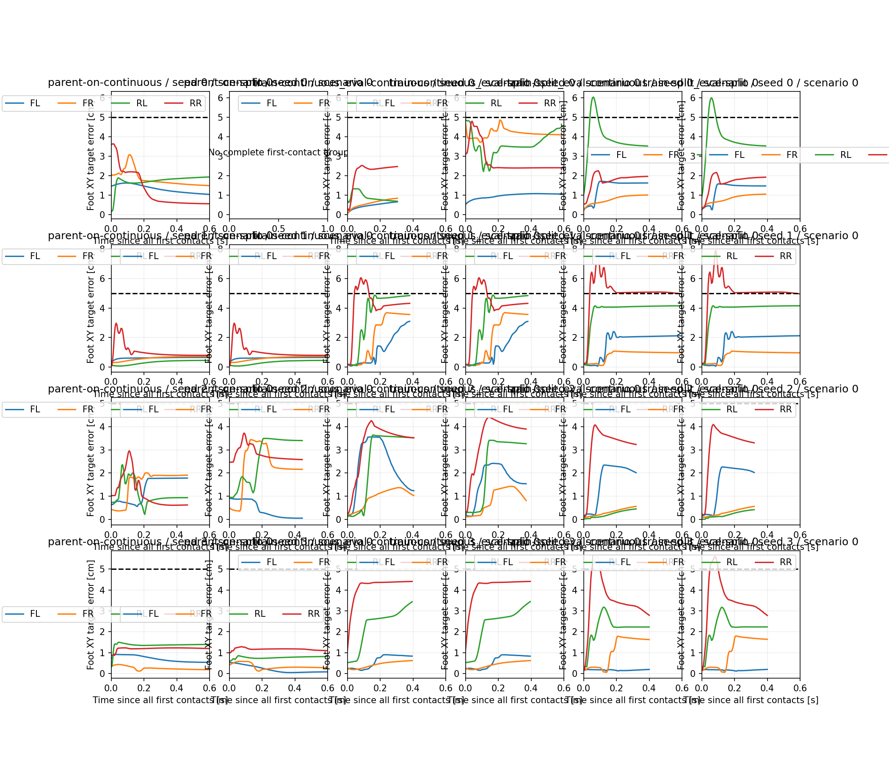

# P2-29 최초 착지 이후 목표 유지

동일64개 개발군·200Hz 원본 기록을 비교했다. 발별 최초접촉 오차는 기존 KPI와1e-5m 이내로 대조했다.

| 조건 | seed | 안정화 미달 | 최초접촉 미완료 | 착지 분석 가능한 미달 | 그중200ms 내 이탈 | 그중200ms 유지 구간 없음 |
|---|---:|---:|---:|---:|---:|---:|
| parent-on-continuous | 0 | 0 | 0 | 0 | 0 | 0 |
| parent-on-split | 0 | 64 | 64 | 0 | 0 | 0 |
| train-continuous_eval-continuous | 0 | 0 | 0 | 0 | 0 | 0 |
| train-continuous_eval-split | 0 | 13 | 0 | 13 | 13 | 13 |
| train-split_eval-continuous | 0 | 0 | 0 | 0 | 0 | 0 |
| train-split_eval-split | 0 | 0 | 0 | 0 | 0 | 0 |
| parent-on-continuous | 1 | 0 | 0 | 0 | 0 | 0 |
| parent-on-split | 1 | 0 | 0 | 0 | 0 | 0 |
| train-continuous_eval-continuous | 1 | 0 | 0 | 0 | 0 | 0 |
| train-continuous_eval-split | 1 | 0 | 0 | 0 | 0 | 0 |
| train-split_eval-continuous | 1 | 0 | 0 | 0 | 0 | 0 |
| train-split_eval-split | 1 | 0 | 0 | 0 | 0 | 0 |
| parent-on-continuous | 2 | 0 | 0 | 0 | 0 | 0 |
| parent-on-split | 2 | 0 | 0 | 0 | 0 | 0 |
| train-continuous_eval-continuous | 2 | 0 | 0 | 0 | 0 | 0 |
| train-continuous_eval-split | 2 | 0 | 0 | 0 | 0 | 0 |
| train-split_eval-continuous | 2 | 0 | 0 | 0 | 0 | 0 |
| train-split_eval-split | 2 | 0 | 0 | 0 | 0 | 0 |
| parent-on-continuous | 3 | 0 | 0 | 0 | 0 | 0 |
| parent-on-split | 3 | 0 | 0 | 0 | 0 | 0 |
| train-continuous_eval-continuous | 3 | 0 | 0 | 0 | 0 | 0 |
| train-continuous_eval-split | 3 | 0 | 0 | 0 | 0 | 0 |
| train-split_eval-continuous | 3 | 0 | 0 | 0 | 0 | 0 |
| train-split_eval-split | 3 | 0 | 0 | 0 | 0 | 0 |

네 발 최초접촉이 완료되지 않은 episode도 원래 성공/실패 분모와 JSON에 남긴다. 이들은 접촉 완료 시점을 정의할 수 없어 이후 목표 유지 분석의 분모에서만 제외한다.

영역 유지는 발 중심 XY 오차5cm 기준만을 뜻한다. 50Hz 제어기의 dwell·접촉 hysteresis·자세·속도 판정을 재현한 성공 지표가 아니다. 연속 구간은 마지막과 첫 샘플의 시간 차로 계산한다. 종료 후에는 관측하지 않으므로 성공 episode와 실패 episode의 전체 경로 길이를 무조건 비교하지 않는다. 200ms 창의 관측 완료 여부와 이탈 관찰 여부를 별도로 저장했다. 지지 중 발 중심 이동은 마찰 미끄러짐의 확정 증거가 아니다.

