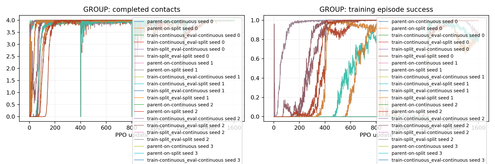

# P2-29 · 분리 지지면 추가학습 교차평가

부모정책을동일하게복사한4seed×2분기. 부모학습재사용과새분기step을구분하며원래초기화실패의인프라비용은별도계상한다.

고유 학습 run 기준 314,572,800 환경 step, 신규 157,286,400step. [사전 프로토콜](p2-29-protocol.md).

| 발 | 조건 | seed | 목표 도약 성공 | 필요 착지 완료 | 낙상 | 시간초과 | ≥20ms 전 발 무접촉 |
|---|---|---:|---:|---:|---:|---:|---:|---:|
| GROUP | parent-on-continuous | 0 | 0/64 | 64/64 | 0/64 | 64/64 | 64/64 |
| GROUP | parent-on-split | 0 | 0/64 | 0/64 | 64/64 | 0/64 | 64/64 |
| GROUP | train-continuous_eval-continuous | 0 | 64/64 | 64/64 | 0/64 | 0/64 | 64/64 |
| GROUP | train-continuous_eval-split | 0 | 15/64 | 64/64 | 0/64 | 49/64 | 64/64 |
| GROUP | train-split_eval-continuous | 0 | 64/64 | 64/64 | 0/64 | 0/64 | 64/64 |
| GROUP | train-split_eval-split | 0 | 64/64 | 64/64 | 0/64 | 0/64 | 64/64 |
| GROUP | parent-on-continuous | 1 | 0/64 | 64/64 | 0/64 | 64/64 | 64/64 |
| GROUP | parent-on-split | 1 | 0/64 | 64/64 | 0/64 | 64/64 | 64/64 |
| GROUP | train-continuous_eval-continuous | 1 | 64/64 | 64/64 | 0/64 | 0/64 | 64/64 |
| GROUP | train-continuous_eval-split | 1 | 64/64 | 64/64 | 0/64 | 0/64 | 64/64 |
| GROUP | train-split_eval-continuous | 1 | 64/64 | 64/64 | 0/64 | 0/64 | 64/64 |
| GROUP | train-split_eval-split | 1 | 64/64 | 64/64 | 0/64 | 0/64 | 64/64 |
| GROUP | parent-on-continuous | 2 | 64/64 | 64/64 | 0/64 | 0/64 | 64/64 |
| GROUP | parent-on-split | 2 | 64/64 | 64/64 | 0/64 | 0/64 | 64/64 |
| GROUP | train-continuous_eval-continuous | 2 | 64/64 | 64/64 | 0/64 | 0/64 | 64/64 |
| GROUP | train-continuous_eval-split | 2 | 64/64 | 64/64 | 0/64 | 0/64 | 64/64 |
| GROUP | train-split_eval-continuous | 2 | 64/64 | 64/64 | 0/64 | 0/64 | 64/64 |
| GROUP | train-split_eval-split | 2 | 64/64 | 64/64 | 0/64 | 0/64 | 64/64 |
| GROUP | parent-on-continuous | 3 | 0/64 | 64/64 | 0/64 | 64/64 | 64/64 |
| GROUP | parent-on-split | 3 | 0/64 | 64/64 | 0/64 | 64/64 | 64/64 |
| GROUP | train-continuous_eval-continuous | 3 | 64/64 | 64/64 | 0/64 | 0/64 | 64/64 |
| GROUP | train-continuous_eval-split | 3 | 64/64 | 64/64 | 0/64 | 0/64 | 64/64 |
| GROUP | train-split_eval-continuous | 3 | 64/64 | 64/64 | 0/64 | 0/64 | 64/64 |
| GROUP | train-split_eval-split | 3 | 64/64 | 64/64 | 0/64 | 0/64 | 64/64 |

## 도약 계약 지표

| 조건 | seed | 유효 비행 | 비행 후 재접촉 | 목표 도약 성공 | 비발 접촉 종료 | 평균 비행 apex 상승 | 높이 명령 충족 | 네 발 첫 접촉 반경 내 | 최종 높이 범위 밖 |
|---|---:|---:|---:|---:|---:|---:|---:|---:|---:|
| parent-on-continuous | 0 | 64/64 | 64/64 | 0/64 | 0 | 22.03 cm | 64/64 | 64/64 | 0/64 |
| parent-on-split | 0 | 0/64 | 0/64 | 0/64 | 64 | 0.00 cm | 0/64 | 0/64 | 64/64 |
| train-continuous_eval-continuous | 0 | 64/64 | 64/64 | 64/64 | 0 | 19.82 cm | 64/64 | 64/64 | 0/64 |
| train-continuous_eval-split | 0 | 64/64 | 64/64 | 15/64 | 0 | 19.09 cm | 64/64 | 15/64 | 0/64 |
| train-split_eval-continuous | 0 | 64/64 | 64/64 | 64/64 | 0 | 23.86 cm | 64/64 | 64/64 | 0/64 |
| train-split_eval-split | 0 | 64/64 | 64/64 | 64/64 | 0 | 23.87 cm | 64/64 | 64/64 | 0/64 |
| parent-on-continuous | 1 | 64/64 | 64/64 | 0/64 | 0 | 11.76 cm | 64/64 | 64/64 | 0/64 |
| parent-on-split | 1 | 64/64 | 64/64 | 0/64 | 0 | 11.76 cm | 64/64 | 64/64 | 0/64 |
| train-continuous_eval-continuous | 1 | 64/64 | 64/64 | 64/64 | 0 | 10.09 cm | 64/64 | 64/64 | 0/64 |
| train-continuous_eval-split | 1 | 64/64 | 64/64 | 64/64 | 0 | 10.09 cm | 64/64 | 64/64 | 0/64 |
| train-split_eval-continuous | 1 | 64/64 | 64/64 | 64/64 | 0 | 10.19 cm | 64/64 | 64/64 | 0/64 |
| train-split_eval-split | 1 | 64/64 | 64/64 | 64/64 | 0 | 10.19 cm | 64/64 | 64/64 | 0/64 |
| parent-on-continuous | 2 | 64/64 | 64/64 | 64/64 | 0 | 12.65 cm | 64/64 | 64/64 | 0/64 |
| parent-on-split | 2 | 64/64 | 64/64 | 64/64 | 0 | 12.48 cm | 64/64 | 64/64 | 0/64 |
| train-continuous_eval-continuous | 2 | 64/64 | 64/64 | 64/64 | 0 | 9.57 cm | 64/64 | 64/64 | 0/64 |
| train-continuous_eval-split | 2 | 64/64 | 64/64 | 64/64 | 0 | 9.54 cm | 64/64 | 64/64 | 0/64 |
| train-split_eval-continuous | 2 | 64/64 | 64/64 | 64/64 | 0 | 13.44 cm | 64/64 | 64/64 | 0/64 |
| train-split_eval-split | 2 | 64/64 | 64/64 | 64/64 | 0 | 13.44 cm | 64/64 | 64/64 | 0/64 |
| parent-on-continuous | 3 | 64/64 | 64/64 | 0/64 | 0 | 10.55 cm | 64/64 | 64/64 | 0/64 |
| parent-on-split | 3 | 64/64 | 64/64 | 0/64 | 0 | 10.55 cm | 64/64 | 64/64 | 0/64 |
| train-continuous_eval-continuous | 3 | 64/64 | 64/64 | 64/64 | 0 | 11.88 cm | 64/64 | 64/64 | 0/64 |
| train-continuous_eval-split | 3 | 64/64 | 64/64 | 64/64 | 0 | 11.88 cm | 64/64 | 64/64 | 0/64 |
| train-split_eval-continuous | 3 | 64/64 | 64/64 | 64/64 | 0 | 11.99 cm | 64/64 | 64/64 | 0/64 |
| train-split_eval-split | 3 | 64/64 | 64/64 | 64/64 | 0 | 11.99 cm | 64/64 | 64/64 | 0/64 |

## 발별 첫 접촉

오차 평균은 관측된 첫 접촉만 포함한다. 반경 내 수의 분모는 전체 episode이며 미접촉을 성공으로 세지 않는다.

| 조건 | seed | 발 | 관측 수 | 평균 오차 | 반경 내 |
|---|---:|---|---:|---:|---:|
| parent-on-continuous | 0 | FL | 64/64 | 1.32 cm | 64/64 |
| parent-on-continuous | 0 | FR | 64/64 | 1.90 cm | 64/64 |
| parent-on-continuous | 0 | RL | 64/64 | 0.29 cm | 64/64 |
| parent-on-continuous | 0 | RR | 64/64 | 0.44 cm | 64/64 |
| parent-on-split | 0 | FL | 0/64 | N/A | 0/64 |
| parent-on-split | 0 | FR | 0/64 | N/A | 0/64 |
| parent-on-split | 0 | RL | 0/64 | N/A | 0/64 |
| parent-on-split | 0 | RR | 0/64 | N/A | 0/64 |
| train-continuous_eval-continuous | 0 | FL | 64/64 | 0.09 cm | 64/64 |
| train-continuous_eval-continuous | 0 | FR | 64/64 | 0.04 cm | 64/64 |
| train-continuous_eval-continuous | 0 | RL | 64/64 | 0.10 cm | 64/64 |
| train-continuous_eval-continuous | 0 | RR | 64/64 | 0.18 cm | 64/64 |
| train-continuous_eval-split | 0 | FL | 64/64 | 0.51 cm | 64/64 |
| train-continuous_eval-split | 0 | FR | 64/64 | 5.03 cm | 15/64 |
| train-continuous_eval-split | 0 | RL | 64/64 | 4.66 cm | 54/64 |
| train-continuous_eval-split | 0 | RR | 64/64 | 2.89 cm | 64/64 |
| train-split_eval-continuous | 0 | FL | 64/64 | 0.22 cm | 64/64 |
| train-split_eval-continuous | 0 | FR | 64/64 | 0.28 cm | 64/64 |
| train-split_eval-continuous | 0 | RL | 64/64 | 0.21 cm | 64/64 |
| train-split_eval-continuous | 0 | RR | 64/64 | 0.25 cm | 64/64 |
| train-split_eval-split | 0 | FL | 64/64 | 0.23 cm | 64/64 |
| train-split_eval-split | 0 | FR | 64/64 | 0.31 cm | 64/64 |
| train-split_eval-split | 0 | RL | 64/64 | 0.22 cm | 64/64 |
| train-split_eval-split | 0 | RR | 64/64 | 0.23 cm | 64/64 |
| parent-on-continuous | 1 | FL | 64/64 | 0.39 cm | 64/64 |
| parent-on-continuous | 1 | FR | 64/64 | 0.28 cm | 64/64 |
| parent-on-continuous | 1 | RL | 64/64 | 0.23 cm | 64/64 |
| parent-on-continuous | 1 | RR | 64/64 | 0.25 cm | 64/64 |
| parent-on-split | 1 | FL | 64/64 | 0.39 cm | 64/64 |
| parent-on-split | 1 | FR | 64/64 | 0.28 cm | 64/64 |
| parent-on-split | 1 | RL | 64/64 | 0.23 cm | 64/64 |
| parent-on-split | 1 | RR | 64/64 | 0.25 cm | 64/64 |
| train-continuous_eval-continuous | 1 | FL | 64/64 | 0.20 cm | 64/64 |
| train-continuous_eval-continuous | 1 | FR | 64/64 | 0.17 cm | 64/64 |
| train-continuous_eval-continuous | 1 | RL | 64/64 | 0.18 cm | 64/64 |
| train-continuous_eval-continuous | 1 | RR | 64/64 | 0.15 cm | 64/64 |
| train-continuous_eval-split | 1 | FL | 64/64 | 0.20 cm | 64/64 |
| train-continuous_eval-split | 1 | FR | 64/64 | 0.16 cm | 64/64 |
| train-continuous_eval-split | 1 | RL | 64/64 | 0.18 cm | 64/64 |
| train-continuous_eval-split | 1 | RR | 64/64 | 0.15 cm | 64/64 |
| train-split_eval-continuous | 1 | FL | 64/64 | 0.25 cm | 64/64 |
| train-split_eval-continuous | 1 | FR | 64/64 | 0.27 cm | 64/64 |
| train-split_eval-continuous | 1 | RL | 64/64 | 0.21 cm | 64/64 |
| train-split_eval-continuous | 1 | RR | 64/64 | 0.25 cm | 64/64 |
| train-split_eval-split | 1 | FL | 64/64 | 0.24 cm | 64/64 |
| train-split_eval-split | 1 | FR | 64/64 | 0.27 cm | 64/64 |
| train-split_eval-split | 1 | RL | 64/64 | 0.21 cm | 64/64 |
| train-split_eval-split | 1 | RR | 64/64 | 0.25 cm | 64/64 |
| parent-on-continuous | 2 | FL | 64/64 | 0.64 cm | 64/64 |
| parent-on-continuous | 2 | FR | 64/64 | 0.47 cm | 64/64 |
| parent-on-continuous | 2 | RL | 64/64 | 0.79 cm | 64/64 |
| parent-on-continuous | 2 | RR | 64/64 | 1.16 cm | 64/64 |
| parent-on-split | 2 | FL | 64/64 | 1.04 cm | 64/64 |
| parent-on-split | 2 | FR | 64/64 | 0.48 cm | 64/64 |
| parent-on-split | 2 | RL | 64/64 | 0.91 cm | 64/64 |
| parent-on-split | 2 | RR | 64/64 | 2.35 cm | 64/64 |
| train-continuous_eval-continuous | 2 | FL | 64/64 | 0.21 cm | 64/64 |
| train-continuous_eval-continuous | 2 | FR | 64/64 | 0.13 cm | 64/64 |
| train-continuous_eval-continuous | 2 | RL | 64/64 | 0.09 cm | 64/64 |
| train-continuous_eval-continuous | 2 | RR | 64/64 | 0.24 cm | 64/64 |
| train-continuous_eval-split | 2 | FL | 64/64 | 0.28 cm | 64/64 |
| train-continuous_eval-split | 2 | FR | 64/64 | 0.21 cm | 64/64 |
| train-continuous_eval-split | 2 | RL | 64/64 | 0.26 cm | 64/64 |
| train-continuous_eval-split | 2 | RR | 64/64 | 0.33 cm | 64/64 |
| train-split_eval-continuous | 2 | FL | 64/64 | 0.13 cm | 64/64 |
| train-split_eval-continuous | 2 | FR | 64/64 | 0.09 cm | 64/64 |
| train-split_eval-continuous | 2 | RL | 64/64 | 0.04 cm | 64/64 |
| train-split_eval-continuous | 2 | RR | 64/64 | 0.11 cm | 64/64 |
| train-split_eval-split | 2 | FL | 64/64 | 0.11 cm | 64/64 |
| train-split_eval-split | 2 | FR | 64/64 | 0.09 cm | 64/64 |
| train-split_eval-split | 2 | RL | 64/64 | 0.05 cm | 64/64 |
| train-split_eval-split | 2 | RR | 64/64 | 0.12 cm | 64/64 |
| parent-on-continuous | 3 | FL | 64/64 | 0.73 cm | 64/64 |
| parent-on-continuous | 3 | FR | 64/64 | 0.22 cm | 64/64 |
| parent-on-continuous | 3 | RL | 64/64 | 0.60 cm | 64/64 |
| parent-on-continuous | 3 | RR | 64/64 | 0.20 cm | 64/64 |
| parent-on-split | 3 | FL | 64/64 | 0.75 cm | 64/64 |
| parent-on-split | 3 | FR | 64/64 | 0.22 cm | 64/64 |
| parent-on-split | 3 | RL | 64/64 | 0.59 cm | 64/64 |
| parent-on-split | 3 | RR | 64/64 | 0.22 cm | 64/64 |
| train-continuous_eval-continuous | 3 | FL | 64/64 | 0.22 cm | 64/64 |
| train-continuous_eval-continuous | 3 | FR | 64/64 | 0.41 cm | 64/64 |
| train-continuous_eval-continuous | 3 | RL | 64/64 | 0.53 cm | 64/64 |
| train-continuous_eval-continuous | 3 | RR | 64/64 | 0.27 cm | 64/64 |
| train-continuous_eval-split | 3 | FL | 64/64 | 0.22 cm | 64/64 |
| train-continuous_eval-split | 3 | FR | 64/64 | 0.41 cm | 64/64 |
| train-continuous_eval-split | 3 | RL | 64/64 | 0.53 cm | 64/64 |
| train-continuous_eval-split | 3 | RR | 64/64 | 0.27 cm | 64/64 |
| train-split_eval-continuous | 3 | FL | 64/64 | 0.19 cm | 64/64 |
| train-split_eval-continuous | 3 | FR | 64/64 | 0.15 cm | 64/64 |
| train-split_eval-continuous | 3 | RL | 64/64 | 0.33 cm | 64/64 |
| train-split_eval-continuous | 3 | RR | 64/64 | 0.20 cm | 64/64 |
| train-split_eval-split | 3 | FL | 64/64 | 0.20 cm | 64/64 |
| train-split_eval-split | 3 | FR | 64/64 | 0.15 cm | 64/64 |
| train-split_eval-split | 3 | RL | 64/64 | 0.32 cm | 64/64 |
| train-split_eval-split | 3 | RR | 64/64 | 0.21 cm | 64/64 |

## 공통 지표 분리

| 조건 | seed | 기존 안정화 달성 | 첫 접촉 네 발 반경 내 |
|---|---:|---:|---:|
| parent-on-continuous | 0 | 64/64 | 64/64 |
| parent-on-split | 0 | 0/64 | 0/64 |
| train-continuous_eval-continuous | 0 | 64/64 | 64/64 |
| train-continuous_eval-split | 0 | 51/64 | 15/64 |
| train-split_eval-continuous | 0 | 64/64 | 64/64 |
| train-split_eval-split | 0 | 64/64 | 64/64 |
| parent-on-continuous | 1 | 64/64 | 64/64 |
| parent-on-split | 1 | 64/64 | 64/64 |
| train-continuous_eval-continuous | 1 | 64/64 | 64/64 |
| train-continuous_eval-split | 1 | 64/64 | 64/64 |
| train-split_eval-continuous | 1 | 64/64 | 64/64 |
| train-split_eval-split | 1 | 64/64 | 64/64 |
| parent-on-continuous | 2 | 64/64 | 64/64 |
| parent-on-split | 2 | 64/64 | 64/64 |
| train-continuous_eval-continuous | 2 | 64/64 | 64/64 |
| train-continuous_eval-split | 2 | 64/64 | 64/64 |
| train-split_eval-continuous | 2 | 64/64 | 64/64 |
| train-split_eval-split | 2 | 64/64 | 64/64 |
| parent-on-continuous | 3 | 64/64 | 64/64 |
| parent-on-split | 3 | 64/64 | 64/64 |
| train-continuous_eval-continuous | 3 | 64/64 | 64/64 |
| train-continuous_eval-split | 3 | 64/64 | 64/64 |
| train-split_eval-continuous | 3 | 64/64 | 64/64 |
| train-split_eval-split | 3 | 64/64 | 64/64 |

## 출발 계약과 궤적 부분집합

3cm 내 성공 궤적 수는 현재 실행에서의 부분집합이다. 다른 출발 반경으로 재실행한 평가를 대체하지 않는다.

| 조건 | seed | 실행 출발 반경 | 3cm 내 출발 / 전체 | 3cm 내 성공 / 전체 |
|---|---:|---:|---:|---:|
| parent-on-continuous | 0 | 3 cm | 64/64 | 0/64 |
| parent-on-split | 0 | 3 cm | 0/64 | 0/64 |
| train-continuous_eval-continuous | 0 | 3 cm | 64/64 | 64/64 |
| train-continuous_eval-split | 0 | 3 cm | 64/64 | 15/64 |
| train-split_eval-continuous | 0 | 3 cm | 64/64 | 64/64 |
| train-split_eval-split | 0 | 3 cm | 64/64 | 64/64 |
| parent-on-continuous | 1 | 3 cm | 64/64 | 0/64 |
| parent-on-split | 1 | 3 cm | 64/64 | 0/64 |
| train-continuous_eval-continuous | 1 | 3 cm | 64/64 | 64/64 |
| train-continuous_eval-split | 1 | 3 cm | 64/64 | 64/64 |
| train-split_eval-continuous | 1 | 3 cm | 64/64 | 64/64 |
| train-split_eval-split | 1 | 3 cm | 64/64 | 64/64 |
| parent-on-continuous | 2 | 3 cm | 64/64 | 64/64 |
| parent-on-split | 2 | 3 cm | 64/64 | 64/64 |
| train-continuous_eval-continuous | 2 | 3 cm | 64/64 | 64/64 |
| train-continuous_eval-split | 2 | 3 cm | 64/64 | 64/64 |
| train-split_eval-continuous | 2 | 3 cm | 64/64 | 64/64 |
| train-split_eval-split | 2 | 3 cm | 64/64 | 64/64 |
| parent-on-continuous | 3 | 3 cm | 64/64 | 0/64 |
| parent-on-split | 3 | 3 cm | 64/64 | 0/64 |
| train-continuous_eval-continuous | 3 | 3 cm | 64/64 | 64/64 |
| train-continuous_eval-split | 3 | 3 cm | 64/64 | 64/64 |
| train-split_eval-continuous | 3 | 3 cm | 64/64 | 64/64 |
| train-split_eval-split | 3 | 3 cm | 64/64 | 64/64 |

## 거리별 평가

| 조건 | seed | 전방 목표 | 성공 | 출발 영역 | 실비행 이동 충족 | 첫 접촉 반경 | 안정화 |
|---|---:|---:|---:|---:|---:|---:|---:|
| parent-on-continuous | 0 | 15 cm | 0/64 | 64/64 | 0/64 | 64/64 | 64/64 |
| parent-on-split | 0 | 15 cm | 0/64 | 0/64 | 0/64 | 0/64 | 0/64 |
| train-continuous_eval-continuous | 0 | 15 cm | 64/64 | 64/64 | 64/64 | 64/64 | 64/64 |
| train-continuous_eval-split | 0 | 15 cm | 15/64 | 64/64 | 64/64 | 15/64 | 51/64 |
| train-split_eval-continuous | 0 | 15 cm | 64/64 | 64/64 | 64/64 | 64/64 | 64/64 |
| train-split_eval-split | 0 | 15 cm | 64/64 | 64/64 | 64/64 | 64/64 | 64/64 |
| parent-on-continuous | 1 | 15 cm | 0/64 | 64/64 | 0/64 | 64/64 | 64/64 |
| parent-on-split | 1 | 15 cm | 0/64 | 64/64 | 0/64 | 64/64 | 64/64 |
| train-continuous_eval-continuous | 1 | 15 cm | 64/64 | 64/64 | 64/64 | 64/64 | 64/64 |
| train-continuous_eval-split | 1 | 15 cm | 64/64 | 64/64 | 64/64 | 64/64 | 64/64 |
| train-split_eval-continuous | 1 | 15 cm | 64/64 | 64/64 | 64/64 | 64/64 | 64/64 |
| train-split_eval-split | 1 | 15 cm | 64/64 | 64/64 | 64/64 | 64/64 | 64/64 |
| parent-on-continuous | 2 | 15 cm | 64/64 | 64/64 | 64/64 | 64/64 | 64/64 |
| parent-on-split | 2 | 15 cm | 64/64 | 64/64 | 64/64 | 64/64 | 64/64 |
| train-continuous_eval-continuous | 2 | 15 cm | 64/64 | 64/64 | 64/64 | 64/64 | 64/64 |
| train-continuous_eval-split | 2 | 15 cm | 64/64 | 64/64 | 64/64 | 64/64 | 64/64 |
| train-split_eval-continuous | 2 | 15 cm | 64/64 | 64/64 | 64/64 | 64/64 | 64/64 |
| train-split_eval-split | 2 | 15 cm | 64/64 | 64/64 | 64/64 | 64/64 | 64/64 |
| parent-on-continuous | 3 | 15 cm | 0/64 | 64/64 | 0/64 | 64/64 | 64/64 |
| parent-on-split | 3 | 15 cm | 0/64 | 64/64 | 0/64 | 64/64 | 64/64 |
| train-continuous_eval-continuous | 3 | 15 cm | 64/64 | 64/64 | 64/64 | 64/64 | 64/64 |
| train-continuous_eval-split | 3 | 15 cm | 64/64 | 64/64 | 64/64 | 64/64 | 64/64 |
| train-split_eval-continuous | 3 | 15 cm | 64/64 | 64/64 | 64/64 | 64/64 | 64/64 |
| train-split_eval-split | 3 | 15 cm | 64/64 | 64/64 | 64/64 | 64/64 | 64/64 |

학습 곡선은 각 update의 종료 episode 통계다. 고정 평가 결과와 구분한다. 종료 단계는 마지막 유효 200Hz 표본이며 실제 완료 여부는 terminal metrics를 우선한다.

## 종료 단계

- GROUP parent-on-continuous seed 0: `{'2:2': 64}`
- GROUP parent-on-split seed 0: `{'0:0': 64}`
- GROUP train-continuous_eval-continuous seed 0: `{'2:2': 64}`
- GROUP train-continuous_eval-split seed 0: `{'2:2': 64}`
- GROUP train-split_eval-continuous seed 0: `{'2:2': 64}`
- GROUP train-split_eval-split seed 0: `{'2:2': 64}`
- GROUP parent-on-continuous seed 1: `{'2:2': 64}`
- GROUP parent-on-split seed 1: `{'2:2': 64}`
- GROUP train-continuous_eval-continuous seed 1: `{'2:2': 64}`
- GROUP train-continuous_eval-split seed 1: `{'2:2': 64}`
- GROUP train-split_eval-continuous seed 1: `{'2:2': 64}`
- GROUP train-split_eval-split seed 1: `{'2:2': 64}`
- GROUP parent-on-continuous seed 2: `{'2:2': 64}`
- GROUP parent-on-split seed 2: `{'2:2': 64}`
- GROUP train-continuous_eval-continuous seed 2: `{'2:2': 64}`
- GROUP train-continuous_eval-split seed 2: `{'2:2': 64}`
- GROUP train-split_eval-continuous seed 2: `{'2:2': 64}`
- GROUP train-split_eval-split seed 2: `{'2:2': 64}`
- GROUP parent-on-continuous seed 3: `{'2:2': 64}`
- GROUP parent-on-split seed 3: `{'2:2': 64}`
- GROUP train-continuous_eval-continuous seed 3: `{'2:2': 64}`
- GROUP train-continuous_eval-split seed 3: `{'2:2': 64}`
- GROUP train-split_eval-continuous seed 3: `{'2:2': 64}`
- GROUP train-split_eval-split seed 3: `{'2:2': 64}`

## 마지막 제어 표본의 안정화 조건 위반

복수 위반을 허용한다. 연속 hold 전체 구간의 실패 원인과 같지 않으며, 기록되지 않은 과거 실행은 표시하지 않는다.

- parent-on-continuous seed 0: `{'height': 0, 'vertical_speed': 0, 'angular_speed': 0, 'foot_target': 0, 'contact_state': 0, 'support_history': 0}`
- parent-on-split seed 0: `{'height': 64, 'vertical_speed': 0, 'angular_speed': 64, 'foot_target': 64, 'contact_state': 0, 'support_history': 0}`
- train-continuous_eval-continuous seed 0: `{'height': 0, 'vertical_speed': 0, 'angular_speed': 0, 'foot_target': 0, 'contact_state': 0, 'support_history': 0}`
- train-continuous_eval-split seed 0: `{'height': 0, 'vertical_speed': 0, 'angular_speed': 0, 'foot_target': 30, 'contact_state': 0, 'support_history': 0}`
- train-split_eval-continuous seed 0: `{'height': 0, 'vertical_speed': 0, 'angular_speed': 0, 'foot_target': 0, 'contact_state': 0, 'support_history': 0}`
- train-split_eval-split seed 0: `{'height': 0, 'vertical_speed': 0, 'angular_speed': 0, 'foot_target': 0, 'contact_state': 0, 'support_history': 0}`
- parent-on-continuous seed 1: `{'height': 0, 'vertical_speed': 0, 'angular_speed': 0, 'foot_target': 0, 'contact_state': 0, 'support_history': 0}`
- parent-on-split seed 1: `{'height': 0, 'vertical_speed': 0, 'angular_speed': 0, 'foot_target': 0, 'contact_state': 0, 'support_history': 0}`
- train-continuous_eval-continuous seed 1: `{'height': 0, 'vertical_speed': 0, 'angular_speed': 0, 'foot_target': 0, 'contact_state': 0, 'support_history': 0}`
- train-continuous_eval-split seed 1: `{'height': 0, 'vertical_speed': 0, 'angular_speed': 0, 'foot_target': 0, 'contact_state': 0, 'support_history': 0}`
- train-split_eval-continuous seed 1: `{'height': 0, 'vertical_speed': 0, 'angular_speed': 0, 'foot_target': 0, 'contact_state': 0, 'support_history': 0}`
- train-split_eval-split seed 1: `{'height': 0, 'vertical_speed': 0, 'angular_speed': 0, 'foot_target': 0, 'contact_state': 0, 'support_history': 0}`
- parent-on-continuous seed 2: `{'height': 0, 'vertical_speed': 0, 'angular_speed': 0, 'foot_target': 0, 'contact_state': 0, 'support_history': 0}`
- parent-on-split seed 2: `{'height': 0, 'vertical_speed': 0, 'angular_speed': 0, 'foot_target': 0, 'contact_state': 0, 'support_history': 0}`
- train-continuous_eval-continuous seed 2: `{'height': 0, 'vertical_speed': 0, 'angular_speed': 0, 'foot_target': 0, 'contact_state': 0, 'support_history': 0}`
- train-continuous_eval-split seed 2: `{'height': 0, 'vertical_speed': 0, 'angular_speed': 0, 'foot_target': 0, 'contact_state': 0, 'support_history': 0}`
- train-split_eval-continuous seed 2: `{'height': 0, 'vertical_speed': 0, 'angular_speed': 0, 'foot_target': 0, 'contact_state': 0, 'support_history': 0}`
- train-split_eval-split seed 2: `{'height': 0, 'vertical_speed': 0, 'angular_speed': 0, 'foot_target': 0, 'contact_state': 0, 'support_history': 0}`
- parent-on-continuous seed 3: `{'height': 0, 'vertical_speed': 0, 'angular_speed': 0, 'foot_target': 0, 'contact_state': 0, 'support_history': 0}`
- parent-on-split seed 3: `{'height': 0, 'vertical_speed': 0, 'angular_speed': 0, 'foot_target': 0, 'contact_state': 0, 'support_history': 0}`
- train-continuous_eval-continuous seed 3: `{'height': 0, 'vertical_speed': 0, 'angular_speed': 0, 'foot_target': 0, 'contact_state': 0, 'support_history': 0}`
- train-continuous_eval-split seed 3: `{'height': 0, 'vertical_speed': 0, 'angular_speed': 0, 'foot_target': 0, 'contact_state': 0, 'support_history': 0}`
- train-split_eval-continuous seed 3: `{'height': 0, 'vertical_speed': 0, 'angular_speed': 0, 'foot_target': 0, 'contact_state': 0, 'support_history': 0}`
- train-split_eval-split seed 3: `{'height': 0, 'vertical_speed': 0, 'angular_speed': 0, 'foot_target': 0, 'contact_state': 0, 'support_history': 0}`

## 해석 및 다음 판단

분석 중. 표만으로 모델 승격을 결정하지 않는다.

## 범위·재현

개발 조건의 탐색적 실험이다. 평가 episode 수와 독립 학습 seed 수를 구분하며 최종 시험 결과로 주장하지 않는다. 같은 발의 평가 시나리오가 동일함을 확인했다. 설정·checkpoint·원본200Hz NPZ는 artifacts, 최종 병렬 평가 영상은 result에 보존한다. 재사용 대조군 원본은 변경하지 않는다.

실행 목록 및 보고서 명세: `configs/reports/p2-29.json`. 이 보고서는 `scripts/experiment_report.py`로 재생성한다.
