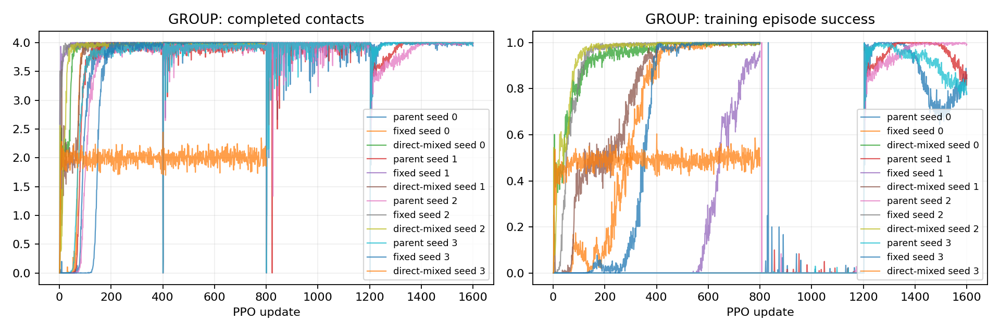

# P2-31 regression

P2-27 parents, reused fixed15 forks and new direct discrete0/15 forks; matched 800-update condition budgets.

고유 학습 run 기준 314,572,800 환경 step, 신규 78,643,200step. [사전 프로토콜](p2-31-protocol.md).

| 발 | 조건 | seed | 목표 도약 성공 | 필요 착지 완료 | 낙상 | 시간초과 | ≥20ms 전 발 무접촉 |
|---|---|---:|---:|---:|---:|---:|---:|---:|
| GROUP | parent | 0 | 48/64 | 64/64 | 0/64 | 16/64 | 64/64 |
| GROUP | fixed | 0 | 64/64 | 64/64 | 0/64 | 0/64 | 64/64 |
| GROUP | direct-mixed | 0 | 64/64 | 64/64 | 0/64 | 0/64 | 64/64 |
| GROUP | parent | 1 | 48/64 | 64/64 | 0/64 | 16/64 | 64/64 |
| GROUP | fixed | 1 | 49/64 | 64/64 | 0/64 | 15/64 | 64/64 |
| GROUP | direct-mixed | 1 | 64/64 | 64/64 | 0/64 | 0/64 | 64/64 |
| GROUP | parent | 2 | 64/64 | 64/64 | 0/64 | 0/64 | 64/64 |
| GROUP | fixed | 2 | 48/64 | 48/64 | 16/64 | 0/64 | 64/64 |
| GROUP | direct-mixed | 2 | 64/64 | 64/64 | 0/64 | 0/64 | 64/64 |
| GROUP | parent | 3 | 48/64 | 64/64 | 0/64 | 16/64 | 64/64 |
| GROUP | fixed | 3 | 48/64 | 48/64 | 16/64 | 0/64 | 64/64 |
| GROUP | direct-mixed | 3 | 32/64 | 32/64 | 10/64 | 22/64 | 64/64 |

## 도약 계약 지표

| 조건 | seed | 유효 비행 | 비행 후 재접촉 | 목표 도약 성공 | 비발 접촉 종료 | 평균 비행 apex 상승 | 높이 명령 충족 | 네 발 첫 접촉 반경 내 | 최종 높이 범위 밖 |
|---|---:|---:|---:|---:|---:|---:|---:|---:|---:|
| parent | 0 | 64/64 | 64/64 | 48/64 | 0 | 21.74 cm | 64/64 | 64/64 | 0/64 |
| fixed | 0 | 64/64 | 64/64 | 64/64 | 0 | 20.87 cm | 64/64 | 64/64 | 0/64 |
| direct-mixed | 0 | 64/64 | 64/64 | 64/64 | 0 | 21.33 cm | 64/64 | 64/64 | 0/64 |
| parent | 1 | 64/64 | 64/64 | 48/64 | 0 | 9.87 cm | 64/64 | 64/64 | 0/64 |
| fixed | 1 | 64/64 | 64/64 | 49/64 | 0 | 8.45 cm | 49/64 | 64/64 | 0/64 |
| direct-mixed | 1 | 64/64 | 64/64 | 64/64 | 0 | 11.50 cm | 64/64 | 64/64 | 0/64 |
| parent | 2 | 64/64 | 64/64 | 64/64 | 0 | 10.35 cm | 64/64 | 64/64 | 0/64 |
| fixed | 2 | 64/64 | 48/64 | 48/64 | 0 | 9.81 cm | 48/64 | 48/64 | 0/64 |
| direct-mixed | 2 | 64/64 | 64/64 | 64/64 | 0 | 11.52 cm | 64/64 | 64/64 | 0/64 |
| parent | 3 | 64/64 | 64/64 | 48/64 | 0 | 8.19 cm | 64/64 | 64/64 | 0/64 |
| fixed | 3 | 64/64 | 48/64 | 48/64 | 0 | 9.19 cm | 49/64 | 48/64 | 0/64 |
| direct-mixed | 3 | 42/64 | 32/64 | 32/64 | 0 | 4.35 cm | 40/64 | 32/64 | 6/64 |

## 발별 첫 접촉

오차 평균은 관측된 첫 접촉만 포함한다. 반경 내 수의 분모는 전체 episode이며 미접촉을 성공으로 세지 않는다.

| 조건 | seed | 발 | 관측 수 | 평균 오차 | 반경 내 |
|---|---:|---|---:|---:|---:|
| parent | 0 | FL | 64/64 | 0.83 cm | 64/64 |
| parent | 0 | FR | 64/64 | 1.15 cm | 64/64 |
| parent | 0 | RL | 64/64 | 0.60 cm | 64/64 |
| parent | 0 | RR | 64/64 | 0.52 cm | 64/64 |
| fixed | 0 | FL | 64/64 | 0.29 cm | 64/64 |
| fixed | 0 | FR | 64/64 | 0.98 cm | 64/64 |
| fixed | 0 | RL | 64/64 | 0.54 cm | 64/64 |
| fixed | 0 | RR | 64/64 | 0.85 cm | 64/64 |
| direct-mixed | 0 | FL | 64/64 | 0.32 cm | 64/64 |
| direct-mixed | 0 | FR | 64/64 | 0.28 cm | 64/64 |
| direct-mixed | 0 | RL | 64/64 | 0.51 cm | 64/64 |
| direct-mixed | 0 | RR | 64/64 | 0.33 cm | 64/64 |
| parent | 1 | FL | 64/64 | 0.44 cm | 64/64 |
| parent | 1 | FR | 64/64 | 0.30 cm | 64/64 |
| parent | 1 | RL | 64/64 | 0.38 cm | 64/64 |
| parent | 1 | RR | 64/64 | 0.31 cm | 64/64 |
| fixed | 1 | FL | 64/64 | 0.77 cm | 64/64 |
| fixed | 1 | FR | 64/64 | 0.42 cm | 64/64 |
| fixed | 1 | RL | 64/64 | 0.84 cm | 64/64 |
| fixed | 1 | RR | 64/64 | 0.72 cm | 64/64 |
| direct-mixed | 1 | FL | 64/64 | 0.32 cm | 64/64 |
| direct-mixed | 1 | FR | 64/64 | 0.57 cm | 64/64 |
| direct-mixed | 1 | RL | 64/64 | 0.52 cm | 64/64 |
| direct-mixed | 1 | RR | 64/64 | 1.05 cm | 64/64 |
| parent | 2 | FL | 64/64 | 0.56 cm | 64/64 |
| parent | 2 | FR | 64/64 | 0.40 cm | 64/64 |
| parent | 2 | RL | 64/64 | 0.38 cm | 64/64 |
| parent | 2 | RR | 64/64 | 0.83 cm | 64/64 |
| fixed | 2 | FL | 48/64 | 0.49 cm | 48/64 |
| fixed | 2 | FR | 48/64 | 0.57 cm | 48/64 |
| fixed | 2 | RL | 48/64 | 0.40 cm | 48/64 |
| fixed | 2 | RR | 48/64 | 0.18 cm | 48/64 |
| direct-mixed | 2 | FL | 64/64 | 0.24 cm | 64/64 |
| direct-mixed | 2 | FR | 64/64 | 0.37 cm | 64/64 |
| direct-mixed | 2 | RL | 64/64 | 0.30 cm | 64/64 |
| direct-mixed | 2 | RR | 64/64 | 0.74 cm | 64/64 |
| parent | 3 | FL | 64/64 | 0.45 cm | 64/64 |
| parent | 3 | FR | 64/64 | 0.29 cm | 64/64 |
| parent | 3 | RL | 64/64 | 0.62 cm | 64/64 |
| parent | 3 | RR | 64/64 | 0.33 cm | 64/64 |
| fixed | 3 | FL | 48/64 | 0.30 cm | 48/64 |
| fixed | 3 | FR | 48/64 | 0.94 cm | 48/64 |
| fixed | 3 | RL | 48/64 | 1.10 cm | 48/64 |
| fixed | 3 | RR | 48/64 | 0.89 cm | 48/64 |
| direct-mixed | 3 | FL | 32/64 | 0.61 cm | 32/64 |
| direct-mixed | 3 | FR | 32/64 | 0.25 cm | 32/64 |
| direct-mixed | 3 | RL | 32/64 | 0.49 cm | 32/64 |
| direct-mixed | 3 | RR | 32/64 | 0.85 cm | 32/64 |

## 공통 지표 분리

| 조건 | seed | 기존 안정화 달성 | 첫 접촉 네 발 반경 내 |
|---|---:|---:|---:|
| parent | 0 | 64/64 | 64/64 |
| fixed | 0 | 64/64 | 64/64 |
| direct-mixed | 0 | 64/64 | 64/64 |
| parent | 1 | 64/64 | 64/64 |
| fixed | 1 | 49/64 | 64/64 |
| direct-mixed | 1 | 64/64 | 64/64 |
| parent | 2 | 64/64 | 64/64 |
| fixed | 2 | 48/64 | 48/64 |
| direct-mixed | 2 | 64/64 | 64/64 |
| parent | 3 | 64/64 | 64/64 |
| fixed | 3 | 48/64 | 48/64 |
| direct-mixed | 3 | 32/64 | 32/64 |

## 출발 계약과 궤적 부분집합

3cm 내 성공 궤적 수는 현재 실행에서의 부분집합이다. 다른 출발 반경으로 재실행한 평가를 대체하지 않는다.

| 조건 | seed | 실행 출발 반경 | 3cm 내 출발 / 전체 | 3cm 내 성공 / 전체 |
|---|---:|---:|---:|---:|
| parent | 0 | 3 cm | 64/64 | 48/64 |
| fixed | 0 | 3 cm | 64/64 | 64/64 |
| direct-mixed | 0 | 3 cm | 64/64 | 64/64 |
| parent | 1 | 3 cm | 64/64 | 48/64 |
| fixed | 1 | 3 cm | 64/64 | 49/64 |
| direct-mixed | 1 | 3 cm | 64/64 | 64/64 |
| parent | 2 | 3 cm | 64/64 | 64/64 |
| fixed | 2 | 3 cm | 48/64 | 48/64 |
| direct-mixed | 2 | 3 cm | 64/64 | 64/64 |
| parent | 3 | 3 cm | 64/64 | 48/64 |
| fixed | 3 | 3 cm | 48/64 | 48/64 |
| direct-mixed | 3 | 3 cm | 32/64 | 32/64 |

## 거리별 평가

| 조건 | seed | 전방 목표 | 성공 | 출발 영역 | 실비행 이동 충족 | 첫 접촉 반경 | 안정화 |
|---|---:|---:|---:|---:|---:|---:|---:|
| parent | 0 | 0 cm | 16/16 | 16/16 | 16/16 | 16/16 | 16/16 |
| parent | 0 | 5 cm | 16/16 | 16/16 | 16/16 | 16/16 | 16/16 |
| parent | 0 | 10 cm | 16/16 | 16/16 | 16/16 | 16/16 | 16/16 |
| parent | 0 | 15 cm | 0/16 | 16/16 | 0/16 | 16/16 | 16/16 |
| fixed | 0 | 0 cm | 16/16 | 16/16 | 16/16 | 16/16 | 16/16 |
| fixed | 0 | 5 cm | 16/16 | 16/16 | 16/16 | 16/16 | 16/16 |
| fixed | 0 | 10 cm | 16/16 | 16/16 | 16/16 | 16/16 | 16/16 |
| fixed | 0 | 15 cm | 16/16 | 16/16 | 16/16 | 16/16 | 16/16 |
| direct-mixed | 0 | 0 cm | 16/16 | 16/16 | 16/16 | 16/16 | 16/16 |
| direct-mixed | 0 | 5 cm | 16/16 | 16/16 | 16/16 | 16/16 | 16/16 |
| direct-mixed | 0 | 10 cm | 16/16 | 16/16 | 16/16 | 16/16 | 16/16 |
| direct-mixed | 0 | 15 cm | 16/16 | 16/16 | 16/16 | 16/16 | 16/16 |
| parent | 1 | 0 cm | 16/16 | 16/16 | 16/16 | 16/16 | 16/16 |
| parent | 1 | 5 cm | 16/16 | 16/16 | 16/16 | 16/16 | 16/16 |
| parent | 1 | 10 cm | 16/16 | 16/16 | 16/16 | 16/16 | 16/16 |
| parent | 1 | 15 cm | 0/16 | 16/16 | 0/16 | 16/16 | 16/16 |
| fixed | 1 | 0 cm | 1/16 | 16/16 | 16/16 | 16/16 | 1/16 |
| fixed | 1 | 5 cm | 16/16 | 16/16 | 16/16 | 16/16 | 16/16 |
| fixed | 1 | 10 cm | 16/16 | 16/16 | 16/16 | 16/16 | 16/16 |
| fixed | 1 | 15 cm | 16/16 | 16/16 | 16/16 | 16/16 | 16/16 |
| direct-mixed | 1 | 0 cm | 16/16 | 16/16 | 16/16 | 16/16 | 16/16 |
| direct-mixed | 1 | 5 cm | 16/16 | 16/16 | 16/16 | 16/16 | 16/16 |
| direct-mixed | 1 | 10 cm | 16/16 | 16/16 | 16/16 | 16/16 | 16/16 |
| direct-mixed | 1 | 15 cm | 16/16 | 16/16 | 16/16 | 16/16 | 16/16 |
| parent | 2 | 0 cm | 16/16 | 16/16 | 16/16 | 16/16 | 16/16 |
| parent | 2 | 5 cm | 16/16 | 16/16 | 16/16 | 16/16 | 16/16 |
| parent | 2 | 10 cm | 16/16 | 16/16 | 16/16 | 16/16 | 16/16 |
| parent | 2 | 15 cm | 16/16 | 16/16 | 16/16 | 16/16 | 16/16 |
| fixed | 2 | 0 cm | 0/16 | 0/16 | 0/16 | 0/16 | 0/16 |
| fixed | 2 | 5 cm | 16/16 | 16/16 | 16/16 | 16/16 | 16/16 |
| fixed | 2 | 10 cm | 16/16 | 16/16 | 16/16 | 16/16 | 16/16 |
| fixed | 2 | 15 cm | 16/16 | 16/16 | 16/16 | 16/16 | 16/16 |
| direct-mixed | 2 | 0 cm | 16/16 | 16/16 | 16/16 | 16/16 | 16/16 |
| direct-mixed | 2 | 5 cm | 16/16 | 16/16 | 16/16 | 16/16 | 16/16 |
| direct-mixed | 2 | 10 cm | 16/16 | 16/16 | 16/16 | 16/16 | 16/16 |
| direct-mixed | 2 | 15 cm | 16/16 | 16/16 | 16/16 | 16/16 | 16/16 |
| parent | 3 | 0 cm | 16/16 | 16/16 | 16/16 | 16/16 | 16/16 |
| parent | 3 | 5 cm | 16/16 | 16/16 | 16/16 | 16/16 | 16/16 |
| parent | 3 | 10 cm | 16/16 | 16/16 | 16/16 | 16/16 | 16/16 |
| parent | 3 | 15 cm | 0/16 | 16/16 | 0/16 | 16/16 | 16/16 |
| fixed | 3 | 0 cm | 0/16 | 0/16 | 0/16 | 0/16 | 0/16 |
| fixed | 3 | 5 cm | 16/16 | 16/16 | 16/16 | 16/16 | 16/16 |
| fixed | 3 | 10 cm | 16/16 | 16/16 | 16/16 | 16/16 | 16/16 |
| fixed | 3 | 15 cm | 16/16 | 16/16 | 16/16 | 16/16 | 16/16 |
| direct-mixed | 3 | 0 cm | 16/16 | 16/16 | 16/16 | 16/16 | 16/16 |
| direct-mixed | 3 | 5 cm | 16/16 | 16/16 | 16/16 | 16/16 | 16/16 |
| direct-mixed | 3 | 10 cm | 0/16 | 0/16 | 0/16 | 0/16 | 0/16 |
| direct-mixed | 3 | 15 cm | 0/16 | 0/16 | 0/16 | 0/16 | 0/16 |

학습 곡선은 각 update의 종료 episode 통계다. 고정 평가 결과와 구분한다. 종료 단계는 마지막 유효 200Hz 표본이며 실제 완료 여부는 terminal metrics를 우선한다.

## 종료 단계

- GROUP parent seed 0: `{'2:2': 64}`
- GROUP fixed seed 0: `{'2:2': 64}`
- GROUP direct-mixed seed 0: `{'2:2': 64}`
- GROUP parent seed 1: `{'2:2': 64}`
- GROUP fixed seed 1: `{'2:2': 64}`
- GROUP direct-mixed seed 1: `{'2:2': 64}`
- GROUP parent seed 2: `{'2:2': 64}`
- GROUP fixed seed 2: `{'0:0': 16, '2:2': 48}`
- GROUP direct-mixed seed 2: `{'2:2': 64}`
- GROUP parent seed 3: `{'2:2': 64}`
- GROUP fixed seed 3: `{'0:0': 16, '2:2': 48}`
- GROUP direct-mixed seed 3: `{'0:0': 32, '2:2': 32}`

## 마지막 제어 표본의 안정화 조건 위반

복수 위반을 허용한다. 연속 hold 전체 구간의 실패 원인과 같지 않으며, 기록되지 않은 과거 실행은 표시하지 않는다.

- parent seed 0: `{'height': 0, 'vertical_speed': 0, 'angular_speed': 0, 'foot_target': 0, 'contact_state': 0, 'support_history': 0}`
- fixed seed 0: `{'height': 0, 'vertical_speed': 0, 'angular_speed': 0, 'foot_target': 0, 'contact_state': 0, 'support_history': 0}`
- direct-mixed seed 0: `{'height': 0, 'vertical_speed': 0, 'angular_speed': 0, 'foot_target': 0, 'contact_state': 0, 'support_history': 0}`
- parent seed 1: `{'height': 0, 'vertical_speed': 0, 'angular_speed': 0, 'foot_target': 0, 'contact_state': 0, 'support_history': 0}`
- fixed seed 1: `{'height': 0, 'vertical_speed': 0, 'angular_speed': 0, 'foot_target': 0, 'contact_state': 0, 'support_history': 0}`
- direct-mixed seed 1: `{'height': 0, 'vertical_speed': 0, 'angular_speed': 0, 'foot_target': 0, 'contact_state': 0, 'support_history': 0}`
- parent seed 2: `{'height': 0, 'vertical_speed': 0, 'angular_speed': 0, 'foot_target': 0, 'contact_state': 0, 'support_history': 0}`
- fixed seed 2: `{'height': 0, 'vertical_speed': 16, 'angular_speed': 16, 'foot_target': 0, 'contact_state': 16, 'support_history': 16}`
- direct-mixed seed 2: `{'height': 0, 'vertical_speed': 0, 'angular_speed': 0, 'foot_target': 0, 'contact_state': 0, 'support_history': 0}`
- parent seed 3: `{'height': 0, 'vertical_speed': 0, 'angular_speed': 0, 'foot_target': 0, 'contact_state': 0, 'support_history': 0}`
- fixed seed 3: `{'height': 0, 'vertical_speed': 16, 'angular_speed': 16, 'foot_target': 16, 'contact_state': 16, 'support_history': 16}`
- direct-mixed seed 3: `{'height': 6, 'vertical_speed': 18, 'angular_speed': 18, 'foot_target': 8, 'contact_state': 16, 'support_history': 17}`

## 해석 및 다음 판단

분석 중. 표만으로 모델 승격을 결정하지 않는다.

## 범위·재현

개발 조건의 탐색적 실험이다. 평가 episode 수와 독립 학습 seed 수를 구분하며 최종 시험 결과로 주장하지 않는다. 같은 발의 평가 시나리오가 동일함을 확인했다. 설정·checkpoint·원본200Hz NPZ는 artifacts, 최종 병렬 평가 영상은 result에 보존한다. 재사용 대조군 원본은 변경하지 않는다.

실행 목록 및 보고서 명세: `configs/reports/p2-31-regression.json`. 이 보고서는 `scripts/experiment_report.py`로 재생성한다.
