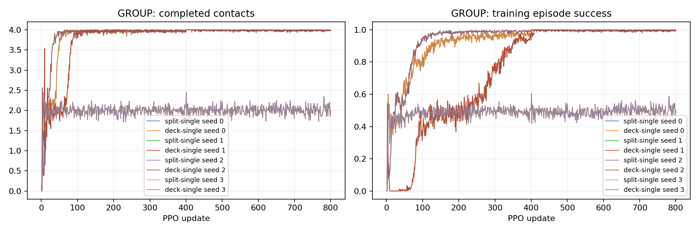

# P2-32 단일 도약 지형 대조

Frozen checkpoints; matched single-jump scenarios before non-reset chaining; no additional training.

고유 학습 run 기준 78,643,200 환경 step, 신규 0step. [사전 프로토콜](p2-32-protocol.md).

| 발 | 조건 | seed | 단일 도약 성공 | 필요 착지 완료 | 낙상 | 시간초과 | ≥20ms 전 발 무접촉 |
|---|---|---:|---:|---:|---:|---:|---:|---:|
| GROUP | split-single | 0 | 64/64 | 64/64 | 0/64 | 0/64 | 64/64 |
| GROUP | deck-single | 0 | 64/64 | 64/64 | 0/64 | 0/64 | 64/64 |
| GROUP | split-single | 1 | 64/64 | 64/64 | 0/64 | 0/64 | 64/64 |
| GROUP | deck-single | 1 | 64/64 | 64/64 | 0/64 | 0/64 | 64/64 |
| GROUP | split-single | 2 | 64/64 | 64/64 | 0/64 | 0/64 | 64/64 |
| GROUP | deck-single | 2 | 64/64 | 64/64 | 0/64 | 0/64 | 64/64 |
| GROUP | split-single | 3 | 0/64 | 0/64 | 15/64 | 49/64 | 64/64 |
| GROUP | deck-single | 3 | 0/64 | 0/64 | 32/64 | 32/64 | 64/64 |

## 도약 계약 지표

| 조건 | seed | 유효 비행 | 비행 후 재접촉 | 단일 도약 성공 | 비발 접촉 종료 | 평균 비행 apex 상승 | 높이 명령 충족 | 네 발 첫 접촉 반경 내 | 최종 높이 범위 밖 |
|---|---:|---:|---:|---:|---:|---:|---:|---:|---:|
| split-single | 0 | 64/64 | 64/64 | 64/64 | 0 | 21.35 cm | 64/64 | 64/64 | 0/64 |
| deck-single | 0 | 64/64 | 64/64 | 64/64 | 0 | 21.35 cm | 64/64 | 64/64 | 0/64 |
| split-single | 1 | 64/64 | 64/64 | 64/64 | 0 | 15.48 cm | 64/64 | 64/64 | 0/64 |
| deck-single | 1 | 64/64 | 64/64 | 64/64 | 0 | 15.49 cm | 64/64 | 64/64 | 0/64 |
| split-single | 2 | 64/64 | 64/64 | 64/64 | 0 | 13.98 cm | 64/64 | 64/64 | 0/64 |
| deck-single | 2 | 64/64 | 64/64 | 64/64 | 0 | 13.97 cm | 64/64 | 64/64 | 0/64 |
| split-single | 3 | 15/64 | 0/64 | 0/64 | 0 | 1.24 cm | 8/64 | 0/64 | 7/64 |
| deck-single | 3 | 32/64 | 0/64 | 0/64 | 0 | 2.55 cm | 19/64 | 0/64 | 12/64 |

## 발별 첫 접촉

오차 평균은 관측된 첫 접촉만 포함한다. 반경 내 수의 분모는 전체 episode이며 미접촉을 성공으로 세지 않는다.

| 조건 | seed | 발 | 관측 수 | 평균 오차 | 반경 내 |
|---|---:|---|---:|---:|---:|
| split-single | 0 | FL | 64/64 | 0.09 cm | 64/64 |
| split-single | 0 | FR | 64/64 | 0.30 cm | 64/64 |
| split-single | 0 | RL | 64/64 | 0.21 cm | 64/64 |
| split-single | 0 | RR | 64/64 | 0.19 cm | 64/64 |
| deck-single | 0 | FL | 64/64 | 0.09 cm | 64/64 |
| deck-single | 0 | FR | 64/64 | 0.30 cm | 64/64 |
| deck-single | 0 | RL | 64/64 | 0.21 cm | 64/64 |
| deck-single | 0 | RR | 64/64 | 0.20 cm | 64/64 |
| split-single | 1 | FL | 64/64 | 0.30 cm | 64/64 |
| split-single | 1 | FR | 64/64 | 0.23 cm | 64/64 |
| split-single | 1 | RL | 64/64 | 0.06 cm | 64/64 |
| split-single | 1 | RR | 64/64 | 0.27 cm | 64/64 |
| deck-single | 1 | FL | 64/64 | 0.27 cm | 64/64 |
| deck-single | 1 | FR | 64/64 | 0.25 cm | 64/64 |
| deck-single | 1 | RL | 64/64 | 0.08 cm | 64/64 |
| deck-single | 1 | RR | 64/64 | 0.24 cm | 64/64 |
| split-single | 2 | FL | 64/64 | 0.11 cm | 64/64 |
| split-single | 2 | FR | 64/64 | 0.23 cm | 64/64 |
| split-single | 2 | RL | 64/64 | 0.16 cm | 64/64 |
| split-single | 2 | RR | 64/64 | 0.34 cm | 64/64 |
| deck-single | 2 | FL | 64/64 | 0.12 cm | 64/64 |
| deck-single | 2 | FR | 64/64 | 0.21 cm | 64/64 |
| deck-single | 2 | RL | 64/64 | 0.15 cm | 64/64 |
| deck-single | 2 | RR | 64/64 | 0.34 cm | 64/64 |
| split-single | 3 | FL | 0/64 | N/A | 0/64 |
| split-single | 3 | FR | 0/64 | N/A | 0/64 |
| split-single | 3 | RL | 0/64 | N/A | 0/64 |
| split-single | 3 | RR | 0/64 | N/A | 0/64 |
| deck-single | 3 | FL | 0/64 | N/A | 0/64 |
| deck-single | 3 | FR | 0/64 | N/A | 0/64 |
| deck-single | 3 | RL | 0/64 | N/A | 0/64 |
| deck-single | 3 | RR | 0/64 | N/A | 0/64 |

## 공통 지표 분리

| 조건 | seed | 기존 안정화 달성 | 첫 접촉 네 발 반경 내 |
|---|---:|---:|---:|
| split-single | 0 | 64/64 | 64/64 |
| deck-single | 0 | 64/64 | 64/64 |
| split-single | 1 | 64/64 | 64/64 |
| deck-single | 1 | 64/64 | 64/64 |
| split-single | 2 | 64/64 | 64/64 |
| deck-single | 2 | 64/64 | 64/64 |
| split-single | 3 | 0/64 | 0/64 |
| deck-single | 3 | 0/64 | 0/64 |

## 출발 계약과 궤적 부분집합

3cm 내 성공 궤적 수는 현재 실행에서의 부분집합이다. 다른 출발 반경으로 재실행한 평가를 대체하지 않는다.

| 조건 | seed | 실행 출발 반경 | 3cm 내 출발 / 전체 | 3cm 내 성공 / 전체 |
|---|---:|---:|---:|---:|
| split-single | 0 | 3 cm | 64/64 | 64/64 |
| deck-single | 0 | 3 cm | 64/64 | 64/64 |
| split-single | 1 | 3 cm | 64/64 | 64/64 |
| deck-single | 1 | 3 cm | 64/64 | 64/64 |
| split-single | 2 | 3 cm | 64/64 | 64/64 |
| deck-single | 2 | 3 cm | 64/64 | 64/64 |
| split-single | 3 | 3 cm | 0/64 | 0/64 |
| deck-single | 3 | 3 cm | 0/64 | 0/64 |

## 거리별 평가

| 조건 | seed | 전방 목표 | 성공 | 출발 영역 | 실비행 이동 충족 | 첫 접촉 반경 | 안정화 |
|---|---:|---:|---:|---:|---:|---:|---:|
| split-single | 0 | 15 cm | 64/64 | 64/64 | 64/64 | 64/64 | 64/64 |
| deck-single | 0 | 15 cm | 64/64 | 64/64 | 64/64 | 64/64 | 64/64 |
| split-single | 1 | 15 cm | 64/64 | 64/64 | 64/64 | 64/64 | 64/64 |
| deck-single | 1 | 15 cm | 64/64 | 64/64 | 64/64 | 64/64 | 64/64 |
| split-single | 2 | 15 cm | 64/64 | 64/64 | 64/64 | 64/64 | 64/64 |
| deck-single | 2 | 15 cm | 64/64 | 64/64 | 64/64 | 64/64 | 64/64 |
| split-single | 3 | 15 cm | 0/64 | 0/64 | 0/64 | 0/64 | 0/64 |
| deck-single | 3 | 15 cm | 0/64 | 0/64 | 0/64 | 0/64 | 0/64 |

학습 곡선은 각 update의 종료 episode 통계다. 고정 평가 결과와 구분한다. 종료 단계는 마지막 유효 200Hz 표본이며 실제 완료 여부는 terminal metrics를 우선한다.

## 종료 단계

- GROUP split-single seed 0: `{'2:2': 64}`
- GROUP deck-single seed 0: `{'2:2': 64}`
- GROUP split-single seed 1: `{'2:2': 64}`
- GROUP deck-single seed 1: `{'2:2': 64}`
- GROUP split-single seed 2: `{'2:2': 64}`
- GROUP deck-single seed 2: `{'2:2': 64}`
- GROUP split-single seed 3: `{'0:0': 64}`
- GROUP deck-single seed 3: `{'0:0': 64}`

## 마지막 제어 표본의 안정화 조건 위반

복수 위반을 허용한다. 연속 hold 전체 구간의 실패 원인과 같지 않으며, 기록되지 않은 과거 실행은 표시하지 않는다.

- split-single seed 0: `{'height': 0, 'vertical_speed': 0, 'angular_speed': 0, 'foot_target': 0, 'contact_state': 0, 'support_history': 0}`
- deck-single seed 0: `{'height': 0, 'vertical_speed': 0, 'angular_speed': 0, 'foot_target': 0, 'contact_state': 0, 'support_history': 0}`
- split-single seed 1: `{'height': 0, 'vertical_speed': 0, 'angular_speed': 0, 'foot_target': 0, 'contact_state': 0, 'support_history': 0}`
- deck-single seed 1: `{'height': 0, 'vertical_speed': 0, 'angular_speed': 0, 'foot_target': 0, 'contact_state': 0, 'support_history': 0}`
- split-single seed 2: `{'height': 0, 'vertical_speed': 0, 'angular_speed': 0, 'foot_target': 0, 'contact_state': 0, 'support_history': 0}`
- deck-single seed 2: `{'height': 0, 'vertical_speed': 0, 'angular_speed': 0, 'foot_target': 0, 'contact_state': 0, 'support_history': 0}`
- split-single seed 3: `{'height': 7, 'vertical_speed': 36, 'angular_speed': 39, 'foot_target': 15, 'contact_state': 28, 'support_history': 29}`
- deck-single seed 3: `{'height': 12, 'vertical_speed': 42, 'angular_speed': 42, 'foot_target': 26, 'contact_state': 40, 'support_history': 40}`

## 해석 및 다음 판단

분석 중. 표만으로 모델 승격을 결정하지 않는다.

## 범위·재현

개발 조건의 탐색적 실험이다. 평가 episode 수와 독립 학습 seed 수를 구분하며 최종 시험 결과로 주장하지 않는다. 같은 발의 평가 시나리오가 동일함을 확인했다. 설정·checkpoint·원본200Hz NPZ는 artifacts, 최종 병렬 평가 영상은 result에 보존한다. 재사용 대조군 원본은 변경하지 않는다.

실행 목록 및 보고서 명세: `configs/reports/p2-32-deck-control.json`. 이 보고서는 `scripts/experiment_report.py`로 재생성한다.
