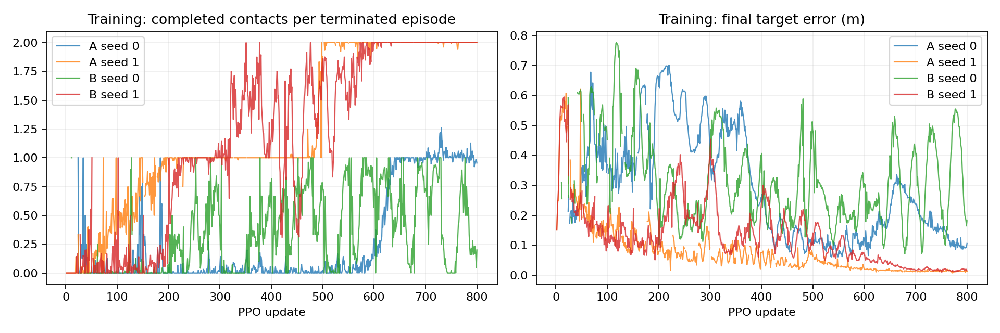

# P1 · Step 02 — 3발 지지·최종 안정화 파일럿 결과

[사전 고정 프로토콜](step02-protocol.md)에 따라 A(추가 수직 속도 벌점 0), B(4)를 각각 seed 0·1로 800updates 학습했다. 총 환경 step은 78,643,200이다. 평가에는 동일한 개발군 64개를 사용했다.

| 조건 | seed | 안정화 포함 완주 | 4발 이동 완료 | 평균 완료 접촉 | 네 발 무접촉 ≥20ms | 수직 속도 RMS |
|---|---:|---:|---:|---:|---:|---:|
| A | 0 | 0/64 | 0/64 | 0.95/4 | 0/64 | 0.043 m/s |
| A | 1 | 0/64 | 0/64 | 1.98/4 | 0/64 | 0.058 m/s |
| B | 0 | 0/64 | 0/64 | 0.91/4 | 0/64 | 0.008 m/s |
| B | 1 | 0/64 | 0/64 | 2.00/4 | 0/64 | 0.040 m/s |

학습 그래프는 해당 update에서 종료한 episode의 평균이며 고정 개발군 성능과 다르다. 수직 속도 RMS는 episode별 평균 제곱의 평균에 제곱근을 취한 값이다. 초기 settling을 포함하며 완주/timeout의 episode 길이가 다르다는 한계가 있다.

## 범위·판단 원칙

- v3는 다른 발 3개 지지 이벤트와 최종 안정화라는 새 계약이다. v2 결과와 성공률을 직접 비교하지 않는다.
- 조건당 독립 학습 seed는 2개다. 64개 평가 환경을 독립 학습 seed로 취급하지 않으며 본 결과는 탐색적 파일럿이다.
- 추가 벌점으로 움직임만 줄고 접촉 진행이나 완주가 나빠지면 개선으로 판단하지 않는다.
- 정책·보상·예산은 실행 도중 변경하지 않았다. 체크포인트·설정·실패·영상은 모두 보존하고 자동 모델 승격은 하지 않았다.
- 별도 2-update 64환경 구현 확인(3,072steps)과 합성 상태 전이 검사는 학습 비교에서 제외한다. 합성 검사는 로봇 정책 성능 결과가 아니다.

## 원본

`artifacts/p1-step02-stable-{a,b}-seed{0,1}` 및 `__final-evaluation`에 학습·평가 기록이 있다. 최종 평가는 200Hz 진단 NPZ와 JSON, 16대 병렬 MP4를 포함한다. 웹에서 P1 / 02·발 디딤 기준선 / 목적: 조건 비교와 조건 A·B로 필터링한다.

## 이번 파일럿의 결론

두 조건 모두 4발 이동 완료와 최종 안정화 성공이 0/64였다. 최종 안정화에 진입하지 못했으므로 마지막 0.2초 조건이 실패의 직접 원인이라고 결론내릴 수 없다.

B는 대응 seed에서 수직 속도 RMS가 작았다(A0 0.0426→B0 0.0083m/s, A1 0.0580→B1 0.0402m/s). 그러나 완료 접촉 수는 뚜렷하게 개선되지 않았고, 몸체 높이 변동폭은 B1에서 오히려 컸다. 모든 안정성 지표가 개선됐다고 할 수 없다.

정지 단계는 A0의 61/64가 두 번째 발의 착지 단계, B0의 58/64가 두 번째 발의 들기 단계였다. A1의 63/64와 B1의 64/64는 세 번째 발의 들기 단계에 머물렀다. 벌점 때문에 B0가 더 일찍 정체되는 양상도 있으므로 움직임 감소만으로 B를 채택하지 않는다.

발 이동 이벤트의 다른 세 발 지지 조건 아래 각 발의 들기·착지 능력을 분리해서 확인하는 것이 다음 실험이다. 발별 단일 이동 커리큘럼과 이후 순차 연결을 별도 버전으로 검토한다. 현재 A/B 어느 쪽도 동적 도약 단계로 넘어갈 기준 모델로 승격하지 않는다.
