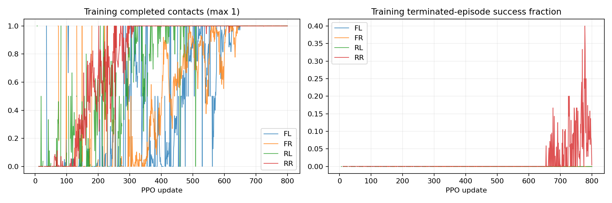

# P1 · Step 02a — 발별 단독 이동 결과

[사전 프로토콜](step02a-protocol.md)에 따라 FL/FR/RL/RR를 각 seed 0, 1024환경, 800updates로 처음부터 학습했다. 총 78,643,200 환경 step. 별도 64개 개발 episode의 첫 종료만 평가했다.

| 이동 발 | 착지 후 안정화 성공 | 1회 착지 완료 | 낙상 | 시간초과 | 네 발 무접촉 ≥20ms | 수직 속도 RMS |
|---|---:|---:|---:|---:|---:|---:|
| FL | 0/64 | 64/64 | 0/64 | 64/64 | 0/64 | 0.0403 m/s |
| FR | 64/64 | 64/64 | 0/64 | 0/64 | 0/64 | 0.0711 m/s |
| RL | 0/64 | 64/64 | 0/64 | 64/64 | 2/64 | 0.0487 m/s |
| RR | 4/64 | 64/64 | 0/64 | 60/64 | 0/64 | 0.0433 m/s |

학습 곡선은 해당 update에서 종료된 episode의 통계다. 고정 개발군 성공률과 구분한다. RMS는 episode별 평균 제곱 수직 속도의 평균에 제곱근을 취했다.

## 종료 직전 단계

200Hz 기록에서 각 환경의 마지막 유효 표본을 사용한다. `0:0`은 들기, `0:1`은 착지, `4:1`은 최종 안정화다. 최종 제어 이벤트 직전 표본일 수 있으므로 착지 완료 여부는 별도 terminal metrics를 우선한다.

- FL: `{'4:1': 64}`
- FR: `{'4:1': 64}`
- RL: `{'4:1': 64}`
- RR: `{'4:1': 64}`

## 해석 범위

발별 독립 학습 seed는 하나다. 발 간 결과 차이를 구조적 실행 가능성이나 통계적 우열로 단정하지 않는다. 단독 이동 성공은 4발 순차 이동이나 파쿠르 성공을 의미하지 않는다. 지지 조건은 lift/place 이벤트와 최종 안정화에 적용하며 모든 중간 시각의 3발 지지를 보장하는 제약은 아니다.

최종 checkpoint를 사전 정의대로 평가했다. 실패와 영상도 보존하며 champion으로 자동 승격하지 않는다. 각 run의 정책·설정·계보·평가·200Hz NPZ는 `artifacts/p1-step02a-single-{fl,fr,rl,rr}-seed0` 및 `__final-evaluation`에 있다. 상세 제목의 최종 영상은 `result/`에 정리했다. 모니터링에서 `P1 / 02a·발별 단독 이동`과 발 조건 태그로 조회한다.

## 이번 결과의 판단

모든 조건에서 지정 발의 들기→착지는 64/64 완료했다. 안정화까지 성공한 횟수는 FL 0, FR 64, RL 0, RR 4였다. 순차 과제의 후반 단계 실패를 해당 발의 단독 이동 불능만으로 설명할 수 없다. 단독 정책과 순차 정책은 다르므로 순차 실행 가능성을 입증한 것은 아니다.

마지막 유효 표본의 발별 수평 오차 평균은 다음과 같다. 판정 반경은 각 발 2.5cm이며 평균값만으로 개별 episode 성공을 판정하지 않는다.

| 이동 조건 | FL 오차 cm | FR 오차 cm | RL 오차 cm | RR 오차 cm | 네 발 모두 반경 내 |
|---|---:|---:|---:|---:|---:|
| FL | 0.68 | 5.24 | 1.04 | 5.01 | 0/64 |
| FR | 1.98 | 0.73 | 1.45 | 1.20 | 64/64 |
| RL | 3.08 | 1.83 | 0.92 | 3.66 | 0/64 |
| RR | 1.37 | 2.65 | 0.11 | 1.20 | 4/64 |

FL 조건의 FR/RR 지지 발, RL 조건의 FL/RR 지지 발은 평균적으로 목표 반경을 벗어났다. RR 조건도 마지막 표본에서 네 발이 반경 내인 경우는 4/64였다. 이는 최종 발 위치 유지가 충족되지 않은 직접 관측이며 미끄러짐이라는 물리 원인을 확정하지 않는다.

RL 조건에서는 2/64 episode에 20ms 이상 네 발 무접촉이 있었다. 이벤트 순간 3발 지지 조건만으로 전체 궤적의 hopping을 제거하지 못한다.

다음 비교 후보는 기존 보상을 대조군으로 두고 지지 발별 오차 및 최종 단계의 네 발 정렬 학습 신호를 명시한 보상이다. 현재의 지지 오차 평균은 개별 발 오차를 가릴 수 있지만, 보상 변경의 효과는 아직 검증하지 않았다. 추가 seed와 동일 예산 비교 후에 순차 연결을 시도한다.

학습 4건과 자동 평가 4건의 checkpoint·artifact hash, GPU UUID 격리·자원 회수 감사를 통과했다. 합성 상태 검사, 단위 검사 15개, 모니터링 검사 6개, 프론트 빌드도 통과했다. 최종 영상 4개는 result와 웹에 등록했다.
