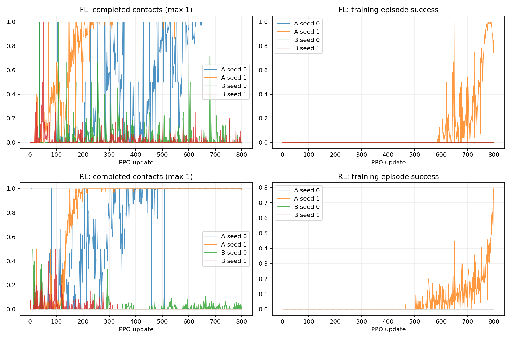

# P1 · Step 02b — 최종 네 발 정렬 보상 결과

[사전 프로토콜](step02b-protocol.md)에 따라 A=기존 보상, B=최종 단계에만 네 발 XY 오차 벌점을 추가했다. FL/RL 각각 seed 0/1, 1024환경×800updates. A seed0 두 건은 Step 02a 원본을 재사용했다. 신규 117,964,800steps, 전체 비교 157,286,400steps. 같은 발의 평가 목표 표본은 A/B·seed 간 동일함을 검사했다.

| 발 | 조건 | seed | 안정화 성공 | 착지 완료 | 낙상 | 시간초과 | ≥20ms 전 발 무접촉 | 최종 네 발 반경 내 |
|---|---|---:|---:|---:|---:|---:|---:|---:|
| FL | A | 0 | 0/64 | 64/64 | 0/64 | 64/64 | 0/64 | 0/64 |
| FL | A | 1 | 64/64 | 64/64 | 0/64 | 0/64 | 0/64 | 64/64 |
| FL | B | 0 | 0/64 | 0/64 | 0/64 | 64/64 | 0/64 | 64/64 |
| FL | B | 1 | 0/64 | 0/64 | 0/64 | 64/64 | 0/64 | 64/64 |
| RL | A | 0 | 0/64 | 64/64 | 0/64 | 64/64 | 2/64 | 0/64 |
| RL | A | 1 | 64/64 | 64/64 | 0/64 | 0/64 | 0/64 | 64/64 |
| RL | B | 0 | 0/64 | 0/64 | 0/64 | 64/64 | 0/64 | 64/64 |
| RL | B | 1 | 0/64 | 0/64 | 0/64 | 64/64 | 0/64 | 60/64 |

학습 곡선은 해당 update에서 종료한 episode 통계로 고정 평가 성공률과 다르다. 최종 반경 지표는 마지막 유효 200Hz 표본이며 안정화 성공 판정 자체를 대체하지 않는다.

## 대응 seed의 성공 수 변화

- FL seed 0: A 0/64 → B 0/64 (차이 +0 episode).
- FL seed 1: A 64/64 → B 0/64 (차이 -64 episode).
- RL seed 0: A 0/64 → B 0/64 (차이 +0 episode).
- RL seed 1: A 64/64 → B 0/64 (차이 -64 episode).

## 해석 범위

각 발·조건의 독립 학습 seed는 2개다. 64개 평가 episode를 독립 학습 seed로 취급하지 않는다. FL/RL은 선행 개발 실험의 실패 조건에서 선택했으므로 본 결과는 탐색적이며 최종 시험 결과가 아니다.

성공 기준을 완화하지 않았고 B는 최종 단계 보상 항 하나만 추가했다. 실행 도중 정책 설정·예산 변경은 없었다. 첫 배치는 4GPU 동시, 후속 B seed1은 선행 run의 평가·자원 회수 후 실행해 wall-clock 차이는 학습 효과와 구분한다.

원본과 200Hz NPZ는 `artifacts/`의 training_run 및 `__final-evaluation` 경로에 있다. 신규 6개 최종 영상은 `result/`에 상세 발·과제·seed·업데이트 제목으로 보존했다. 모니터링 `P1 / 02b·최종 네 발 정렬`에 재사용 대조군을 포함해 연결했다. 자동 champion 승격은 하지 않는다.

## 이번 비교의 결론

A는 FL/RL 모두 seed 0에서 안정화 0/64, seed 1에서 64/64였다. 4개 A run 모두 지정 발 착지는 64/64 완료했다. 기존 보상도 성공 정책을 학습할 수 있지만 두 seed 간 결과가 크게 갈리므로 신뢰할 수 있는 기준 모델을 확보했다고 주장하지 않는다.

B는 FL/RL × seed 0/1의 네 run 모두 착지 0/64, 안정화 0/64였다. FL 두 seed와 RL seed 0은 들기 후 착지 단계(0:1), RL seed 1은 들기 단계(0:0)에서 종료했다. 낙상 없이 멈춰 있는 것은 과제 성공이 아니다. 이 예산과 설정에서 추가 항은 개선을 보이지 않고 진행을 악화시켰으므로 채택하지 않는다.

최종 단계에서만 발생하는 비용을 피하는 양상과 일치하지만, 정책이 그러한 의도로 행동한다고 확정하지 않는다. 아래는 기존 A 궤적에 B의 추가 비용을 사후 적용한 평균 누적값이다. 200Hz 적분 근사이며 할인하지 않았다. 실제 B 정책의 return이나 PPO가 추정한 advantage가 아니다.

- FL seed 0: 추가 비용 적분 25.7846.
- FL seed 1: 추가 비용 적분 0.0350.
- RL seed 0: 추가 비용 적분 14.6774.
- RL seed 1: 추가 비용 적분 0.0059.

성공하지 못한 착지 후 상태에 오래 머무르면 비용이 계속 쌓인다. 다음 후보는 단계 진입 자체를 불리하게 만들지 않도록 설계한 목표 오차 개선 신호와 기존 정책의 추가 seed 확인이다. 해당 설계는 아직 구현·검증하지 않았다. 이번에 관측한 문제를 이유로 성공 반경이나 3발 지지 조건을 완화하지 않는다.

신규 학습 6건과 평가 6건의 hash·계보·GPU UUID 격리·자원 회수 감사를 통과했다. 최종 시점에 학습 GPU 프로세스가 남지 않았다. 단위 검사 16개, 모니터링 검사 6개, 합성 안정화 상태 검사 통과. 신규 평가 영상 6개는 result 및 웹에 등록됐다.
