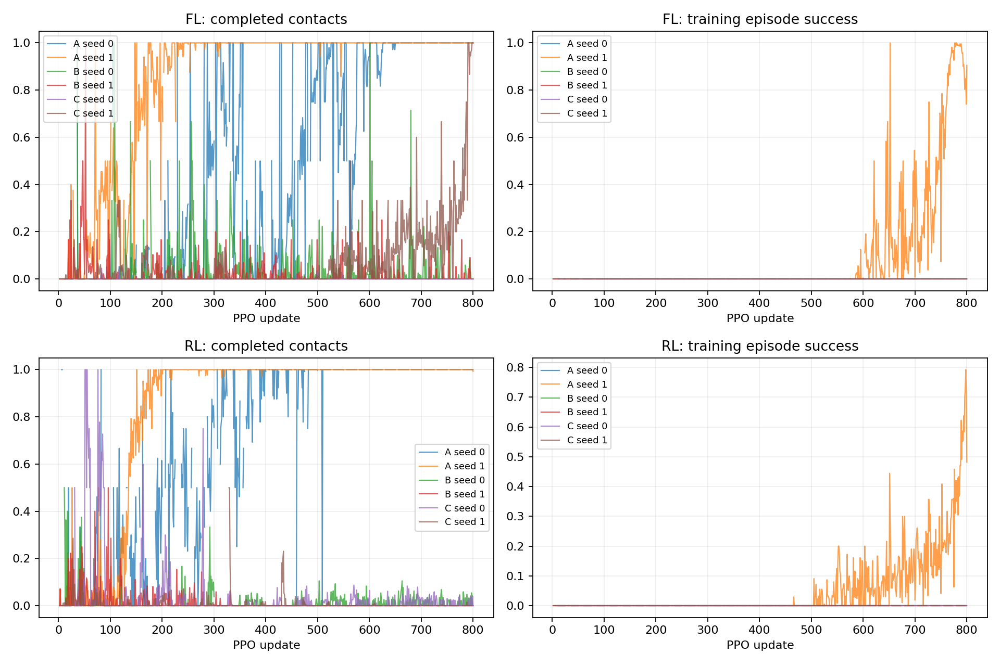

# P1 · Step 02c — 정렬 비용 적용 시점 비교

A=기존 보상, B=최종 단계 전용 정렬 비용, C=모든 단계 정렬 비용. 각 발·조건 2개 학습 seed, 각 1024환경×800updates. A/B는 이전 원본 재사용.

비교 전체 235,929,600 환경 step, 신규 78,643,200step. [사전 프로토콜](step02c-protocol.md).

| 발 | 조건 | seed | 안정화 성공 | 필요 착지 완료 | 낙상 | 시간초과 | ≥20ms 전 발 무접촉 |
|---|---|---:|---:|---:|---:|---:|---:|
| FL | A | 0 | 0/64 | 64/64 | 0/64 | 64/64 | 0/64 |
| FL | A | 1 | 64/64 | 64/64 | 0/64 | 0/64 | 0/64 |
| FL | B | 0 | 0/64 | 0/64 | 0/64 | 64/64 | 0/64 |
| FL | B | 1 | 0/64 | 0/64 | 0/64 | 64/64 | 0/64 |
| FL | C | 0 | 0/64 | 0/64 | 0/64 | 64/64 | 0/64 |
| FL | C | 1 | 0/64 | 9/64 | 0/64 | 64/64 | 0/64 |
| RL | A | 0 | 0/64 | 64/64 | 0/64 | 64/64 | 2/64 |
| RL | A | 1 | 64/64 | 64/64 | 0/64 | 0/64 | 0/64 |
| RL | B | 0 | 0/64 | 0/64 | 0/64 | 64/64 | 0/64 |
| RL | B | 1 | 0/64 | 0/64 | 0/64 | 64/64 | 0/64 |
| RL | C | 0 | 0/64 | 0/64 | 0/64 | 64/64 | 0/64 |
| RL | C | 1 | 0/64 | 0/64 | 0/64 | 64/64 | 0/64 |

학습 곡선은 각 update의 종료 episode 통계다. 고정 평가 결과와 구분한다. 종료 단계는 마지막 유효 200Hz 표본이며 실제 완료 여부는 terminal metrics를 우선한다.

## 종료 단계

- FL A seed 0: `{'4:1': 64}`
- FL A seed 1: `{'4:1': 64}`
- FL B seed 0: `{'0:1': 64}`
- FL B seed 1: `{'0:1': 64}`
- FL C seed 0: `{'0:0': 64}`
- FL C seed 1: `{'0:0': 55, '4:1': 9}`
- RL A seed 0: `{'4:1': 64}`
- RL A seed 1: `{'4:1': 64}`
- RL B seed 0: `{'0:1': 64}`
- RL B seed 1: `{'0:0': 64}`
- RL C seed 0: `{'0:0': 58, '0:1': 6}`
- RL C seed 1: `{'0:0': 64}`

## 해석 및 다음 판단

C는 FL seed 1에서 9/64 착지, 나머지 세 조건에서 0/64 착지였으며 안정화는 네 조건 모두 0/64였다. A의 네 조건 모두 착지 64/64였던 결과보다 과제 진행이 나쁘다. 같은 비용을 모든 단계로 옮기는 것만으로 해결되지 않아 C를 채택하지 않는다.

최종 단계 진입 시 비용 불연속만이 문제라고 단정할 수 없다. 벌점의 크기와 학습 초기 행동 유도도 영향 후보지만 이 실험으로 각 원인을 분리하지 못했다. 계수만 계속 탐색하지 않고 기존 A의 추가 예산 실험으로 방향을 전환한다.

다음 Step 02d는 동일 seed의 기존 A checkpoint를 800→1,600 updates 재개해 실패 seed의 개선과 성공 seed의 회귀를 확인한다. 별도 사전 프로토콜과 새 run을 사용한다. 결과 전에는 추가 학습의 효과를 주장하지 않는다.

신규 학습 4건과 평가 4건의 artifact 해시·계보·GPU 격리·회수 감사를 통과했다. 최종 영상 4개는 result에 보존하고 02c 태그로 웹에 연결했다.

## 범위·재현

개발 조건의 탐색적 실험이다. 평가 episode 수와 독립 학습 seed 수를 구분하며 최종 시험 결과로 주장하지 않는다. 같은 발의 평가 시나리오가 동일함을 확인했다. 설정·checkpoint·원본200Hz NPZ는 artifacts, 최종16대병렬영상은 result에 보존한다. 재사용 대조군 원본은 변경하지 않는다.

실행 목록 및 보고서 명세: `configs/reports/step02c.json`. 이 보고서는 `scripts/experiment_report.py`로 재생성한다.
