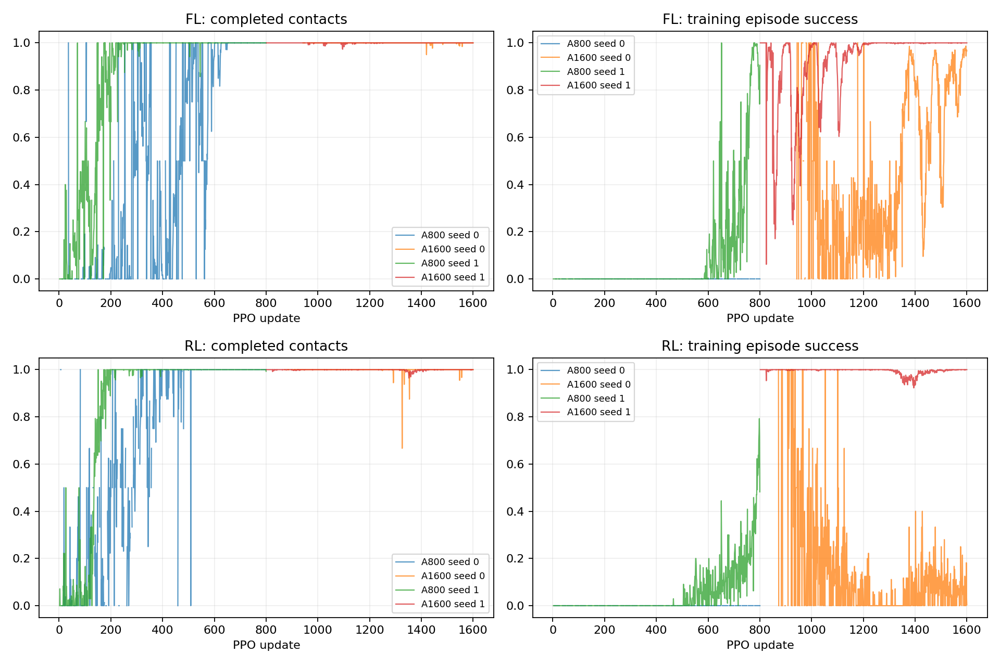

# P1 · Step 02d — 추가 학습 및 회귀

기존 A(v4)의 동일 seed 정책을800→1600updates까지 episode 경계에서 재개했다. 독립 seed 추가가 아닌 대응 예산 실험이다. 신규 step만 별도 집계한다.

비교 전체 157,286,400 환경 step, 신규 78,643,200step. [사전 프로토콜](step02d-protocol.md).

| 발 | 조건 | seed | 안정화 성공 | 필요 착지 완료 | 낙상 | 시간초과 | ≥20ms 전 발 무접촉 |
|---|---|---:|---:|---:|---:|---:|---:|
| FL | A800 | 0 | 0/64 | 64/64 | 0/64 | 64/64 | 0/64 |
| FL | A1600 | 0 | 0/64 | 64/64 | 0/64 | 64/64 | 0/64 |
| FL | A800 | 1 | 64/64 | 64/64 | 0/64 | 0/64 | 0/64 |
| FL | A1600 | 1 | 64/64 | 64/64 | 0/64 | 0/64 | 0/64 |
| RL | A800 | 0 | 0/64 | 64/64 | 0/64 | 64/64 | 2/64 |
| RL | A1600 | 0 | 64/64 | 64/64 | 0/64 | 0/64 | 0/64 |
| RL | A800 | 1 | 64/64 | 64/64 | 0/64 | 0/64 | 0/64 |
| RL | A1600 | 1 | 64/64 | 64/64 | 0/64 | 0/64 | 0/64 |

학습 곡선은 각 update의 종료 episode 통계다. 고정 평가 결과와 구분한다. 종료 단계는 마지막 유효 200Hz 표본이며 실제 완료 여부는 terminal metrics를 우선한다.

## 종료 단계

- FL A800 seed 0: `{'4:1': 64}`
- FL A1600 seed 0: `{'4:1': 64}`
- FL A800 seed 1: `{'4:1': 64}`
- FL A1600 seed 1: `{'4:1': 64}`
- RL A800 seed 0: `{'4:1': 64}`
- RL A1600 seed 0: `{'4:1': 64}`
- RL A800 seed 1: `{'4:1': 64}`
- RL A1600 seed 1: `{'4:1': 64}`

## 해석 및 다음 판단

추가 800updates 후 RL seed 0의 안정화 성공은 0/64→64/64로 개선됐다. FL seed 0은 0/64를 유지했고, FL/RL seed 1의 기존64/64 성공은 모두 유지됐다. 네 재개 정책 모두 착지는64/64였다.

RL seed 0의 ≥20ms 전 발 무접촉 episode는2/64→0/64였다. 나머지 조건에서도 해당 진단은0/64다. 이 고정 개발군 밖의 접촉 안전성을 일반화하지 않는다.

추가 학습이 한 실패 seed에는 도움이 됐으나 모든 실패를 해결하지는 못했다. FL seed 0은 여전히 최종 안정화 단계에 머물렀다. 단순히 예산을 계속 늘리는 것을 유일한 대응으로 삼지 않는다.

학습 중 확률적 행동의 종료 통계와 고정 정책의 평균 행동 평가는 결과가 다를 수 있다. 이번에는 학습 곡선에서 보인 성공 비율만으로 최종 성능을 예측할 수 없었다. 정책 선택은 별도 고정 평가를 기준으로 한다.

다음 Step02e는 한 정책이 네 발의 단독 이동 목표를 처리하는 공유 Tracker 파일럿이다. 발마다 별도 신경망을 학습한 현재 구조에서 순차 실행으로 나아가기 위한 중간 단계이며, 발별64개씩 평가해 실패를 평균으로 숨기지 않는다.

신규 학습4건·평가4건의 hash·부모 checkpoint·801회 재개 시작·GPU격리·자원 회수 감사를 통과했다. 영상4개를 result에 보존했다. 신규78,643,200step, 재사용 원본과 합친 실제총예산157,286,400step이며 누적step을 중복 합산하지 않았다.

## 범위·재현

개발 조건의 탐색적 실험이다. 평가 episode 수와 독립 학습 seed 수를 구분하며 최종 시험 결과로 주장하지 않는다. 같은 발의 평가 시나리오가 동일함을 확인했다. 설정·checkpoint·원본200Hz NPZ는 artifacts, 최종16대병렬영상은 result에 보존한다. 재사용 대조군 원본은 변경하지 않는다.

실행 목록 및 보고서 명세: `configs/reports/step02d.json`. 이 보고서는 `scripts/experiment_report.py`로 재생성한다.
