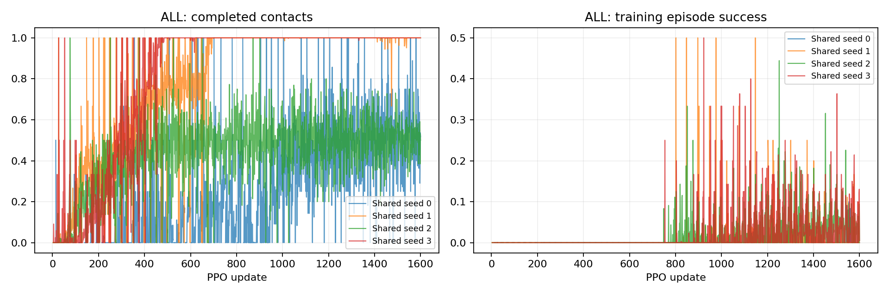

# P1 · Step 02e — 공유 단독 발 Tracker

네 발이 공유하는 정책을 매 episode의 활성 발 균등 추출로 학습했다. 네 독립 seed, 각1024환경×1600updates. 개발 평가256개를 발별64개로 나누어 보고한다.

비교 전체 157,286,400 환경 step, 신규 157,286,400step. [사전 프로토콜](step02e-protocol.md).

| 발 | 조건 | seed | 안정화 성공 | 필요 착지 완료 | 낙상 | 시간초과 | ≥20ms 전 발 무접촉 |
|---|---|---:|---:|---:|---:|---:|---:|
| ALL | Shared | 0 | 0/256 | 61/256 | 0/256 | 256/256 | 0/256 |
| ALL | Shared | 1 | 190/256 | 256/256 | 0/256 | 66/256 | 0/256 |
| ALL | Shared | 2 | 127/256 | 128/256 | 0/256 | 129/256 | 0/256 |
| ALL | Shared | 3 | 192/256 | 256/256 | 0/256 | 64/256 | 0/256 |

## 공유 정책의 발별 평가

| 조건 | seed | 이동 발 | 안정화 | 착지 | ≥20ms 전 발 무접촉 |
|---|---:|---|---:|---:|---:|
| Shared | 0 | FL_foot | 0/64 | 0/64 | 0/64 |
| Shared | 0 | FR_foot | 0/64 | 0/64 | 0/64 |
| Shared | 0 | RL_foot | 0/64 | 7/64 | 0/64 |
| Shared | 0 | RR_foot | 0/64 | 54/64 | 0/64 |
| Shared | 1 | FL_foot | 62/64 | 64/64 | 0/64 |
| Shared | 1 | FR_foot | 64/64 | 64/64 | 0/64 |
| Shared | 1 | RL_foot | 0/64 | 64/64 | 0/64 |
| Shared | 1 | RR_foot | 64/64 | 64/64 | 0/64 |
| Shared | 2 | FL_foot | 63/64 | 64/64 | 0/64 |
| Shared | 2 | FR_foot | 0/64 | 0/64 | 0/64 |
| Shared | 2 | RL_foot | 0/64 | 0/64 | 0/64 |
| Shared | 2 | RR_foot | 64/64 | 64/64 | 0/64 |
| Shared | 3 | FL_foot | 64/64 | 64/64 | 0/64 |
| Shared | 3 | FR_foot | 64/64 | 64/64 | 0/64 |
| Shared | 3 | RL_foot | 64/64 | 64/64 | 0/64 |
| Shared | 3 | RR_foot | 0/64 | 64/64 | 0/64 |

학습 곡선은 각 update의 종료 episode 통계다. 고정 평가 결과와 구분한다. 종료 단계는 마지막 유효 200Hz 표본이며 실제 완료 여부는 terminal metrics를 우선한다.

## 종료 단계

- ALL Shared seed 0: `{'0:0': 132, '0:1': 63, '4:1': 61}`
  - FL_foot: `{'0:0': 64}`
  - FR_foot: `{'0:0': 64}`
  - RL_foot: `{'0:1': 57, '4:1': 7}`
  - RR_foot: `{'0:0': 4, '0:1': 6, '4:1': 54}`
- ALL Shared seed 1: `{'4:1': 256}`
  - FL_foot: `{'4:1': 64}`
  - FR_foot: `{'4:1': 64}`
  - RL_foot: `{'4:1': 64}`
  - RR_foot: `{'4:1': 64}`
- ALL Shared seed 2: `{'0:0': 128, '4:1': 128}`
  - FL_foot: `{'4:1': 64}`
  - FR_foot: `{'0:0': 64}`
  - RL_foot: `{'0:0': 64}`
  - RR_foot: `{'4:1': 64}`
- ALL Shared seed 3: `{'4:1': 256}`
  - FL_foot: `{'4:1': 64}`
  - FR_foot: `{'4:1': 64}`
  - RL_foot: `{'4:1': 64}`
  - RR_foot: `{'4:1': 64}`

## 해석 및 다음 판단

공유 정책의 안정화 성공은 seed0=0/256, seed1=190/256, seed2=127/256, seed3=192/256이었다. 네 발 모두 높은 성공을 보이는 seed는 없었다. 모델을 champion으로 승격하지 않는다.
seed1은 FL62/64·FR64/64·RR64/64지만 RL0/64, seed3은 FL/FR/RL 각각64/64지만 RR0/64였다. 두 정책 모두 착지는 전 발64/64였으므로 해당 뒷발 조건의 병목은 착지 이후 안정화다. seed0/2에는 발 들기나 착지 자체의 실패도 남는다.
네 평가 모두 ≥20ms 전 발 무접촉 episode는0개였다. 이는 현재 정적 과제와 개발군의 관측이며 동적 도약 능력이나 실제 센서 안전성을 뜻하지 않는다.
하나의 정책이 여러 발 조건을 수행할 수는 있었지만 발별·seed별 취약성이 남았다. 이전 발별 독립 정책과 학습 분포 및 발당 노출 수가 다르므로 공유 여부의 순수한 효과라고 해석하지 않는다.
정적3발지지 과제의 모든 seed 성공을 전체 파쿠르 목표로 대체하지 않는다. 이 결과와 실패를 보존하고 다음은 P2의 명시적 도약·비행·착지 최소 실험이다. docs/p2-transition-review.md에 충돌 계약과 원래 목표로의 연결을 기록했다. P1 전체 검수 완료나 순차 파쿠르 해결을 선언하는 것은 아니다.
학습4건·자동평가4건의hash·GPU격리·자원회수 감사를 통과했다. 최종 영상4개를result에보존했고 웹02e태그와 발별 평가표에 연결했다. 새 보고서 경로의 반복 압축 해제를 제거해 계산 병목을 줄였다.

## 범위·재현

개발 조건의 탐색적 실험이다. 평가 episode 수와 독립 학습 seed 수를 구분하며 최종 시험 결과로 주장하지 않는다. 같은 발의 평가 시나리오가 동일함을 확인했다. 설정·checkpoint·원본200Hz NPZ는 artifacts, 최종16대병렬영상은 result에 보존한다. 재사용 대조군 원본은 변경하지 않는다.

실행 목록 및 보고서 명세: `configs/reports/step02e.json`. 이 보고서는 `scripts/experiment_report.py`로 재생성한다.
