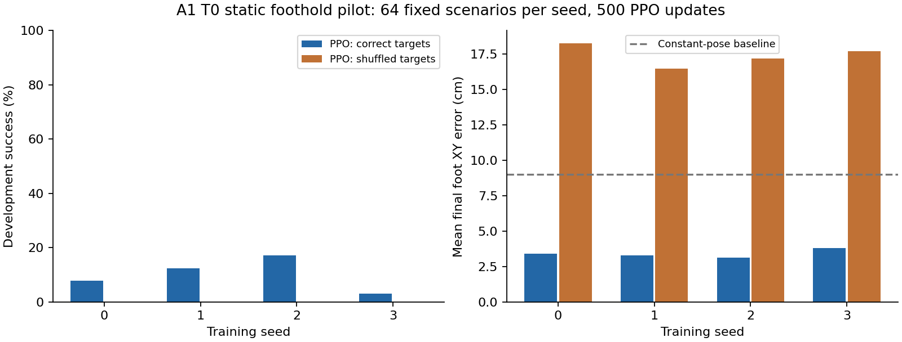

# A1 T0 파일럿 결과 — 2026-09-10

## 확인한 결과

A1 모델을 사용해 T0 목표 접촉 PPO 학습 → checkpoint → 새 attempt 재개 → 고정 개발군 평가 → 원본 MP4 경로를 실행했다. GPU 네 장에서 독립 seed 작업을 운영했다. 이는 **평지 정적 목표 접촉 파일럿**이며 동적 파쿠르나 P0/P1 전체 완료가 아니다.

학습은 seed 0~3, seed당 256 환경 ×24 step ×500 PPO updates = 3,072,000 환경 step이다. 100 updates 후 저장하고 별도 프로세스에서 400 updates를 추가했다. 네 seed 합계 12,288,000 step이며, 독립 학습 seed 수는 4다.

각 모델은 같은 개발 시나리오 64개에서 첫 episode를 모두 평가했다. 목표는 네 발의 XY 오차 3.5 cm 미만과 접촉을 0.2초 동안 동시에 유지하는 것이다. 4초 안에 조건을 달성하지 못하면 timeout으로 분류한다.

| 모델 | 목표 접촉 성공 | 낙상/실패 | 평균 최종 발 오차 | 목표 셔플 성공 / 오차 |
|---|---:|---:|---:|---:|
| 기본 자세 | 0/64 | 0.0% | 9.01 cm | — |
| PPO seed 0 | 5/64 (7.8%) | 0.0% | 3.41 cm | 0/64 / 18.27 cm |
| PPO seed 1 | 8/64 (12.5%) | 0.0% | 3.31 cm | 0/64 / 16.47 cm |
| PPO seed 2 | 11/64 (17.2%) | 0.0% | 3.14 cm | 0/64 / 17.20 cm |
| PPO seed 3 | 2/64 (3.1%) | 0.0% | 3.81 cm | 0/64 / 17.73 cm |

500회 학습 모델들은 기본 자세 대조군보다 평균 최종 발 오차가 작았다. 그러나 목표 접촉 성공률은 3.1~17.2%로 낮다. 실패율 0%는 이 제한된 평지 평가에서 낙상 종료가 없었다는 의미이며, 대부분의 episode는 시간 제한에 도달했다. 안정적인 목표 재배치 능력을 달성했다고 보기 어렵다.

100 updates 시점의 seed 0 모델은 개발군에서 성공 0/64, 실패 64/64, 최종 오차 약 63.2 cm였다. 이 나쁜 중간 결과도 `artifacts/t0-policy100-dev/`에 보존했다. 최신 checkpoint를 무조건 우수 모델로 취급하지 않는다.

목표 관측만 환경 간 셔플하면 성공이 모두 0/64로 감소하고 오차가 커졌다. 이는 목표 입력에 대한 민감도 진단이다. 별도 학습한 무목표 모델과의 공정한 RQ 절제 실험이나 통계적 유의성 증명으로 해석하지 않는다.

## 재현 가능한 산출물

- `artifacts/t0-pilot-seed{0..3}/`: 초기 100 updates와 checkpoints.
- `artifacts/t0-resume-seed{0..3}/`: 추가 400 updates, parent checkpoint hash, 최종 `checkpoint-000500.pt`.
- `artifacts/t0-eval500-seed{0..3}/`: episode별 결과와 정확한 개발 시나리오.
- `artifacts/t0-eval500-seed0/evaluation.mp4`: seed 0의 개발 시나리오 10000 원본 영상. 가장 성공적인 사례로 골라낸 영상이 아니다.
- `artifacts/t0-eval500-seed0/replay.json`: 계획 목표·실제 발 위치·행동·simulator 시간 대응.
- `artifacts/t0-shuffle500-seed{0..3}/`: 목표 입력 셔플 진단.
- `artifacts/pilot-audit.jsonl`: 완료 artifact 감사 결과.

표와 그림 재생성: Isaac Python으로 `scripts/report_pilot.py` 실행.

## 검증한 운영 경로

1. 각 worker의 GPU PID를 2초 간격으로 관측했다. 감사한 실행에서는 요청 UUID 이외의 GPU 점유가 관측되지 않았다. 모든 완료 worker의 GPU PID가 사라지고 메모리가 회수됨을 확인했다. 순간적인 점유까지 완전히 배제하는 격리 증명은 아니다.
2. 두 번째 작업이 같은 GPU의 자체 lease를 잡으려 하면 거부됐다 (`GPU has an active parkour lease`).
3. seed 0~3 모두 checkpoint에서 optimizer·normalization·RNG를 불러와 다음 iteration부터 재개했다. normalizer count 증가, 가중치 변화, step 연속성, 유한한 parameter를 확인했다.
4. hash가 틀린 checkpoint는 역직렬화 전에 거부했다.
5. seed 0의 500 update 모델은 영상 포함 평가와 순수 headless 평가의 episode별 결과가 동일했다.
6. `t0-timeout-injection`에 4초 예산을 주어 worker를 종료시켰다. supervisor가 FAILED 상태로 정리하고 GPU를 회수했다. 이후 마지막 유효 checkpoint로 `t0-recovery-after-timeout`을 새로 실행해 501번째 update와 저장을 확인했다. 자동 재시도 scheduler를 구현한 것은 아니다.
7. 개발 시나리오의 batch 크기 독립성과 RNG 독립성, 표본 범위·ID 유일성 검사를 통과했다.

네 동시 학습 작업의 iteration 중앙값은 약 0.41~0.42초, 작업당 약 14.6~15.0k 환경 step/s였다. 256 환경의 이 T0 설정에 한정된 측정이다. 4096 환경의 기존 thesis 처리량과 직접 비교할 수 없으며, GPU 활용률 최적화나 고정 workload trace scheduler 비교를 완료했다고 주장하지 않는다.

주 파일럿 학습 8개 attempt의 GPU 할당 시간 합계는 약 931 GPU초(0.258 GPU시간)였다. supervisor 시작·종료 시간을 포함하고, 평가·별도 오류 주입·디버그 실행은 제외한 값이다. 실제 전력량이나 GPU 연산 활성 시간 측정은 아니다.

## 알려진 제한과 다음 작업

- 정답 선속도·자세·접촉을 사용한다. 센서 기반 student나 접촉/이력 절제 실험은 아직 없다.
- T0 목표 기준은 실제 초기 자산 kinematics에서 읽은 XY다. 기본 reset 자세의 실제 발 위치와 차이가 있다. 다음 실험은 reset 이후 기구학·정적 평형과 목표 도달 범위를 명시적으로 보정한 새로운 task 버전으로 수행한다.
- 좁은 발판을 도입하기 전에 XY뿐 아니라 접촉 surface ID·높이·법선·가장자리 여유를 평가해야 한다.
- 목표가 가까울 때 단순한 지지 자세 변경만으로 점수를 얻는 한계가 있다. 한 발씩 이동→목표 접촉→다음 목표 갱신의 순차 과제로 확장해야 한다.
- self-collision, PD/action 범위, 접촉 한계를 동적 실행 전에 검토한다. 토크 한계를 성능 향상을 위해 임의 증대하지 않는다.
- 전용 worker의 process exit로 Isaac Sim 종료 정체를 우회한다. 저장되지 않은 작업을 남기지 않는 전제다. graceful plugin teardown 해결로 표현하지 않는다.
- 초기 run의 `git_commit` 값 `HEAD`는 첫 Git commit 전 resolver의 잘못된 표기다. 해당 run의 정확한 소스는 SHA-256 및 보존된 source snapshot으로 확인한다. resolver는 수정했다.
- 완전한 자산 dependency hash, 격리된 환경 lock/container, 다른 서버 재실행은 미완료다.
- 웹, PostgreSQL/S3, 영속 큐·자원 broker·실패 커리큘럼·모델 승격·장기 운영 시험은 후속이다. 현재 champion을 지정하지 않았다.
